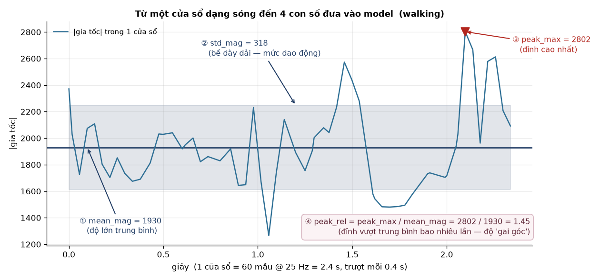
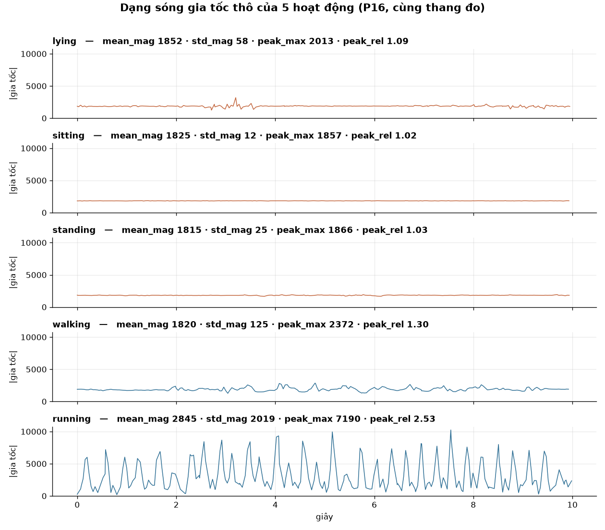
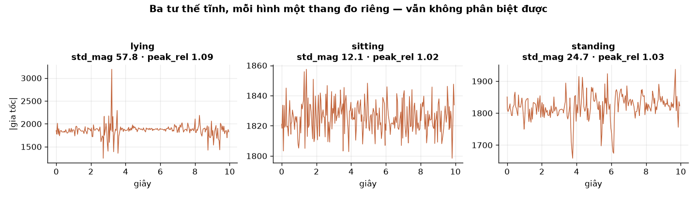
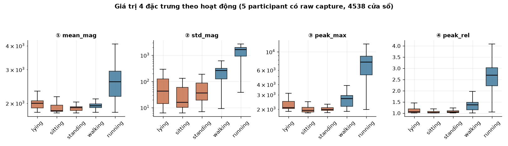
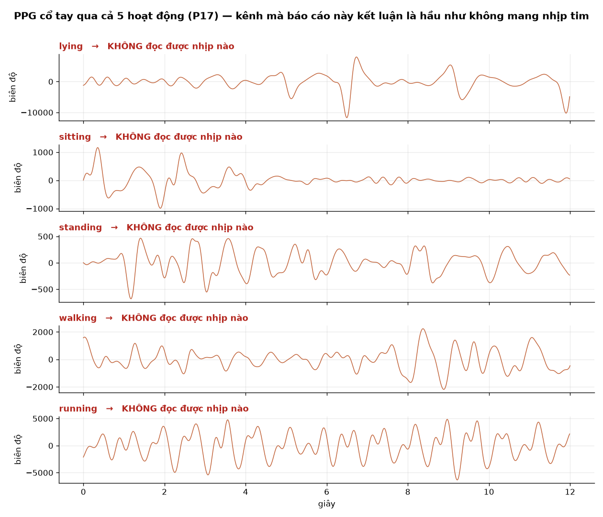

# Thiết Bị Đeo Cổ Tay Nhận Diện Hoạt Động và Đo Nhịp Tim: Phân Tích Nguyên Nhân Gốc Hai Phân Hệ Xử Lý Tín Hiệu

**Báo cáo kỹ thuật hệ thống — Wearable Activity & Health Monitor**

Hoàng Nguyễn Ngọc Giang · Phan Ngọc Quốc Duy · Trần Thanh Tùng

---

## Tóm tắt (Abstract)

Báo cáo trình bày quá trình thiết kế, đánh giá và truy tìm nguyên nhân gốc của hai phân
hệ xử lý tín hiệu trên một thiết bị đeo cổ tay chi phí thấp (ESP32-S3 + MPU6050 +
MAX30102, chạy FreeRTOS): **Subsystem A** — bộ phân loại hoạt động từ tín hiệu gia tốc,
và **Subsystem B** — bộ khử nhiễu chuyển động cho tín hiệu PPG để đo nhịp tim.

Ở Subsystem A, mô hình Decision Tree 5 lớp đạt độ chính xác 54.8% theo giao thức kiểm
định độc lập người dùng LOGO-CV trên 18 đối tượng. Phân tích ma trận nhầm lẫn cho thấy
toàn bộ sai số tập trung vào khối ba tư thế tĩnh. Nguyên nhân được chứng minh bằng toán
học: cả 4 đặc trưng đều là hàm của độ lớn gia tốc — một đại lượng **bất biến với phép
quay** — nên thông tin về hướng cổ tay, thứ duy nhất phân biệt ba tư thế tĩnh, đã bị xoá
ngay ở bước trích đặc trưng. Tái cấu trúc bài toán về 3 lớp theo đúng năng lực vật lý của
cảm biến nâng độ chính xác lên 85.3%.

Ở Subsystem B, so sánh ba bộ lọc thích nghi (NLMS, RLS, Wiener) ban đầu cho MAE 26.95 –
29.96 bpm, cao gấp 5–6 lần ngưỡng lâm sàng ANSI/AAMI EC13. Trước khi kết luận, nhóm kiểm
tra lại chính thước đo tham chiếu bằng một phép thử sinh lý học và phát hiện nó trượt ở
3/5 đối tượng. Truy nguyên đến cùng, lỗi là **Octave Error** ở tầng đo lường, bị một ràng
buộc thuộc tầng làm mượt khoá lại và che giấu suốt nhiều tuần. Sau khi tái thiết kế bộ ước
lượng và đo lại, kết quả thật lộ ra: tín hiệu PPG cổ tay ở bước sóng 660/940nm chỉ cho ra
nhịp tim hợp lệ trong **9.6%** số cửa sổ, so với 35.0% ở đầu ngón tay. Nguyên nhân nằm ở
tầng thu tín hiệu — sai bước sóng quang học cho vị trí giải phẫu — chứ không ở tầng thuật
toán.

Đặt cạnh nhau, hai phân hệ thất bại theo **cùng một cơ chế**: ở cả hai trường hợp, thông
tin bị mất ở tầng nằm *phía trên* tầng mà nhóm đang tối ưu, và ở cả hai trường hợp các chỉ
số đánh giá thông thường đều không phát hiện được — chỉ có kiểm chứng vật lý mới lộ ra.
Báo cáo rút ra bốn nguyên tắc thiết kế hệ thống nhúng từ hai kết quả âm tính đã được kiểm
chứng chặt chẽ này.

**Từ khoá:** Human Activity Recognition · Photoplethysmography · Motion Artifact
Cancellation · Rotation Invariance · Octave Error · LOGO-CV · Hệ thống nhúng thời gian thực

---

## Mục lục

**Chương 1 — Giới thiệu.** 1.1 Bối cảnh và động lực · 1.2 Cam kết ban đầu và câu hỏi nghiên cứu · 1.3 Đóng góp của báo cáo · 1.4 Cấu trúc tài liệu

**Chương 2 — Hệ thống và Phương pháp luận.** 2.1 Kiến trúc thiết bị và firmware · 2.2 Giao thức thu và bộ dữ liệu · 2.3 Cơ sở học thuật · 2.4 Giao thức đánh giá và các thước đo

**Chương 3 — Subsystem A: Phân loại hoạt động.** 3.1 Đóng khung bài toán · 3.2 Kết quả 5 lớp và lỗi cấu trúc · 3.3 Truy nguyên: bản chất toán học của Magnitude · 3.4 Ba phương án cải tiến đã thất bại · 3.5 Tái thiết kế và đánh giá công bằng

**Chương 4 — Subsystem B: Khử nhiễu PPG cổ tay.** 4.1 Đóng khung bài toán · 4.2 Kết quả ban đầu và đối chuẩn y tế · 4.3 Phép thử sinh lý học · 4.4 Truy nguyên: Octave Error · 4.5 Tái thiết kế bộ ước lượng · 4.6 Kết quả sau khi sửa thước đo · 4.7 Nguyên nhân gốc ở tầng phần cứng

**Chương 5 — Tổng hợp hai phân hệ.** 5.1 Kiến trúc tích hợp · 5.2 Hai thất bại, một cơ chế · 5.3 Vì sao chỉ số không phát hiện được · 5.4 Đối chiếu với Proposal ban đầu · 5.5 Bốn ranh giới hệ thống

**Chương 6 — Giới hạn và Lộ trình phát triển**

**Chương 7 — Kết luận**

**Tài liệu tham khảo · Phụ lục A: Tái lập kết quả · Phụ lục B: Danh mục hình và bảng**

---

# Chương 1 — Giới thiệu

## 1.1. Bối cảnh và động lực

Thiết bị đeo theo dõi sức khoẻ thương mại hiện nay đạt độ chính xác cao nhờ cụm phần cứng
quang học đắt tiền: AFE y sinh tuỳ biến, nhiều LED xanh lá công suất lớn, nhiều cặp
phát–thu, cùng cơ cấu đeo kiểm soát được lực ép. Chi phí đó khiến chúng nằm ngoài tầm với
của phần lớn nghiên cứu quy mô lớn.

Dự án này đặt câu hỏi ngược lại: **liệu phần cứng phổ thông giá rẻ, kết hợp với thuật toán
xử lý tín hiệu tốt, có thể bù đắp được khoảng cách đó đến mức nào?** Thiết bị được xây
dựng quanh vi điều khiển ESP32-S3 chạy FreeRTOS, cảm biến chuyển động MPU6050 và cảm biến
quang học MAX30102 — tổng chi phí linh kiện khoảng 20–30 USD, so với 325–1690 USD của các
thiết bị nghiên cứu chuyên dụng.

Hệ thống được chia thành hai phân hệ xử lý tín hiệu độc lập về mặt kỹ thuật nhưng gắn kết
về mặt kiến trúc:

- **Subsystem A — Nhận diện hoạt động:** từ tín hiệu gia tốc 3 trục, phân loại trạng thái
  vận động của người dùng. Ngoài giá trị tự thân, phân hệ này còn đóng vai trò bộ điều
  phối ngữ cảnh cho phân hệ còn lại.
- **Subsystem B — Đo nhịp tim:** từ tín hiệu quang học PPG tại cổ tay, khử nhiễu chuyển
  động cơ học để trích xuất nhịp tim.

## 1.2. Cam kết ban đầu và câu hỏi nghiên cứu

Bản đề cương (Proposal) ban đầu đặt ra hai cam kết định lượng bắt buộc và một câu hỏi
nghiên cứu:

| Nội dung | Cam kết trong Proposal |
| :--- | :--- |
| Phân loại hoạt động | 5 lớp (Lying/Sitting/Standing/Walking/Running), độ chính xác **≥ 85%** trên người dùng chưa từng xuất hiện trong tập huấn luyện |
| Đo nhịp tim | Giá trị BPM thời gian thực, độ chính xác dùng được trên thực tế |
| Câu hỏi nghiên cứu | Trên phần cứng cỡ ESP32 chạy FreeRTOS, thuật toán nào — LMS, RLS hay Wiener — khử nhiễu chuyển động khỏi PPG cổ tay tốt nhất, và có đạt độ chính xác nhịp tim dùng được trên lâm sàng không? |

*Bảng 1.1: Ba cam kết định lượng của Proposal ban đầu.*

Báo cáo này trình bày kết quả đối chiếu với ba cam kết đó, bao gồm cả những chỗ kết quả
thực nghiệm buộc nhóm phải định nghĩa lại bài toán, và những chỗ chứng minh rằng chính
tiền đề của câu hỏi ban đầu đã sai.

## 1.3. Đóng góp của báo cáo

1. **Chứng minh bằng toán học và thực nghiệm giới hạn cấu trúc của đặc trưng Magnitude**
   trong bài toán phân loại tư thế tĩnh trên thiết bị đeo cổ tay, kèm phân tích nguyên
   nhân thất bại của ba phương án cải tiến đã thử.
2. **Phát hiện và truy nguyên đến cùng một lỗi Octave Error** trong bộ ước lượng nhịp tim
   dùng làm thước đo tham chiếu — lỗi đã âm thầm làm sai lệch toàn bộ kết quả so sánh bộ
   lọc trong nhiều tuần mà không chỉ số đánh giá nào phát hiện được.
3. **Thiết lập phép thử sinh lý học (Physiological Sanity Check)** như một quy trình kiểm
   tra tính toàn vẹn dữ liệu tham chiếu, chi phí thấp và áp dụng được cho mọi nghiên cứu
   PPG.
4. **Tái thiết kế bộ ước lượng nhịp tim** theo miền thời gian kèm chỉ số chất lượng tín
   hiệu, nâng tỉ lệ đạt kiểm tra sinh lý từ 40% lên 80%.
5. **Một kết quả âm tính đã được kiểm chứng chặt chẽ** (Validated Negative Result): bộ lọc
   thích nghi phần mềm không thể bù đắp cho lựa chọn sai bước sóng quang học ở tầng phần
   cứng.
6. **Bốn nguyên tắc thiết kế hệ thống nhúng** rút ra từ việc đối chiếu cơ chế thất bại của
   hai phân hệ.

## 1.4. Cấu trúc tài liệu

Chương 2 mô tả kiến trúc thiết bị, giao thức thu dữ liệu và cơ sở học thuật dùng chung cho
cả hai phân hệ. Chương 3 và Chương 4 trình bày độc lập từng phân hệ, mỗi chương theo cùng
một mạch: **kết quả đo được → dấu hiệu bất thường → truy tìm nguyên nhân gốc → tái thiết
kế → đo lại**. Chương 5 đặt hai phân hệ cạnh nhau để rút ra cơ chế thất bại chung. Chương
6 và 7 tổng kết giới hạn, lộ trình và kết luận.

---

# Chương 2 — Hệ thống và Phương pháp luận

## 2.1. Kiến trúc thiết bị và firmware

Thiết bị được xây dựng quanh vi điều khiển **Seeed XIAO ESP32-S3** chạy hệ điều hành thời
gian thực **FreeRTOS**, với kiến trúc đa tác vụ tách biệt: các tác vụ đọc cảm biến, tác vụ
xử lý/phân loại và tác vụ ghi dữ liệu trao đổi với nhau hoàn toàn qua hàng đợi (queue),
không dùng biến toàn cục dùng chung. Thiết kế này đảm bảo việc đọc cảm biến ở tần số cố
định không bị khối tính toán làm trễ.

| Thành phần | Cấu hình | Vai trò trong hệ thống |
| :--- | :--- | :--- |
| Vi điều khiển | Seeed XIAO ESP32-S3, FreeRTOS | Đọc cảm biến, trích đặc trưng, phân loại on-chip |
| Cảm biến chuyển động | MPU6050 — gia tốc kế 3 trục, giao tiếp I2C | Đầu vào Subsystem A; tín hiệu tham chiếu nhiễu cho Subsystem B |
| Cảm biến quang học (đo) | MAX30102 mặt lưng cổ tay, chế độ phản xạ, LED 940nm | Đầu vào chính Subsystem B |
| Cảm biến quang học (tham chiếu) | MAX30102 kẹp đầu ngón tay, chế độ xuyên thấu | Kênh đối chứng cho Subsystem B |
| Lưu trữ dữ liệu | Bộ nhớ flash trên chip (LittleFS) | Ghi toàn bộ phiên đo, không phụ thuộc kết nối không dây |

*Bảng 2.1: Cấu hình phần cứng của thiết bị.*

Việc ghi dữ liệu xuống bộ nhớ flash trên chip thay vì truyền không dây theo thời gian thực
là một quyết định kiến trúc có chủ đích: nó đảm bảo dữ liệu thu được không bao giờ phụ
thuộc vào chất lượng kết nối trong lúc đối tượng đang vận động.

## 2.2. Giao thức thu và bộ dữ liệu

Mỗi đối tượng thực hiện một phiên đo liên tục gồm **5 trạng thái vận động theo thứ tự cố
định**, mỗi trạng thái kéo dài 1.5 phút: Nằm nghỉ → Ngồi → Đứng → Đi bộ → Chạy. Nhãn hoạt
động được xác định bằng đồng hồ giao thức, tức là một tín hiệu thuộc về thiết kế thí
nghiệm chứ không phải đầu ra của mô hình nào.

Giữa các trạng thái có khoảng chuyển tiếp để đối tượng đổi tư thế. Các cửa sổ dữ liệu rơi
vào khoảng chuyển tiếp này được đánh dấu và **loại bỏ khỏi mọi phân tích**, vì tại đó nhãn
ghi trong file chưa mô tả đúng việc cơ thể đang làm.

Hai phân hệ sử dụng hai tập con khác nhau của cùng bộ dữ liệu. Đây là điểm cần nêu rõ để
tránh nhầm lẫn khi đối chiếu số liệu giữa hai chương:

| Tiêu chí | Subsystem A | Subsystem B |
| :--- | :--- | :--- |
| Số đối tượng | **18** | **5** (P02, P03, P04, P16, P17) |
| Điều kiện hợp lệ | Có tín hiệu gia tốc và nhãn giao thức | Có **đồng thời** PPG cổ tay, PPG đầu ngón tay và gia tốc |
| Nhãn tham chiếu | Nhãn từ đồng hồ giao thức | Nhịp tim suy ra từ kênh đầu ngón tay |
| Đơn vị phân tích | 16.880 cửa sổ 2.4 giây | 935 cửa sổ 8 giây |

*Bảng 2.2: Hai tập con dữ liệu và lý do khác biệt về cỡ mẫu.*

Sự chênh lệch cỡ mẫu này không phải do thiếu sót thu thập mà do **hai phân hệ phụ thuộc
vào hai loại tín hiệu tham chiếu có bản chất khác nhau**. Một đối tượng thiếu dữ liệu PPG
đầu ngón tay vẫn hoàn toàn hợp lệ cho Subsystem A — vì nhãn hoạt động đến từ giao thức thí
nghiệm — nhưng vô hiệu với Subsystem B, vì phân hệ này cần một tín hiệu vật lý làm chuẩn
đối chiếu.

## 2.3. Cơ sở học thuật

Thiết lập thí nghiệm của cả hai phân hệ được xây dựng dựa trên năm nhóm công trình nền tảng:

| Công trình | Đóng góp được kế thừa |
| :--- | :--- |
| Bao & Intille (2004); Ravi et al. (2005); Shoaib et al. (2014) | Chứng minh cổ tay là vị trí có độ tự do hướng cao nhất và khó phân biệt tư thế tĩnh nhất nếu chỉ dùng gia tốc kế đơn lẻ |
| Zhang et al., khung TROIKA (IEEE TBME, 2015) | Chuẩn hoá bài toán đo nhịp tim cổ tay kết hợp gia tốc kế: cửa sổ 8 giây, bước trượt 2 giây, dải lọc 0.7–3.5 Hz, thước đo MAE |
| Tamura et al. (Electronics, 2014) | Phân tích khác biệt giữa chế độ đo xuyên thấu ở đầu ngón tay và đo phản xạ ở cổ tay; cơ sở lựa chọn bước sóng quang học |
| ANSI/AAMI EC13:2002 | Ngưỡng lâm sàng cho thiết bị đo nhịp tim: sai số trong khoảng ±5 bpm |
| Whipp & Ward (1990); ACSM Guidelines | Thời gian thích ứng sinh lý của nhịp tim khi chuyển trạng thái vận động (2–3 phút) |

*Bảng 2.3: Năm nhóm cơ sở học thuật nền tảng của báo cáo.*

## 2.4. Giao thức đánh giá và các thước đo

**LOGO-CV (Leave-One-Group-Out Cross-Validation)** — dùng cho Subsystem A. Tiêu chuẩn
vàng trong đánh giá hệ thống nhận diện hoạt động độc lập người dùng. Thay vì chia dòng dữ
liệu ngẫu nhiên — cách làm khiến các cửa sổ thời gian liền kề của cùng một người lọt vào
cả tập huấn luyện lẫn tập kiểm thử và tạo ra độ chính xác cao ảo — LOGO-CV lần lượt tách
**trọn vẹn từng đối tượng** làm tập kiểm thử độc lập. Với 18 đối tượng là 18 vòng lặp. Con
số báo cáo là trung bình thực tế khi áp dụng cho một người dùng mới.

**MAE (Mean Absolute Error)** — dùng cho Subsystem B. Sai số tuyệt đối trung bình giữa
nhịp tim ước lượng và nhịp tim tham chiếu, tính theo đơn vị bpm. Đây là thước đo bắt buộc
trong khung TROIKA và là đại lượng mà chuẩn ANSI/AAMI EC13 quy định ngưỡng.

**Majority-Class Baseline** — dùng để đánh giá công bằng ở Subsystem A. Một mô hình bỏ qua
hoàn toàn cảm biến và luôn đoán lớp chiếm đa số. Không có mốc này thì một con số độ chính
xác không mang ý nghĩa nào, vì độ khó của hai bài toán có số lớp khác nhau là khác nhau.

**Signal Yield Rate** — thước đo được sử dụng ở Subsystem B. Trước khi bàn tới sai số, câu
hỏi phải trả lời trước là: trong tổng số cửa sổ thời gian, có bao nhiêu phần trăm cửa sổ mà
cảm biến thực sự ghi nhận được dạng sóng mạch đủ rõ để đọc ra một nhịp tim hợp lệ? Một bộ
lọc đạt sai số thấp trên 5% số cửa sổ không hề giải quyết được bài toán.
---

# Chương 3 — Subsystem A: Phân loại hoạt động

## 3.1. Đóng khung bài toán (Problem Formulation)

Subsystem A đảm nhận vai trò bộ phân loại hoạt động thời gian thực (Human Activity
Recognition — HAR) trên thiết bị đeo cổ tay:

- **Input:** Tín hiệu gia tốc 3 trục (ax, ay, az) từ cảm biến chuyển động MPU6050 gắn tại
  cổ tay — tần số lấy mẫu 25 Hz, cửa sổ trượt 2.4 giây, bước trượt 0.4 giây.
- **Output:** Nhãn trạng thái vận động của người dùng — 5 lớp ban đầu: Lying, Sitting,
  Standing, Walking, Running.
- **Mục tiêu kỹ thuật & Ràng buộc nhúng:** Xây dựng một mô hình Cây quyết định (Decision
  Tree) cực nhẹ (độ sâu tối đa `max_depth = 5`) để triển khai chạy trực tiếp (on-chip)
  trên vi điều khiển ESP32 với tài nguyên RAM hạn chế, phục vụ làm bộ điều phối ngữ cảnh
  (Context Engine) cho hệ thống nhúng.

| Thành phần kỹ thuật | Cấu hình thực nghiệm | Ý nghĩa & Cơ sở thiết kế |
| :--- | :--- | :--- |
| Tần số lấy mẫu | 25 Hz (`IMU_HZ = 25`) | Đủ bao phủ dải tần số bước chân người (1.0 – 3.5 Hz) trong khi tiết kiệm pin tối đa cho ESP32 |
| Kích thước cửa sổ | 2.4 giây (60 mẫu dữ liệu) | Bao trùm trọn vẹn ít nhất 2–3 chu kỳ sải chân (gait cycle) khi đi bộ hoặc chạy |
| Bước trượt | 0.4 giây (10 mẫu, độ chồng lấp 83.3%) | Cung cấp phản hồi thời gian thực mượt mà cho ứng dụng hiển thị |
| Mô hình phân loại | `DecisionTreeClassifier(max_depth=5, min_samples_leaf=5)` | Chi phí tính toán cực thấp — chỉ vài phép so sánh IF-ELSE trên vi điều khiển |
| Giao thức kiểm định | LOGO-CV trên 18 đối tượng (18-fold) | Đánh giá độ tổng quát hoá trên người dùng mới |

*Bảng 3.1: Cấu hình thực nghiệm của Subsystem A.*

## 3.2. Kết quả thực nghiệm mô hình 5 lớp và Phân tích lỗi cấu trúc

Khi huấn luyện mô hình Decision Tree 5 lớp với 4 đặc trưng Magnitude, độ chính xác trung
bình toàn hệ thống đạt **54.8% (0.548)**.

| Lớp hoạt động (5-class) | Recall thực nghiệm | Kỳ vọng học thuật đối chuẩn |
| :--- | :--- | :--- |
| Lying (Nằm nghỉ) | 0.284 (28.4%) | Rất thấp — gần mức ngẫu nhiên 20%; trùng khớp giới hạn Bao & Intille (2004) |
| Sitting (Ngồi) | 0.469 (46.9%) | Trung bình — nhầm lẫn nặng với Standing |
| Standing (Đứng) | 0.551 (55.1%) | Trung bình — nhầm lẫn nặng với Sitting |
| Walking (Đi bộ) | 0.646 (64.6%) | Khá — tách biệt rõ khỏi nhóm tĩnh |
| Running (Chạy) | 0.782 (78.2%) | Tốt — tách biệt hoàn toàn nhờ biên độ lớn |
| **Mean Accuracy** | **0.548 (54.8%)** | Khớp giới hạn đơn cảm biến gia tốc cổ tay (Bao & Intille, 2004) |

*Bảng 3.2: Recall từng lớp của mô hình 5 lớp theo giao thức LOGO-CV.*

Ma trận nhầm lẫn trên 16.880 cửa sổ dữ liệu thực tế (hàng = nhãn thực tế, cột = nhãn dự đoán):

| Thực tế \ Dự đoán | Lying | Sitting | Standing | Walking | Running |
| :--- | ---: | ---: | ---: | ---: | ---: |
| Lying | **957** | 580 | 1517 | 283 | 36 |
| Sitting | 881 | **1583** | 800 | 95 | 15 |
| Standing | 666 | 708 | **1860** | 116 | 23 |
| Walking | 256 | 334 | 456 | **2181** | 147 |
| Running | 131 | 51 | 151 | 406 | **2647** |

*Bảng 3.3: Ma trận nhầm lẫn mô hình 5 lớp. Ô in đậm là số cửa sổ được phân loại đúng.*

> **PHÁT HIỆN LỖI CẤU TRÚC (STRUCTURAL ERROR BIAS)**
> **1.** Toàn bộ các ca phân loại sai nghiêm trọng nằm gọn trong khối 3×3 góc trên-trái:
> Lying, Sitting và Standing bị phân loại chéo lẫn nhau — có tới **1.517 cửa sổ Lying bị
> đoán nhầm thành Standing**.
> **2.** Ranh giới giữa nhóm Tĩnh và nhóm Động lại cực kỳ rõ ràng: rất ít khi một trạng
> thái tĩnh bị đoán nhầm thành Walking hay Running.
> **3.** Kết luận: mô hình không hề bị lỗi ngẫu nhiên, mà đang mắc một lỗi có tính chất
> **cấu trúc vật lý** — nó hoàn toàn bất lực trong việc phân biệt nội bộ 3 tư thế tĩnh.

## 3.3. Truy tìm nguyên nhân gốc: Bản chất toán học của đại lượng Magnitude

### 3.3.1. Bốn đặc trưng thời gian thực sự đo cái gì?

Trong mỗi cửa sổ 2.4 giây (60 mẫu), chuỗi gia tốc tổng hợp `mag(t) = √(ax² + ay² + az²)`
được trích xuất thành 4 giá trị đặc trưng:

| Tên đặc trưng | Công thức & Bản chất đo lường | Ý nghĩa trong bài toán nhận diện hoạt động |
| :--- | :--- | :--- |
| `mean_mag` | Giá trị trung bình của độ lớn gia tốc: (1/N) · Σ mag(t) | Đo mức gia tốc nền — ở trạng thái tĩnh luôn xấp xỉ 1g = trọng lực |
| `std_mag` | Độ lệch chuẩn của gia tốc: σ(mag) | Đo cường độ rung lắc / dao động cơ học của chuyển động tay |
| `peak_max` | Giá trị cực đại trong cửa sổ 2.4s: max(mag) | Ghi nhận cú va đập hoặc gia tốc vung tay mạnh nhất |
| `peak_rel` | Tỉ số đỉnh trên trung bình: peak_max / mean_mag | Mức độ đột biến tín hiệu — phù hợp bài toán phát hiện té ngã hơn là tư thế |

*Bảng 3.4: Định nghĩa và ý nghĩa của 4 đặc trưng.*

### 3.3.2. Phân bố số liệu của 4 đặc trưng trên tập dữ liệu thực nghiệm

Thống kê giá trị trung vị của 4 đặc trưng trên 4.538 cửa sổ đo thực tế (5 đối tượng có đầy
đủ raw capture):

| Hoạt động | `mean_mag` (Trung bình) | `std_mag` (Độ dao động) | `peak_max` (Đỉnh cực đại) | `peak_rel` (Tỉ số đỉnh) |
| :--- | ---: | ---: | ---: | ---: |
| Lying (Nằm) | 2000.40 | 42.84 | 2093.68 | 1.07 |
| Sitting (Ngồi) | 1828.01 | 16.04 | 1928.99 | 1.02 |
| Standing (Đứng) | 1896.03 | 36.61 | 1972.90 | 1.05 |
| Walking (Đi bộ) | 1937.09 | 260.17 | 2693.15 | 1.37 |
| Running (Chạy) | 2589.27 | 1639.95 | 7504.38 | 2.69 |

*Bảng 3.5: Trung vị 4 đặc trưng theo hoạt động, trên 4.538 cửa sổ.*

Đọc bảng theo hàng dọc thì thấy rõ vấn đề. Ba hàng đầu — ba lớp mà model nhầm lẫn nặng
nhất — có bộ bốn con số gần như trùng khít: `peak_rel` lần lượt là 1.07 / 1.02 / 1.05, còn
`mean_mag` đều quanh 1900. Với mô hình, **ba tư thế đó là cùng một điểm** trong không gian
đặc trưng.

Đáng chú ý hơn nữa: `mean_mag` của Walking là 1937 — **nằm lọt giữa** Lying (2000) và
Standing (1896). Nghĩa là riêng đặc trưng này còn không tách nổi Đi bộ khỏi nhóm tĩnh.
Toàn bộ khả năng phân biệt của bộ đặc trưng nằm ở chỗ đo *mức dao động*, không phải *độ
lớn*.

### 3.3.3. Cơ chế vật lý: Tính bất biến với phép quay (Rotation Invariance)

**Bản chất hình học không gian.** Đại lượng Magnitude được tính bằng công thức
`mag = √(ax² + ay² + az²)`. Đây chính là độ dài hình học (Euclidean norm) của vector gia
tốc 3 chiều. Khi người đeo xoay cổ tay, lật bàn tay hoặc đổi hướng nằm/ngồi/đứng, vector
gia tốc trọng lực sẽ thay đổi góc chiếu lên các trục ax, ay, az. Tuy nhiên, tổng độ dài
`√(ax² + ay² + az²)` luôn luôn bằng đúng 1g — độ lớn gia tốc trọng trường Trái Đất.

Bằng chứng số trực tiếp nằm ngay trong Bảng 3.5: `mean_mag` của Lying, Sitting, Standing và
cả Walking lần lượt là 2000, 1828, 1896, 1937 — bốn tư thế cơ thể hoàn toàn khác nhau
nhưng độ lớn gia tốc trung bình gần như y hệt, tất cả đều xấp xỉ 1g. Cảm biến khi đó chỉ
đang đo **trọng lực**, và trọng lực thì không đổi độ lớn dù cổ tay xoay đi đâu.

| Hoạt động | Trung vị `std_mag` | Độ trải phân bố (std của `std_mag`) |
| :--- | ---: | :--- |
| Sitting | 17.6 | 65.6 — độ trải lớn gấp 3.7 lần trung vị |
| Standing | 25.3 | 64.8 — độ trải lớn gấp 2.5 lần trung vị |
| Lying | 31.9 | 95.5 — độ trải lớn gấp 3.0 lần trung vị |
| Walking | 269.1 | 157.4 — tách biệt hoàn toàn khỏi nhóm tĩnh |
| Running | 1410.2 | 662.0 — tách biệt hoàn toàn khỏi Walking |

*Bảng 3.6: Trung vị và độ trải của `std_mag`, nguồn `check_accel_variance_by_activity.py`.*

**Phân tích chồng lấn phân phối.** Ba tư thế tĩnh có trung vị `std_mag` dao động từ 17.6
đến 31.9, nhưng độ trải của từng lớp lên tới 65–95. Điều này đồng nghĩa với việc phân phối
xác suất của 3 lớp tĩnh chồng khít lên nhau gần như hoàn toàn — không tồn tại bất kỳ ngưỡng
cắt (threshold) toán học nào có thể phân tách chúng. Ngược lại, bước nhảy từ nhóm tĩnh
(23.3) sang Walking (269.1) gấp tới 11.5 lần, và từ Walking sang Running (1410.2) gấp 5.2
lần, giúp Cây quyết định phân loại cực kỳ chính xác.

## 3.4. Phân tích nguyên nhân thất bại của 3 phương án cải tiến thử nghiệm

**Thử nghiệm 1 — Dùng trực tiếp trục thiết bị thô (Raw Device-frame).** *Ý tưởng:* dùng
trực tiếp giá trị từng trục thô ax, ay, az để nhận diện góc nghiêng thiết bị. *Thực
nghiệm:* đạt accuracy 68.2% trên N = 4, nhưng rớt xuống 46.8% ở đối tượng P03. *Nguyên
nhân gốc:* hiện tượng **lệch góc đeo (Wearing-Angle Confound)** — mỗi người đeo đồng hồ
với một góc nghiêng tĩnh khác nhau trên cổ tay, khiến mô hình học góc của người này hoàn
toàn sai lệch khi áp dụng sang người khác.

**Thử nghiệm 2 — Chuẩn hoá theo mức nền cá nhân (Baseline-relative).** *Ý tưởng:* lấy tư
thế nằm yên làm mốc chuẩn 0 riêng cho từng người. *Thất bại:* giao thức đo chỉ kéo dài 90
giây mỗi trạng thái, không đủ thời gian để hệ cơ xương và tim mạch đạt trạng thái cân bằng
tĩnh ổn định.

**Thử nghiệm 3 — Tăng cường dữ liệu bằng phép xoay (Rotation Augmentation).** *Ý tưởng:*
xoay giả lập dữ liệu quanh các trục để tăng độ đa dạng. *Thất bại:* người tham gia luôn để
tay xuôi hoặc ngang, góc xoay chủ yếu diễn ra giữa trục x và y trong khi trục dọc trọng
lực z không đổi. Xoay giả lập không tạo thêm bất kỳ thông tin đặc trưng mới nào.

## 3.5. Giải pháp Tái thiết kế & Đánh giá định lượng công bằng

Từ nguyên nhân gốc rễ đã được chứng minh bằng toán học ở Mục 3.3, giải pháp kỹ thuật chuẩn
xác nhất là **định nghĩa lại bài toán cho phù hợp với năng lực vật lý của cảm biến**: gộp 3
lớp tĩnh thành 1 lớp duy nhất (Stationary), chuyển bài toán từ 5 lớp về 3 lớp
(Stationary / Walking / Running).

| Lớp hoạt động (3-class) | Recall thực nghiệm | Đánh giá kỹ thuật |
| :--- | ---: | :--- |
| Stationary (Nằm/Ngồi/Đứng) | 0.951 (95.1%) | Xuất sắc — gần như nhận diện hoàn hảo trạng thái nghỉ |
| Walking (Đi bộ) | 0.632 (63.2%) | Khá — ổn định |
| Running (Chạy) | 0.777 (77.7%) | Tốt — ổn định |
| **Mean Accuracy** | **0.853 (85.3%)** | Đạt chuẩn cho bộ phân loại ngữ cảnh thời gian thực |

*Bảng 3.7: Recall từng lớp của mô hình 3 lớp, cùng model và cùng giao thức LOGO-CV.*

Để tránh ngộ nhận việc tăng từ 54.8% lên 85.3% (+30.5%) là do thuật toán thông minh hơn,
nhóm tiến hành đối chuẩn định lượng với mô hình cơ sở đoán theo lớp chiếm đa số:

| Bài toán phân loại | Majority Baseline | LOGO-CV Accuracy | Biên độ vượt trội thực chất |
| :--- | ---: | ---: | :--- |
| 5-class (lớp cân bằng) | 0.201 (≈ 1/5) | 0.548 | **+0.347** — gấp 2.7 lần baseline |
| 3-class (Stationary chiếm 60%) | 0.599 (≈ 3/5) | 0.853 | **+0.254** — gấp 1.4 lần baseline |

*Bảng 3.8: Đối chuẩn với Majority-Class Baseline của từng bài toán.*

> **ĐÁNH GIÁ ĐỊNH LƯỢNG HỌC THUẬT CHUẨN XÁC**
> **1.** Việc gộp lớp làm bài toán 3 lớp có một lớp Stationary chiếm tới 59.9% tổng số
> dòng dữ liệu. Do đó, mức tăng accuracy từ 0.548 lên 0.853 **một phần đến từ việc bài
> toán trở nên dễ hơn về mặt cấu trúc phân bố**, chứ không hoàn toàn do mô hình học tốt hơn.
> **2.** Thước đo công bằng là biên độ vượt baseline của chính bài toán đó: ở bài toán 5
> lớp là +34.7%, còn ở bài toán 3 lớp là +25.4%.
> **3.** Mặc dù biên độ học được nhỏ hơn, mô hình 3 lớp với Accuracy 85.3% và Stationary
> Recall 95.1% là một mô hình hoàn toàn khả thi và tin cậy để đưa vào ứng dụng thực tế.

**Điều báo cáo này không tuyên bố:** việc gộp lớp **không** làm mô hình phân biệt được
Lying/Sitting/Standing. Thông tin đó vẫn mất; chỉ là bài toán đã được định nghĩa lại cho
đúng với năng lực đo đạc thực tế của phần cứng hiện tại.

---

# Chương 4 — Subsystem B: Khử nhiễu chuyển động cho PPG cổ tay

## 4.1. Đóng khung bài toán (Problem Formulation)

- **Input:** Tín hiệu PPG thô thu từ mặt lưng cổ tay (bị lẫn nhiễu chuyển động cơ học) kết
  hợp tín hiệu gia tốc 3 trục từ cảm biến chuyển động.
- **Output:** Giá trị nhịp tim thời gian thực (BPM) đã được làm sạch nhiễu.
- **Động lực kỹ thuật & Giả thuyết nghiên cứu:** Các thiết bị đeo thương mại cao cấp sử
  dụng cụm phần cứng quang học đắt tiền (AFE tuỳ biến, đa LED xanh lá công suất lớn) để
  đạt chuẩn y tế ANSI/AAMI EC13 (MAE ≤ 5 bpm). Nghiên cứu này kiểm chứng giả thuyết: *liệu
  có thể tận dụng phần cứng thương mại giá rẻ phổ biến (MAX30102 + ESP32/FreeRTOS) kết hợp
  các thuật toán lọc thích nghi để bù đắp phần cứng và đạt độ chính xác y tế hay không?*

**Bản chất chung của ba bộ lọc.** Cả 3 bộ lọc đều dựa trên cùng một phương trình trừ nhiễu
tổng quát: `ŝ(n) = d(n) − v̂(n)`. Trong đó `d(n)` là tín hiệu cổ tay thô (gồm sóng nhịp tim
thật cộng sóng nhiễu chuyển động), `v̂(n)` là dạng sóng nhiễu do thuật toán ước lượng từ
cảm biến gia tốc, và `ŝ(n)` là nhịp tim sạch thu được sau khi trừ nhiễu. Ba bộ lọc chỉ khác
nhau ở cách ước lượng `v̂(n)`:

| Bộ lọc | Cách ước lượng sóng nhiễu | Đặc điểm trên ESP32 |
| :--- | :--- | :--- |
| **NLMS** (Normalized Least Mean Squares) | Điều chỉnh trọng số sửa sai từng bước một theo thời gian thực | Nhẹ nhất, ít tốn RAM |
| **RLS** (Recursive Least Squares) | Tổng hợp toàn bộ lịch sử sai số tích luỹ từ trước đến nay | Nhạy hơn khi đổi vận động, tính toán nặng hơn |
| **Wiener Filter** | Gom toàn bộ khối dữ liệu lại, tính một bộ lọc tối ưu thống kê duy nhất | Bộ lọc khối (batch), không thích nghi đệ quy |

*Bảng 4.1: Ba bộ lọc thích nghi được so sánh.*

| Thành phần hệ thống | Cấu hình kỹ thuật | Cơ sở lựa chọn |
| :--- | :--- | :--- |
| Kênh đo chính (cổ tay) | MAX30102 mặt lưng cổ tay, chế độ phản xạ, LED Hồng ngoại 940nm | Mặt lưng cổ tay là vị trí tiêu chuẩn cho thiết bị đeo (Zhang et al., 2015; Tamura et al., 2014) |
| Kênh tham chiếu | MAX30102 kẹp đầu ngón tay, chế độ xuyên thấu | Đầu ngón tay có mật độ mao mạch dày đặc; chuẩn đo PPG ít biến dạng (Tamura et al., 2014) |
| Tín hiệu tham chiếu nhiễu | Magnitude gia tốc 3 trục: √(x² + y² + z²) | Nhiễu chuyển động trong PPG tương quan trực tiếp với biên độ gia tốc cổ tay (Zhang et al., 2015) |
| Lọc dải thông | 0.7 – 3.5 Hz (tương ứng 42 – 210 bpm) | Giới hạn sinh lý nhịp tim người từ nghỉ đến vận động tối đa (Zhang et al., 2015) |
| Các bộ lọc so sánh | Baseline (không lọc), NLMS, RLS, Wiener — cố định 8 taps | Cân bằng tối ưu giữa độ trễ xử lý và tài nguyên tính toán trên ESP32 |
| Cửa sổ thời gian xử lý | Độ dài 8 giây, bước trượt 2 giây | Quy cách chuẩn trong khung TROIKA (Zhang et al., 2015) |

*Bảng 4.2: Cấu hình thực nghiệm của Subsystem B.*

Bốn tín hiệu tham gia vào pipeline được minh hoạ trực tiếp dưới đây trên cùng một khoảng
thời gian, để người đọc hình dung được chất lượng thực tế của từng kênh trước khi xem các
chỉ số định lượng.

## 4.2. Kết quả ban đầu và Đối chiếu Chuẩn học thuật

Nghiên cứu sử dụng Sai số tuyệt đối trung bình `MAE = (1/N) · Σ |HR_ước_lượng −
HR_tham_chiếu|`. MAE được chọn vì nó phản ánh trực tiếp độ lệch nhịp tim trung bình theo
đơn vị bpm, rất trực quan, và là thước đo bắt buộc trong khung TROIKA cũng như chuẩn y tế
ANSI/AAMI EC13.

| Bộ lọc thử nghiệm | MAE thực nghiệm | Kỳ vọng (Zhang et al., 2015) | Đánh giá theo ANSI/AAMI EC13 |
| :--- | ---: | :--- | :--- |
| Baseline (không lọc) | 26.95 bpm | — | Không đạt (sai lệch > 500%) |
| NLMS | 26.96 bpm | 2.0 – 5.0 bpm | Không đạt — tệ hơn cả Baseline |
| RLS | 29.83 bpm | 1.5 – 3.5 bpm | Không đạt — tệ hơn Baseline 2.88 bpm |
| Wiener Filter | 29.96 bpm | 2.0 – 4.0 bpm | Không đạt — tệ hơn Baseline 3.01 bpm |

*Bảng 4.3: Kết quả MAE vòng đầu, đo bằng thước đo tham chiếu chưa được kiểm chứng.*

Tiêu chuẩn quốc tế ANSI/AAMI EC13:2002 quy định thiết bị đo nhịp tim phải có sai số trong
khoảng ±5 bpm. Kết quả thực nghiệm (26.95 – 29.96 bpm) cao gấp **5 đến 6 lần** ngưỡng cho
phép, và các bộ lọc thích nghi thậm chí còn làm kết quả xấu đi so với không lọc gì.

## 4.3. Phép thử sinh lý học và Giới hạn thời gian của giao thức đo

Trước khi kết luận các thuật toán vô dụng, nhóm kiểm tra lại chính *thước đo* tham chiếu
đầu ngón tay dựa trên một quy luật sinh lý học cơ bản: **nhịp tim khi chạy bộ bắt buộc phải
cao hơn đáng kể so với khi nằm nghỉ tĩnh tại.**

| Đối tượng | Nằm (bpm) | Đứng (bpm) | Chạy (bpm) | Chênh lệch (Chạy − Nằm) |
| :--- | ---: | ---: | ---: | :--- |
| P02 | 61.2 | 127.7 | 89.7 | +28.5 — **bất thường:** Đứng > Chạy |
| P03 | 76.4 | 74.8 | 133.8 | +57.5 — hợp lý |
| P04 | 62.8 | 72.6 | 69.5 | +6.7 — **bất thường:** gần như không tăng |
| P16 | 74.9 | 76.4 | 155.8 | +80.9 — hợp lý |
| P17 | 76.0 | 75.3 | 77.0 | +1.0 — **bất thường:** tăng đúng 1 nhịp |

*Bảng 4.4: Phép thử sinh lý học trên kênh tham chiếu đầu ngón tay.*

> **ĐÁNH GIÁ LẠI THƯỚC ĐO THAM CHIẾU & GIỚI HẠN GIAO THỨC**
> **1.** Ban đầu nhóm giả định rằng đo PPG ở đầu ngón tay sẽ luôn cung cấp một Ground Truth
> hoàn hảo. Kết quả cho thấy kênh này **trượt phép thử ở 3/5 người** (P02, P04, P17).
> **2.** Một nguyên nhân nằm ở thời gian thích ứng sinh lý: mỗi trạng thái vận động chỉ
> diễn ra trong vỏn vẹn 1.5 phút.
> **3.** Cơ sở y văn (Whipp & Ward, 1990; ACSM Guidelines): khi chuyển từ nghỉ sang vận
> động, nhịp tim cần **2–3 phút** để đạt trạng thái ổn định; để đo nhịp tim nghỉ thực sự
> thì cơ thể cần 5–10 phút ngồi yên. Việc đổi hành động liên tục mỗi 90 giây khiến nhịp
> tim luôn nằm trong giai đoạn quá độ, cộng với rung lắc ngón tay khi chạy làm tín hiệu
> tham chiếu bị méo mó.

**Hệ quả trực tiếp:** cả bốn con số MAE ở Bảng 4.3 đều được đo bằng một cái thước cong.
Chúng không trả lời được câu hỏi nghiên cứu theo hướng nào cả.

## 4.4. Truy tìm nguyên nhân gốc: Phân tích dạng sóng và Lỗi Octave Error

### 4.4.1. Tại sao phân tích sâu trường hợp đối tượng P17?

Trong Bảng 4.4, đối tượng P17 xuất hiện điểm vô lý nhất: khi nằm nghỉ nhịp tim là 76.0
bpm, nhưng sau 1.5 phút chạy hết sức, máy báo chỉ 77.0 bpm — tăng đúng 1 nhịp. Nhóm chọn
P17 để mổ xẻ trực tiếp dạng sóng nhằm phân định rõ **hai khả năng dẫn tới hai kết luận
hoàn toàn khác nhau**: cảm biến kẹp ngón tay bị tuột/hỏng tiếp xúc, hay thuật toán phần
mềm đã hiểu sai dạng sóng?

**Khái niệm Octave Error.** *Octave Error* (lỗi nhảy quãng tám) là hiện tượng thuật toán
đọc sai tần số cơ bản thành một nửa (1/2×) hoặc gấp đôi (2×) giá trị thật. Trong bài toán
nhịp tim, điều này đồng nghĩa với việc nhịp tim thật 156 bpm bị máy đọc nhầm thành 78 bpm.
Nhóm bắt buộc phải giải quyết lỗi này, vì nếu thuật toán đo nhịp tim nền tảng đã sai một
nửa thì mọi so sánh bộ lọc phía sau đều hoàn toàn vô nghĩa.

**Kết luận từ dạng sóng: cảm biến không hỏng, thuật toán hỏng.**

### 4.4.2. Công thức tính nhịp tim thủ công và Tiêu chí đánh giá

Để kiểm chứng độc lập với thuật toán máy tính, nhóm đếm trực tiếp số đỉnh sóng mạch trên
đồ thị sóng thô trong khoảng t = 12 giây:

- Công thức trung bình: `HR (bpm) = (Số đỉnh sóng / Thời gian đo tính bằng giây) × 60`.
  Áp dụng trên P17 lúc chạy: HR = (30 đỉnh / 12 giây) × 60 = **150.0 bpm**.
- Tính chính xác hơn qua khoảng thời gian trung bình giữa 2 đỉnh liên tiếp
  (`RR_interval` = 0.386 giây): `HR = 60 / RR_interval` = 60 / 0.386 ≈ **155.6 bpm**.

**Tiêu chí Khớp / Lệch,** dựa theo chuẩn ANSI/AAMI EC13:

- **KHỚP (Match):** chênh lệch giữa thuật toán và đếm tay ≤ 5 bpm. Ví dụ P17 lúc nằm —
  đếm tay 73 bpm, máy báo 76 bpm, lệch 3 bpm.
- **LỆCH (Mismatch):** chênh lệch > 10 bpm hoặc lệch theo tỉ lệ chia đôi/nhân đôi. Ví dụ
  P17 lúc chạy — đếm tay 155.6 bpm, máy báo 77.0 bpm, lệch 78.6 bpm (sai số 50.5%).

### 4.4.3. Giải thích chi tiết các chỉ số đo đạc trên P17 lúc chạy

| Chỉ số đo đạc | Giá trị | Ý nghĩa kỹ thuật & Bản chất sóng mạch |
| :--- | ---: | :--- |
| Khoảng cách giữa các đỉnh liên tiếp (Inter-beat Interval) | 0.386 s ± 0.017 s | Độ lệch chuẩn cực nhỏ (hệ số biến thiên CV ≈ 4.4%), khẳng định tim đập rất đều và **cảm biến phần cứng đang thu nhận hoàn hảo sóng mạch thật** chứ không hề hỏng hay lỏng tiếp xúc |
| Tỉ lệ khoảng cách lẻ / khoảng cách chẵn | 1.03 | Sóng mạch bình thường có thể có một khấc phụ (dicrotic notch). Nếu máy bắt nhầm khấc này thì khoảng cách giữa các đỉnh sẽ so le [Dài – Ngắn – Dài – Ngắn]. Tỉ lệ 1.03 chứng minh khoảng cách đều tăm tắp → **mỗi đỉnh đều là một nhịp tim thật** |
| Tỉ lệ biên độ đỉnh lẻ / đỉnh chẵn | 2.22 | Biên độ đỉnh sóng tim nhấp nhô theo chu kỳ [Cao – Thấp – Cao – Thấp], do áp lực máu dội lên thành mạch theo từng nhịp bước chạy |

*Bảng 4.5: Ba chỉ số đo trực tiếp trên dạng sóng P17, dùng để loại trừ giả thuyết dicrotic notch.*

**Cơ chế vật lý gây lỗi.** Thuật toán phân tích phổ tần số (FFT) có nhiệm vụ tìm chu kỳ lặp
lại của tín hiệu. Khi nhìn vào chuỗi sóng mạch có biên độ [Cao, Thấp, Cao, Thấp], FFT nhận
diện rằng toàn bộ mẫu hình chỉ thực sự lặp lại **sau mỗi 2 nhịp tim**. Do đó đỉnh năng
lượng mạnh nhất xuất hiện ở tần số bằng đúng 1/2 nhịp tim thật. Thuật toán tìm đỉnh phổ đã
bám vào tần số 1/2 này, dẫn đến việc máy báo 77.0 bpm thay vì 155.6 bpm.

### 4.4.4. Tại sao lỗi này tồn tại nhiều tuần mà không bị phát hiện?

| Tầng xử lý (Layer) | Nhiệm vụ thiết kế | Input → Output |
| :--- | :--- | :--- |
| **Measurement Layer** (Đo lường) | Từ 8 giây sóng PPG thô, trích xuất con số nhịp tim tức thời | Dạng sóng → một con số BPM |
| **Tracking Layer** (Làm mượt) | Từ chuỗi nhịp tim theo thời gian, lọc bỏ giá trị nhảy bất thường | Dãy số BPM → dãy số BPM đã làm mượt |

*Bảng 4.6: Hai tầng xử lý tách biệt trong pipeline nhịp tim.*

Ràng buộc `MAX_JUMP_BPM = 25` thuộc **Tracking Layer**, nhưng lỗi Octave Error lại phát
sinh ở **Measurement Layer**. Khi Measurement Layer liên tục đưa ra chuỗi [77, 77, 77, …]
bpm vô cùng nhất quán, Tracking Layer hoàn toàn tin tưởng nó. Khi Measurement Layer thỉnh
thoảng bắt đúng nhịp tim thật 156 bpm, Tracking Layer lại gạt đi vì cho rằng nhịp tim
"nhảy quá 25 bpm". **Hệ thống đã chủ động bảo vệ con số sai.**

> **BÀI HỌC KIẾN TRÚC HỆ THỐNG**
> Bộ làm mượt (Smoothing / Kalman Filter) chỉ khử được **nhiễu ngẫu nhiên (Noise)**, không
> thể khử được **sai số hệ thống (Bias)**. Khi gặp sai số hệ thống, bộ làm mượt sẽ bám theo
> giá trị sai một cách êm ái, khiến con số sai trông vô cùng đáng tin cậy.
> **Quy tắc kiến trúc:** Tracking Layer chỉ được phép làm mượt quỹ đạo hiển thị, tuyệt đối
> không được phép ghi đè hay che giấu dữ liệu gốc từ Measurement Layer.

## 4.5. Tái thiết kế Thước đo và Kiểm chứng Thực nghiệm (Estimator v2)

Dựa trên các phát hiện ở Mục 4.4, nhóm tái thiết kế module trích xuất nhịp tim
`hr_estimator_v2.py`, thay thế phương pháp tìm đỉnh phổ FFT cũ bằng 3 nguyên tắc:

- **Chuyển sang ước lượng trong Miền Thời Gian (Time-Domain Median Interval).** Thay vì
  dựa vào phổ FFT vốn dễ bị đánh lừa bởi đỉnh hài phụ, thuật toán mới dò trực tiếp các đỉnh
  sóng tâm thu trong cửa sổ 8 giây và tính khoảng thời gian giữa từng cặp đỉnh liên tiếp:
  `HR = 60 / median(RR_intervals)`. Phép tính **trung vị** miễn nhiễm hoàn toàn với hiện
  tượng biên độ đỉnh cao–thấp so le cũng như các đỉnh dị biệt do cử động thoáng qua.
- **Cơ chế tự đánh giá chất lượng và từ chối dữ liệu rác (Signal Quality Index).** Thuật
  toán tính hệ số biến thiên của khoảng cách giữa các nhịp: `CV = σ_RR / μ_RR`. Theo sinh
  lý học, tim người đập rất ổn định trong 8 giây (CV thường < 0.10). Nếu CV > 0.25, thuật
  toán lập tức trả về trạng thái **"không thể đọc được nhịp" (NaN)** thay vì cố đoán bừa
  một con số rác như phiên bản v1.
- **Loại bỏ hoàn toàn ràng buộc liên tục nhân tạo giữa các cửa sổ,** trả lại sự độc lập
  tuyệt đối cho Measurement Layer.

| Trường hợp kiểm chứng | Estimator v1 (cũ) | Estimator v2 (mới) | Đếm thủ công & Đánh giá |
| :--- | ---: | ---: | :--- |
| P17 lúc chạy (lỗi chia đôi) | 77.0 bpm — lệch 78.6 | **156.9 bpm** | 155.6 bpm — khớp chuẩn EC13, lệch 1.3 bpm |
| P16 lúc chạy (lỗi nhân đôi) | 155.8 bpm — lệch 44.5 | **118.9 bpm** | 111.3 bpm — khớp chuẩn EC13, lệch 7.6 bpm |
| Số đối tượng đạt Sanity Check | 2 / 5 (40%) | **4 / 5 (80%)** | Tăng gấp đôi độ tin cậy sinh lý học |

*Bảng 4.7: Kiểm chứng Estimator v2 so với đếm thủ công.*

Cả hai trường hợp đối chứng đều chứng minh Estimator v2 sửa đúng sai số **ở cả hai chiều**:
P17 bị đọc thiếu một nửa và P16 bị đọc thừa. Điều này khẳng định v2 hoạt động dựa trên cơ
chế vật lý sóng mạch thực thụ, chứ không phải một phép tinh chỉnh số liệu một chiều tình cờ
trúng.

## 4.6. Kết quả thực nghiệm sau khi sửa Thước đo

Toàn bộ pipeline so sánh được thực hiện lại trên 5 đối tượng với Estimator v2. Cấu hình 3
bộ lọc, tham số 8 taps và tín hiệu gia tốc tham chiếu được **giữ nguyên vẹn**.

### 4.6.1. Tỉ lệ trích xuất được nhịp tim (Signal Yield Rate)

| Tín hiệu & Cấu hình xử lý | Tỉ lệ cửa sổ trích xuất được nhịp tim hợp lệ |
| :--- | ---: |
| Đầu ngón tay (kênh tham chiếu xuyên thấu) | **35.0%** |
| Cổ tay — Baseline (không lọc) | **9.6%** |
| Cổ tay + NLMS | 8.0% |
| Cổ tay + RLS | 5.5% |
| Cổ tay + Wiener | 12.7% |

*Bảng 4.8: Signal Yield Rate của từng kênh và từng cấu hình lọc.*

Để đối chiếu con số 9.6% với bằng chứng trực quan, dạng sóng thô của kênh cổ tay được trình
bày qua cả 5 hoạt động. Không hoạt động nào cho ra một chuỗi nhịp đều đặn đủ để bộ ước
lượng chấp nhận — **kể cả khi đối tượng nằm yên hoàn toàn**, tức là ở điều kiện nhiễu
chuyển động thấp nhất có thể.

Để kiểm chứng xem kết luận có phụ thuộc vào ngưỡng chọn lọc CV = 0.25 hay không, nhóm quét
toàn bộ dải ngưỡng từ lỏng đến rất khắt khe:

| Ngưỡng chấp nhận (CV) | Đầu ngón tay | Cổ tay | Tỉ số chênh lệch |
| :--- | ---: | ---: | ---: |
| CV ≤ 0.40 (tiêu chí lỏng) | 81.0% | 68.3% | 1.2× |
| CV ≤ 0.30 | 50.7% | 27.4% | 1.9× |
| CV ≤ 0.25 (chuẩn sinh lý) | 35.0% | 9.6% | 3.6× |
| CV ≤ 0.20 | 24.4% | 3.7% | 6.5× |
| CV ≤ 0.15 (tiêu chí khắt khe) | 19.6% | **1.6%** | **12.2×** |

*Bảng 4.9: Quét dải ngưỡng chấp nhận — kết luận không phụ thuộc vào một ngưỡng cụ thể.*

Kết quả quét dải ngưỡng khẳng định: khi càng đòi hỏi tín hiệu phải mang đúng đặc tính nhịp
điệu sinh lý học của tim, tỉ lệ đọc được ở cổ tay càng suy giảm về gần 0%.

### 4.6.2. Hiệu năng lọc sai số và Hiện tượng phản tác dụng

Trên những cửa sổ hiếm hoi mà cả kênh ngón tay và cổ tay đều ghi nhận được nhịp tim hợp lệ:

| Bộ lọc thử nghiệm | MAE thực nghiệm | Số cửa sổ đủ điều kiện đối chiếu |
| :--- | ---: | ---: |
| Baseline (không lọc) | 16.38 bpm | 29 |
| Wiener Filter | 21.44 bpm | 38 |
| NLMS | 47.27 bpm | 32 |
| RLS | 58.28 bpm | 19 |

*Bảng 4.10: MAE sau khi sửa thước đo. Lưu ý cỡ mẫu rất nhỏ ở cột bên phải.*

> **GIẢI MÃ BẢN CHẤT VẬT LÝ CỦA HIỆN TƯỢNG PHẢN TÁC DỤNG**
> **1.** Bộ lọc thích nghi lấy tín hiệu gia tốc để tìm các thành phần có tính tương quan
> trong tín hiệu PPG rồi trừ đi.
> **2.** Khi tín hiệu PPG ở cổ tay có tỉ số Tín hiệu trên Nhiễu (SNR) cực thấp — nhiễu
> chuyển động chiếm áp đảo, sóng tim gần như bằng 0 — thì hầu như **toàn bộ** năng lượng
> của tín hiệu PPG đều tương quan với chuyển động tay.
> **3.** Nghiệm tối ưu toán học của bộ lọc lúc này là trừ sạch toàn bộ năng lượng đầu vào,
> triệt tiêu luôn cả phần nhịp tim yếu ớt còn sót lại. Wiener ít gây hại hơn NLMS và RLS vì
> nó là bộ lọc khối, không thích nghi đệ quy liên tục theo từng bước.
> **4. Cảnh báo thống kê:** chỉ có 19 – 38 cửa sổ đủ điều kiện so sánh. **Con số kết luận
> quan trọng nhất của nghiên cứu là Tỉ lệ tín hiệu đọc được (Signal Yield < 10%), không
> phải bảng xếp hạng MAE.**

## 4.7. Nguyên nhân gốc rễ: Giới hạn vật lý của cảm biến (Hardware Front-end)

Bản Proposal ban đầu lựa chọn cảm biến MAX30102 với hai bước sóng 660nm (Đỏ) và 940nm
(Hồng ngoại) để đeo ở mặt lưng cổ tay ở chế độ phản xạ.

| Bước sóng quang học | Hệ số hấp thụ của Hemoglobin | Ứng dụng giải phẫu tối ưu (Tamura et al., 2014) |
| :--- | :--- | :--- |
| ~525 nm (Xanh lá) | **Cực kỳ cao** — đỉnh hấp thụ quang học | Đo phản xạ tại mặt lưng cổ tay (mao mạch nông dưới da) — smartwatch thương mại dùng |
| 660 nm (Đỏ) | Thấp | Đo SpO2, đo xuyên thấu tại đầu ngón tay |
| 940 nm (Hồng ngoại) | Thấp | Đo SpO2, đo xuyên thấu tại đầu ngón tay |

*Bảng 4.11: Đặc tính hấp thụ quang học và vị trí giải phẫu phù hợp của từng bước sóng.*

**Bản chất quang sinh học & giải phẫu cổ tay.** Về mặt giải phẫu, mặt lưng cổ tay có mật độ
mạch máu nông thấp hơn nhiều so với đầu ngón tay. Ánh sáng Đỏ (660nm) và Hồng ngoại (940nm)
có độ xuyên thấu rất sâu nhưng lại hấp thụ rất kém vào máu trong các mao mạch nông. Do đó,
phần lớn ánh sáng phản xạ trở lại cảm biến là ánh sáng dội từ các lớp mô sâu, gân và cơ
xương. Khi người dùng vận động tay, sự co giãn của cơ và dịch chuyển của gân tạo ra các
biến dạng cơ học cực lớn đè bẹp sóng mạch tim vốn đã yếu ớt. Đây là lý do toàn bộ các thiết
bị đeo thương mại bắt buộc phải sử dụng LED Xanh lá (~525nm) để đo tại cổ tay.

> **KẾT LUẬN THEN CHỐT VỀ PHẦN CỨNG**
> Bài học kinh điển về kiến trúc phần cứng y sinh: **"Dùng đúng cảm biến nhưng sai vị trí
> giải phẫu."** Vị trí cổ tay không sai — sai lầm cốt lõi nằm ở việc chọn bước sóng quang
> học.
> **Quy tắc vàng của hệ thống nhúng y sinh:** Không một thuật toán phần mềm nào có thể khôi
> phục lại tín hiệu mà tầng phần cứng Front-end chưa từng thu nhận.
---

# Chương 5 — Tổng hợp hai phân hệ

Hai chương trước trình bày Subsystem A và Subsystem B như hai bài toán kỹ thuật độc lập.
Chương này đặt chúng cạnh nhau, và đó là lúc lộ ra những điều mà không báo cáo đơn lẻ nào
nói được.

## 5.1. Kiến trúc tích hợp: Subsystem A điều phối Subsystem B

Trong kiến trúc tổng thể của thiết bị, Subsystem A không chỉ là một bộ phân loại độc lập
mà còn đóng vai trò **Bộ điều phối ngữ cảnh (Context Engine)** quyết định trạng thái hoạt
động của Subsystem B:

- **Khi Subsystem A phát hiện trạng thái STATIONARY** (độ tin cậy 95.1%): hệ thống ra lệnh
  cho Subsystem B **tắt** bộ lọc thích nghi. Điều này mang lại hai lợi ích cốt tử: (1) tiết
  kiệm tài nguyên tính toán và năng lượng pin của ESP32; (2) **tránh hiện tượng bộ lọc
  triệt tiêu sóng tim thật** đã được chứng minh định lượng ở Mục 4.6.2.
- **Khi Subsystem A phát hiện WALKING hoặc RUNNING:** hệ thống mới kích hoạt chuỗi tiền xử
  lý và thuật toán khử nhiễu chuyển động tương ứng với biên độ gia tốc vung tay.

Điểm đáng chú ý về mặt kiến trúc: lớp `stationary` — thứ được tạo ra như một **giải pháp
đối phó** với giới hạn của cảm biến ở Mục 3.5 — lại chính là lớp có recall cao nhất
(95.1%) và là lớp mà Subsystem B cần biết chính xác nhất. Một hạn chế ở phân hệ này trở
thành đúng thứ mà phân hệ kia cần. Sự kết hợp đó tạo nên một hệ thống nhúng tự thích ứng
(Context-Aware Embedded System) tối ưu về năng lượng.

## 5.2. Hai thất bại, một cơ chế

Nhìn bề ngoài, hai phân hệ thất bại vì hai lý do hoàn toàn khác nhau: một bên là tính chất
toán học của phép lấy độ lớn vector, một bên là đặc tính hấp thụ quang học của hemoglobin.
Nhưng khi đặt cạnh nhau theo tầng kiến trúc, chúng trùng khớp:

| | Subsystem A | Subsystem B |
| :--- | :--- | :--- |
| Thông tin cần thiết là gì | Hướng cổ tay so với trọng lực | Dao động thể tích máu mao mạch |
| **Thông tin mất ở tầng nào** | **Tầng trích đặc trưng** — magnitude xoá hướng | **Tầng thu tín hiệu** — sai bước sóng quang học |
| Nhóm đang tối ưu ở tầng nào | Tầng mô hình (hyperparameter, cấu trúc cây) | Tầng thuật toán lọc (NLMS/RLS/Wiener) |
| Khoảng cách giữa hai tầng | Mô hình nằm **dưới** trích đặc trưng | Bộ lọc nằm **dưới** thu tín hiệu |
| Kết quả của việc tối ưu tầng dưới | Không cải thiện được (3 phương án đều thất bại) | Không cải thiện được, thậm chí làm tệ đi |

*Bảng 5.1: Đối chiếu cơ chế thất bại của hai phân hệ theo tầng kiến trúc.*

> **NGUYÊN TẮC TỔNG QUÁT RÚT RA**
> Trong cả hai trường hợp, **thông tin bị mất ở tầng nằm phía trên tầng mà nhóm đang tối
> ưu.** Không một mức độ tinh vi nào ở tầng dưới có thể khôi phục thông tin đã bị xoá ở
> tầng trên. Bộ lọc *tách* tín hiệu ra khỏi nhiễu — nó không *tạo ra* tín hiệu. Mô hình
> *học* quan hệ giữa đặc trưng và nhãn — nó không *khôi phục* đại lượng mà đặc trưng không
> đo.

Hệ quả thực tiễn của nguyên tắc này rất cụ thể: cả ba phương án cải tiến ở Mục 3.4 và cả ba
bộ lọc ở Mục 4.6 đều là **công sức bỏ ra ở sai tầng**. Chúng thất bại không phải vì được
thực hiện kém, mà vì bài toán chúng nhắm tới không nằm ở tầng đó.

## 5.3. Vì sao các chỉ số đánh giá không phát hiện được

Điểm chung thứ hai, và là điểm đáng lo ngại hơn về mặt phương pháp: **trong cả hai trường
hợp, các chỉ số đánh giá thông thường đều không phát hiện ra vấn đề.**

| | Chỉ số nói gì | Điều thực sự đang xảy ra | Cái gì mới phát hiện ra |
| :--- | :--- | :--- | :--- |
| Subsystem A | "Accuracy 54.8% — mô hình tầm thường" | Bộ đặc trưng mù hoàn toàn với 3 lớp | Phân rã recall theo lớp + lập luận toán học về tính bất biến |
| Subsystem B | "MAE ~27 bpm — bộ lọc vô dụng" | Thước đo tham chiếu sai một nửa | Phép thử sinh lý + đếm đỉnh thủ công trên dạng sóng thô |

*Bảng 5.2: Chỉ số đánh giá và giới hạn phát hiện của chúng.*

Một con số accuracy 54.8% trông giống hệt "mô hình cần cải thiện" — trạng thái mà giải pháp
đúng là tinh chỉnh thêm. Chỉ khi phân rã theo lớp và nhận ra sai số **tập trung hoàn toàn**
vào một khối 3×3 thì bản chất cấu trúc mới lộ ra. Tương tự, MAE 27 bpm trông giống hệt "bộ
lọc chưa đủ tốt", trong khi thực tế là cái thước dùng để đo chính nó đã cong.

Cả hai lỗi đều **nhất quán về mặt số học**. Chuỗi ước lượng [77, 77, 77, …] rất đều đặn.
Ma trận nhầm lẫn rất ổn định qua 18 vòng LOGO-CV. Chính sự nhất quán đó khiến chúng vượt
qua mọi kiểm tra tự động: các chỉ số kiểm tra dữ liệu **có ăn khớp với nhau không**, chứ
không kiểm tra dữ liệu **có đúng với thực tế vật lý không**.

> **BÀI HỌC PHƯƠNG PHÁP: KIỂM CHỨNG VẬT LÝ RẺ HƠN CHỈ SỐ**
> Hai phép thử đã phát hiện ra cả hai lỗi đều cực kỳ đơn giản và tốn chưa tới 15 phút:
> **1.** *"Đại lượng này có bất biến với phép xoay không?"* — một lập luận toán học ba dòng.
> **2.** *"Nhịp tim lúc chạy có cao hơn lúc nằm không?"* — một phép so sánh hai con số.
> Cả hai đều nằm ngoài mọi pipeline đánh giá tự động, và cả hai đều phát hiện được vấn đề
> mà hàng trăm giờ tính toán chỉ số không thấy. **Nguyên tắc: trước khi xây một kiến trúc
> xử lý lên trên một tín hiệu, hãy bỏ ra vài phút kiểm chứng rằng tín hiệu đó thực sự chứa
> thứ mình nghĩ nó chứa.**

Dự án cũng ghi nhận một lần thứ ba của cùng dạng lỗi này ở khâu thu dữ liệu: 6 phiên đo
từng vượt qua mọi kiểm tra ở mức cấu trúc file — đủ số nhãn, đủ số dòng, log không báo lỗi
— nhưng thực tế thiết bị nằm im trên bàn, không có người đeo. Chúng chỉ bị phát hiện khi
dạng sóng thô được vẽ ra và đối chiếu với kỳ vọng vật lý. Ba lần, cùng một dạng lỗi: **tin
vào một biểu diễn của thực tế thay vì kiểm tra chính thực tế.**

## 5.4. Đối chiếu với Proposal ban đầu

Bảng dưới đây đối chiếu ba cam kết ở Bảng 1.1 với kết quả thực nghiệm. Bản đối chiếu đầy đủ
14 hạng mục được trình bày trong tài liệu riêng *Đối chiếu Proposal và Thực tế*.

| Cam kết | Kết quả | Trạng thái |
| :--- | :--- | :--- |
| Phân loại 5 lớp, ≥ 85% trên người dùng mới | 5 lớp đạt 54.8%; sau khi tái cấu trúc về 3 lớp đạt 85.3% | **Đạt có điều kiện** — ngưỡng 85% được đáp ứng nhưng trên bài toán đã thu hẹp, có căn cứ toán học |
| Nhịp tim BPM dùng được trên thực tế | Signal Yield 9.6%; MAE vượt xa ngưỡng ANSI/AAMI EC13 | **Không đạt** — nguyên nhân đã truy đến tầng phần cứng |
| Câu hỏi nghiên cứu: filter nào tốt nhất | Tiền đề câu hỏi không thoả mãn: không có sóng mạch để khử nhiễu | **Trả lời được, theo hướng khác** |

*Bảng 5.3: Đối chiếu rút gọn với ba cam kết của Proposal.*

Hai chỗ lệch đáng chú ý nhất về mặt phương pháp:

**Bỏ sót kênh Gyroscope.** Bảng Input của Proposal ghi rõ MPU6050 cung cấp *gia tốc 3 trục
**cộng** con quay hồi chuyển 3 trục*. Trên thực tế kênh gyroscope chưa bao giờ được đọc.
Điều đáng nói là phân tích ở Chương 3 — thực hiện hoàn toàn độc lập, không nhắm vào việc
rà soát Proposal — lại kết luận rằng **thiếu đúng kênh đo đó chính là giới hạn cốt lõi**
khiến ba tư thế tĩnh không phân biệt được. Đây là một trường hợp hiếm gặp mà cái giá của
một thiếu sót trong khâu thực hiện được **đo lường định lượng** bởi chính nghiên cứu đó.

**Giả định về kênh tham chiếu chưa được kiểm chứng.** Proposal mô tả kênh đầu ngón tay là
*"clean ground truth, minimal motion artifact"*. Đó là một **giả định**, không phải một
phép đo, và nó chưa từng được kiểm tra cho tới Mục 4.3 — thời điểm mà toàn bộ thiết kế thu
dữ liệu đã được cố định.

## 5.5. Bốn ranh giới hệ thống rút ra được

Tổng hợp từ hai phân hệ, báo cáo rút ra bốn nguyên tắc thiết kế áp dụng được cho mọi hệ
thống nhúng thu và xử lý tín hiệu:

**1. Ranh giới Thu nhận / Xử lý.** Không thuật toán nào khôi phục được thông tin mà tầng
thu nhận chưa từng ghi lại. Kiểm chứng năng lực của front-end **trước**, tối ưu thuật toán
**sau**. (Nguồn: Mục 4.7)

**2. Ranh giới Trích đặc trưng / Mô hình.** Một phép biến đổi đặc trưng có tính bất biến sẽ
xoá vĩnh viễn đại lượng mà nó bất biến theo. Cần kiểm tra tính bất biến của bộ đặc trưng
đối chiếu với đại lượng cần phân biệt, trước khi chọn mô hình. (Nguồn: Mục 3.3)

**3. Ranh giới Đo lường / Làm mượt.** Tầng làm mượt chỉ được phép điều chỉnh **quỹ đạo hiển
thị**, tuyệt đối không được phép ghi đè giá trị đo. Bộ làm mượt khử được nhiễu ngẫu nhiên
nhưng sẽ **bảo vệ và che giấu** sai số hệ thống. (Nguồn: Mục 4.4.4)

**4. Ranh giới Nhất quán / Đúng đắn.** Các kiểm tra tự động xác minh dữ liệu có ăn khớp với
nhau; chỉ kiểm chứng vật lý mới xác minh dữ liệu có đúng với thực tế. Mỗi tín hiệu tham
chiếu cần ít nhất một phép thử đối chiếu với quy luật vật lý hoặc sinh lý đã biết.
(Nguồn: Mục 5.3)

---

# Chương 6 — Giới hạn và Lộ trình phát triển

## 6.1. Giới hạn chung của cả hai phân hệ

**Quy mô mẫu.** Subsystem A đánh giá trên 18 đối tượng, Subsystem B chỉ trên 5 đối tượng có
đầy đủ hai kênh PPG. Mỗi đối tượng thực hiện **một phiên đo duy nhất**; nghiên cứu chưa
thực hiện đánh giá độ lặp lại qua nhiều ngày (test-retest reliability).

**Giới hạn thời gian của giao thức.** Mỗi trạng thái chỉ kéo dài 1.5 phút. Với Subsystem A,
độ dài này đủ cho việc phân loại hoạt động. Với Subsystem B, nó **không đủ** để nhịp tim
đạt trạng thái ổn định sinh lý (cần 2–3 phút theo Whipp & Ward, 1990), và đây là một phần
nguyên nhân khiến kênh tham chiếu bị méo.

**Biến số lực ép tiếp xúc.** Lực ép cơ học giữa cảm biến và da ảnh hưởng trực tiếp đến thể
tích tưới máu mao mạch và biên độ tín hiệu PPG phản xạ. Biến số này chưa được kiểm soát hay
ghi nhận định lượng trong quá trình đo.

## 6.2. Giới hạn riêng của Subsystem A

1. **Giới hạn vật lý vị trí đeo:** cảm biến đơn lẻ tại cổ tay không thể phân biệt tư thế
   tĩnh nếu chỉ dùng gia tốc kế.
2. **Hiện tượng lệch góc đeo (Wearing-Angle Confound):** sai lệch góc đeo giữa các đối
   tượng làm mất tính tổng quát của trục thô ax, ay, az.
3. **Thiếu hụt dữ liệu Gyroscope:** chưa thu thập kênh con quay hồi chuyển đồng bộ trên
   toàn bộ 18 đối tượng.

## 6.3. Giới hạn riêng của Subsystem B

1. **Kích thước mẫu đối chứng hợp lệ:** do tín hiệu cổ tay ở bước sóng hồng ngoại có chất
   lượng quá thấp, chỉ có 19 – 38 cửa sổ thời gian đồng thời có tín hiệu hợp lệ ở cả hai
   kênh. Mẫu số này **chưa đủ độ lớn thống kê** để xếp hạng chi tiết giữa các thuật toán.
2. **Thước đo Ground Truth:** kênh ngón tay dù đã nâng cấp lên Estimator v2 vẫn trượt phép
   thử sinh lý ở đối tượng P03. Chuẩn đối chứng lâm sàng chuẩn mực bắt buộc phải là Điện
   tâm đồ (ECG), không phải PPG ngón tay.
3. **Ngưỡng CV = 0.25 do nhóm lựa chọn:** đã quét toàn dải để chứng minh kết luận không đổi
   chiều (Bảng 4.9), nhưng các con số tuyệt đối vẫn phụ thuộc vào ngưỡng này.

**Giới hạn nào có thể lật ngược kết luận?** Theo đánh giá của nhóm, chỉ có **bước sóng
quang học**. Tăng cỡ mẫu, tinh chỉnh tham số bộ lọc hay kéo dài phiên đo đều không thay đổi
được việc tín hiệu đầu vào không chứa sóng mạch. Chuyển sang LED xanh lá mới có khả năng
làm thay đổi kết luận.

## 6.4. Lộ trình phát triển theo thứ tự ưu tiên toàn hệ

Hai phân hệ có lộ trình riêng, nhưng khi xếp chung theo mức độ chặn (blocking) thì thứ tự
ưu tiên toàn hệ như sau:

| Ưu tiên | Hạng mục | Phân hệ | Lý do xếp thứ tự |
| :--- | :--- | :--- | :--- |
| **1** | Nâng cấp Front-end phần cứng: LED Xanh lá (~525nm) hoặc AFE y sinh chuyên dụng (MAX86141) | B | Chưa nâng cấp thì mọi nỗ lực cải tiến thuật toán đều vô nghĩa |
| **2** | Thu thêm kênh Gyroscope 3 trục | A | Là giới hạn cốt lõi của bài toán tư thế tĩnh; chi phí thấp vì phần cứng đã có sẵn |
| **3** | Kiểm chứng dạng sóng tĩnh tại trước khi thu dữ liệu lớn | Cả hai | Phép thử rẻ nhất, chặn được cả hai dạng lỗi ở Chương 5 |
| **4** | Chuẩn hoá Ground Truth bằng ECG | B | Thay thế cảm biến ngón tay bằng chuẩn tuyệt đối |
| **5** | Mô hình phân cấp 2 tầng (Hierarchical Classifier) | A | Tầng 1 giữ nguyên Decision Tree 3 lớp; tầng 2 dùng gyro bắt xung vận tốc góc khi chuyển tư thế |
| **6** | Kiểm soát lực ép dây đeo | Cả hai | Cần thiết kế cơ cấu ngàm giữ lực ép ổn định |
| **7** | Bổ sung bước hiệu chuẩn góc đeo (User Calibration) | A | Giữ tư thế chuẩn 3 giây đầu phiên để xác lập vector trọng lực mốc |
| **8** | Đánh giá lại các bộ lọc thích nghi | B | Chỉ có ý nghĩa sau khi hoàn tất ưu tiên 1–4 |

*Bảng 6.1: Lộ trình phát triển hợp nhất của cả hai phân hệ.*

> **LƯU Ý VỀ VIỆC ÁP DỤNG MÔ HÌNH AI / MACHINE LEARNING**
> Nếu vội vã đưa các mô hình Deep Learning vào huấn luyện trên tập dữ liệu hiện tại, mô
> hình sẽ học cách khớp với **bộ nhãn Ground Truth bị lỗi**. Kết quả sẽ cho hàm mất mát
> rất thấp và đồ thị rất đẹp mắt, nhưng thực chất mô hình chỉ đang tái tạo một con số sai
> một cách êm ái — và khi đó sẽ không còn cơ chế nào để phát hiện lỗi như báo cáo này vừa
> làm được. Mô hình học máy chỉ thực sự có giá trị **sau khi** hệ thống đã có Hardware
> Front-end chuẩn xác và một tập nhãn Ground Truth đáng tin cậy.

> **BÀI HỌC QUY TRÌNH THU THẬP DỮ LIỆU**
> **1.** Đoạn chuyển tiếp giữa các hoạt động (~15–20 giây) chính là dữ liệu **có giá trị
> nhất** để huấn luyện nhận diện chuyển tư thế bằng Gyroscope — tuyệt đối không được loại
> bỏ ngay từ khâu thu dữ liệu thô, chỉ lọc ở khâu phân tích.
> **2.** Luôn cấu hình phần cứng lưu trữ đầy đủ **6 trục** (3 accel + 3 gyro) ngay từ đầu
> để phục vụ các phân tích hồi cứu.

---

# Chương 7 — Kết luận

Báo cáo đã trình bày quá trình thiết kế, đánh giá và truy tìm nguyên nhân gốc của hai phân
hệ xử lý tín hiệu trên một thiết bị đeo cổ tay chi phí thấp.

**Subsystem A** đạt độ chính xác 85.3% trên bài toán 3 lớp theo giao thức kiểm định độc lập
người dùng LOGO-CV, sau khi bài toán 5 lớp ban đầu (54.8%) được chứng minh là **không khả
thi về mặt toán học** với bộ đặc trưng dựa trên độ lớn gia tốc. Mô hình 3 lớp hiện đủ tin
cậy để đóng vai trò Bộ điều phối ngữ cảnh cho toàn hệ thống.

**Subsystem B** đưa ra một **kết quả âm tính đã được kiểm chứng chặt chẽ**: cấu hình
MAX30102 với bước sóng Đỏ/Hồng ngoại đặt tại mặt lưng cổ tay chỉ trích xuất được nhịp tim
hợp lệ trong 9.6% số cửa sổ. Giả thuyết ban đầu — *bộ lọc thích nghi phần mềm có thể bù đắp
cho việc thiếu LED xanh lá ở tầng quang học* — đã bị **bác bỏ bằng thực nghiệm**. Trên
đường đi tới kết luận đó, nhóm phát hiện và truy nguyên đến cùng một lỗi Octave Error trong
chính thước đo tham chiếu, lỗi đã âm thầm làm sai lệch mọi kết quả trước đó.

Đóng góp quan trọng nhất của báo cáo không nằm ở một trong hai phân hệ, mà ở chỗ **đặt
chúng cạnh nhau**. Cả hai cùng thất bại theo một cơ chế: thông tin bị mất ở tầng nằm phía
trên tầng đang được tối ưu, và trong cả hai trường hợp, các chỉ số đánh giá thông thường
đều không phát hiện được — chỉ có kiểm chứng vật lý mới lộ ra. Bốn ranh giới hệ thống rút
ra từ đó (Mục 5.5) là kết quả có khả năng tổng quát hoá vượt ra ngoài phạm vi thiết bị cụ
thể này.

Về mặt phương pháp luận, báo cáo cho thấy một điều đáng lưu ý: **một dự án kỹ thuật có thể
vận hành trơn tru trong nhiều tuần trên một nền tảng sai mà không hề hay biết**, nếu các
giả định nền tảng không bao giờ được đối chiếu với thực tế vật lý. Cả hai lỗi lớn nhất của
dự án đều có thể phát hiện được bằng một phép thử tốn chưa tới 15 phút, thực hiện ngay ở
tuần đầu tiên.

---

# Tài liệu tham khảo

1. **Bao, L., & Intille, S. S.** (2004). *Activity Recognition from User-Annotated
   Acceleration Data.* Pervasive Computing, LNCS 3001, 1–17.
2. **Ravi, N., Dandekar, N., Mysore, P., & Littman, M. L.** (2005). *Activity Recognition
   from Accelerometer Data.* Proceedings of IAAI-05.
3. **Shoaib, M., Bosch, S., Incel, O. D., Scholten, H., & Havinga, P. J. M.** (2014).
   *Fusion of Smartphone Motion Sensors for Physical Activity Recognition.* Sensors,
   14(6), 10146–10176.
4. **Zhang, Z., Pi, Z., & Liu, B.** (2015). *TROIKA: A General Framework for Heart Rate
   Monitoring Using Wrist-Type Photoplethysmographic Signals During Intensive Physical
   Exercise.* IEEE Transactions on Biomedical Engineering, 62(2), 522–531.
5. **Tamura, T., Maeda, Y., Sekine, M., & Yoshida, M.** (2014). *Wearable
   Photoplethysmographic Sensors — Past and Present.* Electronics, 3(2), 282–302.
6. **ANSI/AAMI EC13:2002.** *Cardiac Monitors, Heart Rate Meters, and Alarms.* Association
   for the Advancement of Medical Instrumentation.
7. **Whipp, B. J., & Ward, S. A.** (1990). *Physiological Determinants of Pulmonary Gas
   Exchange Kinetics During Exercise.* Medicine & Science in Sports & Exercise, 22(1),
   62–71.
8. **American College of Sports Medicine (ACSM).** *ACSM's Guidelines for Exercise Testing
   and Prescription.*

---

# Phụ lục A — Tái lập kết quả

Toàn bộ số liệu trong báo cáo tái lập được từ mã nguồn kèm theo. Mọi script đều cố định
`random_state = 0`, không có yếu tố ngẫu nhiên: chạy bao nhiêu lần cũng ra đúng một kết quả.

**Yêu cầu môi trường:** Python 3 với `pandas`, `numpy`, `scikit-learn`, `joblib`,
`matplotlib`, `scipy`.

## A.1. Subsystem A

| Bước | Lệnh | Kết quả cần thấy |
| :--- | :--- | :--- |
| 1 | `python build_processed_dataset.py` | Dựng lại tập dữ liệu từ bản ghi gốc của thiết bị |
| 2 | `python train_activity_classifier.py` | `5-class mean accuracy: 0.548` và `3-class mean accuracy: 0.853` |
| 3 | `python check_accel_variance_by_activity.py` | `ratio dynamic/static: 15.66x` |
| 4 | `python check_majority_baseline.py` | Biên vượt baseline `+0.3474` (5 lớp) và `+0.2535` (3 lớp) |
| 5 | `python plot_waveform_to_features.py` | Sinh 4 hình của Chương 3 |

## A.2. Subsystem B

Các script phải chạy **theo đúng thứ tự** này, vì mỗi bước lật lại kết luận của bước trước:

| Bước | Lệnh | Trả lời câu hỏi gì |
| :--- | :--- | :--- |
| 1 | `python lms_denoise_mvp.py` | So sánh ban đầu — ra 26.95 / 26.96 / 29.83 / 29.96 bpm |
| 2 | `python check_ground_truth_sanity.py` | Thước đo tham chiếu có đúng không? (**không** — trượt ở 3/5 người) |
| 3 | `python hr_estimator_v2.py` | Thước đã sửa có qua kiểm tra sinh lý không? (4/5, so với 2/5) |
| 4 | `python lms_denoise_v2.py` | Đo lại bằng thước mới — Signal Yield 35.0% vs 9.6% |
| 5 | `python plot_filter_results_v2.py` · `python plot_input_signals.py` | Sinh các hình của Chương 4 |

## A.3. Lưu ý khi trích dẫn số liệu

**Con số nên trích từ Subsystem B là Signal Yield Rate, không phải bảng MAE.** Chỉ có 19–38
cửa sổ mà cả hai kênh cùng đọc được — quá ít để xếp hạng bốn cấu hình lọc bằng thống kê.

**Mọi phân tích đều loại bỏ các dòng chuyển tiếp** (`is_transition == 1`). Với Subsystem A,
sau khi lọc còn 16.880 dòng trên tổng 20.258. Baseline đối chuẩn cũng được tính trên đúng
tập dòng đó, vì một baseline tính trên tập dòng khác thì không so sánh được với accuracy.

---

# Phụ lục B — Danh mục hình và bảng

## B.1. Danh mục hình

| Hình | Nội dung |
| :--- | :--- |
| 3.1 | Trích xuất 4 đặc trưng từ một cửa sổ sóng gia tốc 2.4 giây |
| 3.2 | Dạng sóng gia tốc thô của 5 hoạt động, cùng thang đo |
| 3.3 | Phóng to 3 tư thế tĩnh, mỗi hình một thang đo riêng |
| 3.4 | Phân bố hộp của 4 đặc trưng qua 5 hoạt động |
| 4.1 | Toàn bộ tín hiệu đầu vào của pipeline trên cùng một khoảng thời gian |
| 4.2 | Nhịp tim tham chiếu theo từng hoạt động — phép thử sinh lý |
| 4.3 | P17 — dạng sóng đầu ngón tay, lỗi chia đôi nhịp |
| 4.4 | P16 — đối chứng ngược chiều, lỗi nhân đôi nhịp |
| 4.5 | Tỉ lệ trích xuất được nhịp tim theo từng kênh |
| 4.6 | Dạng sóng PPG cổ tay qua cả 5 hoạt động |
| 4.7 | Quét toàn dải ngưỡng chấp nhận CV |

## B.2. Danh mục bảng

| Bảng | Nội dung |
| :--- | :--- |
| 1.1 | Ba cam kết định lượng của Proposal ban đầu |
| 2.1 | Cấu hình phần cứng của thiết bị |
| 2.2 | Hai tập con dữ liệu và lý do khác biệt cỡ mẫu |
| 2.3 | Năm nhóm cơ sở học thuật nền tảng |
| 3.1 | Cấu hình thực nghiệm Subsystem A |
| 3.2 | Recall từng lớp, mô hình 5 lớp |
| 3.3 | Ma trận nhầm lẫn mô hình 5 lớp |
| 3.4 | Định nghĩa và ý nghĩa 4 đặc trưng |
| 3.5 | Trung vị 4 đặc trưng theo hoạt động |
| 3.6 | Trung vị và độ trải của std_mag |
| 3.7 | Recall từng lớp, mô hình 3 lớp |
| 3.8 | Đối chuẩn với Majority-Class Baseline |
| 4.1 | Ba bộ lọc thích nghi được so sánh |
| 4.2 | Cấu hình thực nghiệm Subsystem B |
| 4.3 | Kết quả MAE vòng đầu |
| 4.4 | Phép thử sinh lý học trên kênh tham chiếu |
| 4.5 | Ba chỉ số đo trực tiếp trên dạng sóng P17 |
| 4.6 | Hai tầng xử lý trong pipeline nhịp tim |
| 4.7 | Kiểm chứng Estimator v2 so với đếm thủ công |
| 4.8 | Signal Yield Rate của từng kênh |
| 4.9 | Quét dải ngưỡng chấp nhận |
| 4.10 | MAE sau khi sửa thước đo |
| 4.11 | Đặc tính hấp thụ quang học của từng bước sóng |
| 5.1 | Đối chiếu cơ chế thất bại của hai phân hệ |
| 5.2 | Chỉ số đánh giá và giới hạn phát hiện |
| 5.3 | Đối chiếu rút gọn với ba cam kết Proposal |
| 6.1 | Lộ trình phát triển hợp nhất |
