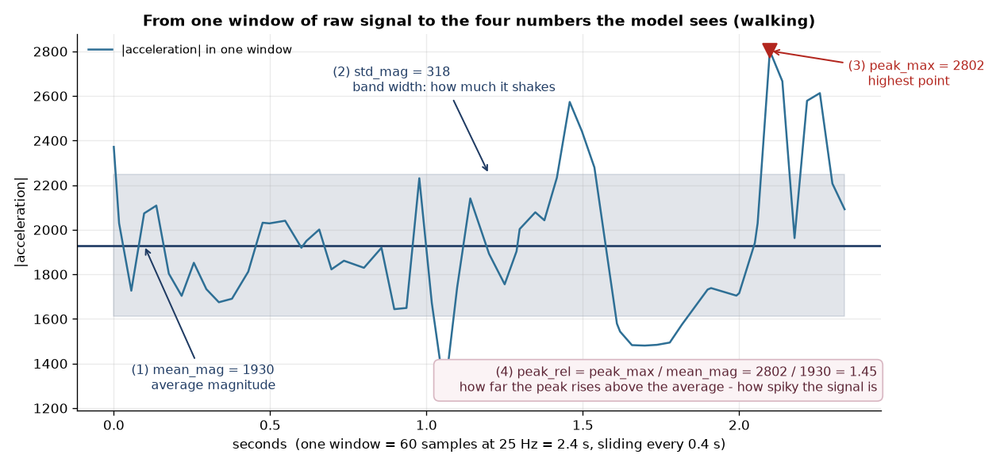
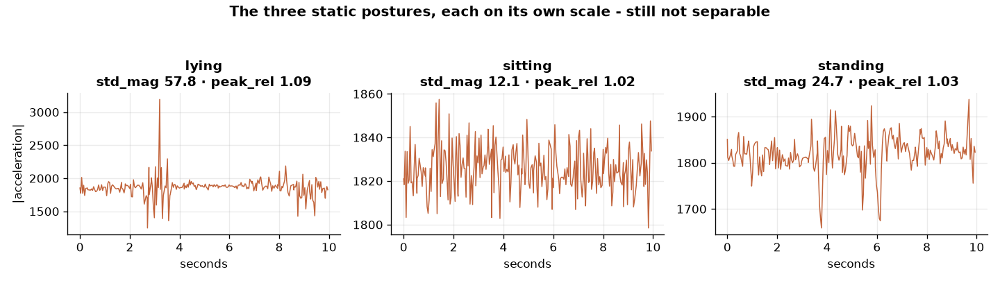
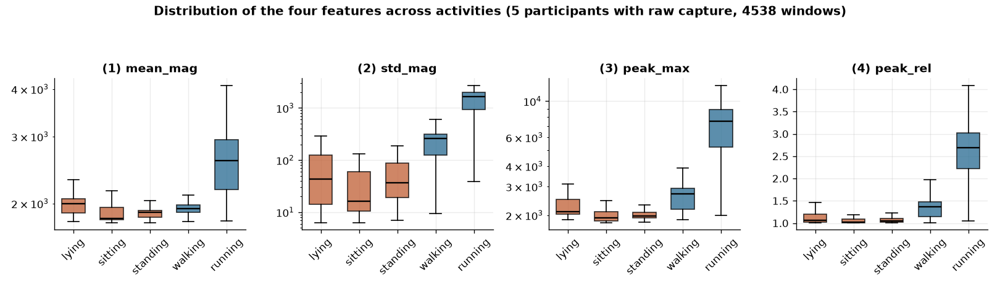
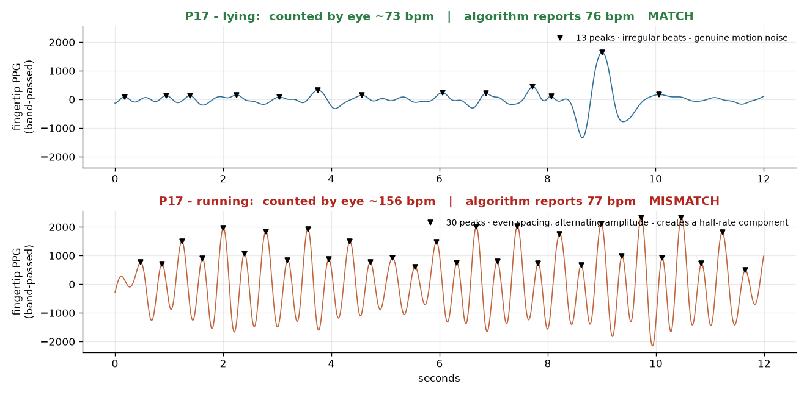
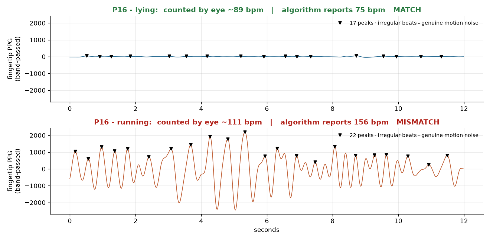
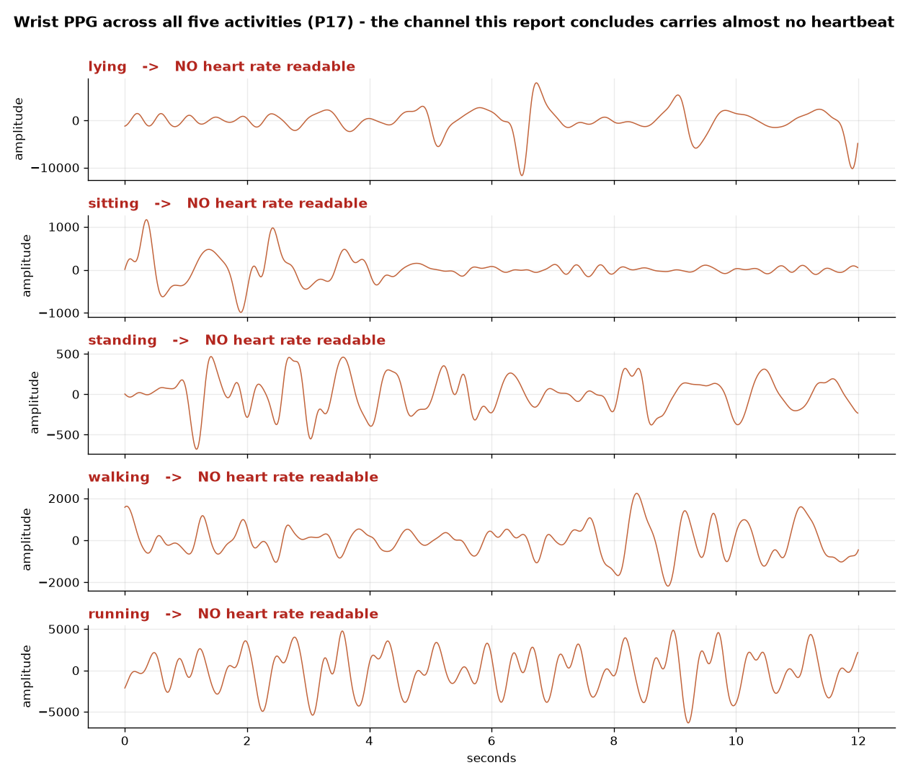
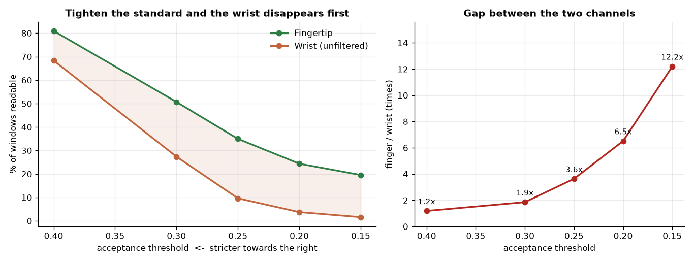

# A Wrist-Worn Device for Activity Recognition and Heart Rate Measurement: Root-Cause Analysis of Two Signal Processing Subsystems

**System engineering report — Wearable Activity & Health Monitor**

Hoang Nguyen Ngoc Giang · Phan Ngoc Quoc Duy · Tran Thanh Tung

---

## Abstract

This report describes how we designed, evaluated, and traced the root cause of failure in
two signal processing subsystems on a low-cost wrist-worn device (ESP32-S3 + MPU6050 +
MAX30102, running FreeRTOS): **Subsystem A**, an activity classifier built on the
accelerometer signal, and **Subsystem B**, a motion artifact filter for the PPG signal
used to measure heart rate.

In Subsystem A, a 5-class Decision Tree reached 54.8% accuracy under LOGO-CV, a
user-independent evaluation protocol, across 18 participants. The confusion matrix showed
that nearly all of the error sat inside one block of three static postures. We proved the
cause mathematically: all four features are functions of acceleration magnitude, and
magnitude is **invariant to rotation**. The only thing that separates the three static
postures is wrist orientation, and that information is erased at the feature extraction
step. Redefining the problem as 3 classes, to match what the sensor can physically
measure, raised accuracy to 85.3%.

In Subsystem B, comparing three adaptive filters (NLMS, RLS, Wiener) first gave MAE values
of 26.95 – 29.96 bpm, five to six times worse than the ANSI/AAMI EC13 clinical threshold.
Before drawing a conclusion, we checked the reference channel itself against a simple
physiological rule and found that it failed for 3 of the 5 participants. Tracing the
problem to the end, we found an **octave error** in the measurement layer, held in place
and hidden for weeks by a constraint that belonged to the smoothing layer. After
redesigning the estimator and repeating the measurement, the real result appeared: at
660/940 nm, the wrist PPG channel produces a valid heart rate in only **9.6%** of windows,
compared with 35.0% at the fingertip. The cause lies in the sensing layer — the wrong
optical wavelength for that anatomical site — not in the algorithms.

Placed side by side, the two subsystems failed through **the same mechanism**. In both
cases the information was lost at a layer *above* the layer we were optimising, and in
both cases the usual evaluation metrics did not detect the problem. Only a physical check
revealed it. From these two carefully validated negative results, the report draws four
design principles for embedded systems.

**Keywords:** Human Activity Recognition · Photoplethysmography · Motion Artifact
Cancellation · Rotation Invariance · Octave Error · LOGO-CV · Real-time embedded systems

---

## Table of Contents

**Chapter 1 — Introduction.** 1.1 Background and motivation · 1.2 Original commitments and research question · 1.3 Contributions · 1.4 Structure of this report

**Chapter 2 — System and Methodology.** 2.1 Device and firmware architecture · 2.2 Collection protocol and dataset · 2.3 Academic foundations · 2.4 Evaluation protocol and metrics

**Chapter 3 — Subsystem A: Activity Classification.** 3.1 Problem formulation · 3.2 Five-class results and structural error · 3.3 Root cause: the mathematics of magnitude · 3.4 Three improvement attempts that failed · 3.5 Redesign and fair evaluation

**Chapter 4 — Subsystem B: Wrist PPG Motion Artifact Removal.** 4.1 Problem formulation · 4.2 Initial results and clinical benchmark · 4.3 The physiological check · 4.4 Root cause: octave error · 4.5 Rebuilding the estimator · 4.6 Results after fixing the reference · 4.7 Root cause at the hardware layer

**Chapter 5 — Bringing the Two Subsystems Together.** 5.1 Integrated architecture · 5.2 Two failures, one mechanism · 5.3 Why the metrics did not catch it · 5.4 Comparison against the original proposal · 5.5 Four system boundaries

**Chapter 6 — Limitations and Roadmap**

**Chapter 7 — Conclusion**

**References · Appendix A: Reproducing the results · Appendix B: List of figures and tables**

---

# Chapter 1 — Introduction

## 1.1. Background and motivation

Commercial health wearables achieve high accuracy because of expensive optical hardware:
custom biomedical AFEs, multiple high-power green LEDs, several emitter-detector pairs,
and a strap design that controls contact pressure. That cost puts them out of reach for
most large-scale studies.

This project asks the opposite question: **how far can cheap, widely available hardware
combined with good signal processing close that gap?** The device is built around an
ESP32-S3 microcontroller running FreeRTOS, an MPU6050 motion sensor, and a MAX30102
optical sensor — roughly 20–30 USD in components, against 325–1690 USD for research-grade
devices.

The system is split into two subsystems that are technically independent but
architecturally linked:

- **Subsystem A — Activity recognition:** classifies the user's movement state from the
  3-axis accelerometer signal. Beyond its own value, it also acts as a context engine for
  the other subsystem.
- **Subsystem B — Heart rate measurement:** removes mechanical motion artifacts from the
  optical PPG signal at the wrist in order to extract a heart rate.

## 1.2. Original commitments and research question

The original proposal set out two quantitative commitments and one research question:

| Item | Commitment in the proposal |
| :--- | :--- |
| Activity classification | 5 classes (Lying/Sitting/Standing/Walking/Running), accuracy **≥ 85%** on users not seen during training |
| Heart rate | Real-time BPM values, accurate enough to be useful in practice |
| Research question | On ESP32-class hardware running FreeRTOS, which algorithm — LMS, RLS or Wiener — best removes motion artifacts from wrist PPG, and does the result reach clinically usable heart rate accuracy? |

*Table 1.1: The three quantitative commitments of the original proposal.*

This report compares the experimental results against those three commitments. That
includes the places where the results forced us to redefine the problem, and the places
where we found that the premise of the original question was itself wrong.

## 1.3. Contributions

1. **A mathematical and experimental proof of the structural limit of magnitude-based
   features** for classifying static postures on a wrist-worn device, together with an
   analysis of why three separate improvement attempts failed.
2. **The discovery and full root-cause analysis of an octave error** in the heart rate
   estimator used as the reference measurement — an error that silently distorted every
   filter comparison for weeks without any evaluation metric detecting it.
3. **A physiological sanity check** established as a low-cost procedure for verifying the
   integrity of reference data, applicable to any PPG study.
4. **A redesigned heart rate estimator** working in the time domain with a signal quality
   index, raising the share of participants that pass the physiological check from 40% to
   80%.
5. **A carefully validated negative result:** software adaptive filters cannot compensate
   for choosing the wrong optical wavelength at the hardware layer.
6. **Four design principles for embedded systems**, drawn from comparing how the two
   subsystems failed.

## 1.4. Structure of this report

Chapter 2 describes the device architecture, the collection protocol, and the academic
foundations shared by both subsystems. Chapters 3 and 4 present each subsystem
separately, both following the same thread: **measured result → warning sign → root cause
→ redesign → measure again**. Chapter 5 places the two side by side to draw out the shared
failure mechanism. Chapters 6 and 7 cover limitations, the roadmap, and conclusions.

---

# Chapter 2 — System and Methodology

## 2.1. Device and firmware architecture

The device is built around a **Seeed XIAO ESP32-S3** microcontroller running the
**FreeRTOS** real-time operating system, with a multi-task architecture that keeps
concerns separate: the sensor-reading tasks, the processing task, and the logging task
communicate only through queues, with no shared global variables. This design makes sure
that reading sensors at a fixed rate is never delayed by computation.

| Component | Configuration | Role in the system |
| :--- | :--- | :--- |
| Microcontroller | Seeed XIAO ESP32-S3, FreeRTOS | Reads sensors, extracts features, classifies on-chip |
| Motion sensor | MPU6050 — 3-axis accelerometer, I2C | Input for Subsystem A; noise reference for Subsystem B |
| Optical sensor (measurement) | MAX30102 on the back of the wrist, reflective mode, 940 nm LED | Main input for Subsystem B |
| Optical sensor (reference) | MAX30102 clipped to the fingertip, transmissive mode | Control channel for Subsystem B |
| Data storage | On-chip flash memory (LittleFS) | Records the whole session, independent of any wireless link |

*Table 2.1: Hardware configuration of the device.*

Writing data to on-chip flash instead of streaming it wirelessly in real time was a
deliberate architectural decision: it guarantees that the recorded data never depends on
link quality while the participant is moving.

## 2.2. Collection protocol and dataset

Each participant completes one continuous session made up of **five movement states in a
fixed order**, each lasting 1.5 minutes: Lying → Sitting → Standing → Walking → Running.
The activity label comes from the protocol timer, which means it is part of the
experimental design rather than the output of any model.

Between states there is a transition period for the participant to change posture. Data
windows that fall inside these transitions are marked and **excluded from all analysis**,
because during them the recorded label does not yet describe what the body is doing.

The two subsystems use two different subsets of the same dataset. This needs to be stated
clearly to avoid confusion when comparing numbers between the two chapters:

| Criterion | Subsystem A | Subsystem B |
| :--- | :--- | :--- |
| Participants | **18** | **5** (P02, P03, P04, P16, P17) |
| Requirement to be valid | Accelerometer signal plus protocol label | **All three** of wrist PPG, fingertip PPG and accelerometer |
| Reference label | Label from the protocol timer | Heart rate derived from the fingertip channel |
| Unit of analysis | 16,880 windows of 2.4 seconds | 935 windows of 8 seconds |

*Table 2.2: The two data subsets and why their sizes differ.*

This difference in sample size is not a collection oversight. It exists because **the two
subsystems depend on two fundamentally different kinds of reference signal**. A
participant missing fingertip PPG data is still perfectly valid for Subsystem A, because
the activity label comes from the experimental protocol; but that participant is unusable
for Subsystem B, which needs a physical signal as its standard of comparison.

## 2.3. Academic foundations

The experimental setup for both subsystems builds on five groups of foundational work:

| Work | What we take from it |
| :--- | :--- |
| Bao & Intille (2004); Ravi et al. (2005); Shoaib et al. (2014) | Show that the wrist has the highest orientation freedom and is the hardest place to tell static postures apart using an accelerometer alone |
| Zhang et al., the TROIKA framework (IEEE TBME, 2015) | Standardises wrist heart rate measurement combined with an accelerometer: 8-second windows, 2-second step, 0.7–3.5 Hz band, MAE as the metric |
| Tamura et al. (Electronics, 2014) | Analyses the difference between transmissive measurement at the fingertip and reflective measurement at the wrist; the basis for choosing an optical wavelength |
| ANSI/AAMI EC13:2002 | The clinical threshold for heart rate devices: error within ±5 bpm |
| Whipp & Ward (1990); ACSM Guidelines | Time the heart needs to adapt when the activity level changes (2–3 minutes) |

*Table 2.3: The five groups of academic foundations used in this report.*

## 2.4. Evaluation protocol and metrics

**LOGO-CV (Leave-One-Group-Out Cross-Validation)** — used for Subsystem A. This is the
standard way to evaluate an activity recognition system independently of the user.
Splitting rows at random would put neighbouring time windows from the same person into
both the training and the test set, which produces a falsely high accuracy. LOGO-CV
instead holds out **one entire participant** at a time as the test set. With 18
participants that is 18 rounds. The reported number is the real average performance on a
new user.

**MAE (Mean Absolute Error)** — used for Subsystem B. The average absolute difference in
bpm between the estimated and the reference heart rate. It is the required metric in the
TROIKA framework and the quantity for which ANSI/AAMI EC13 defines a threshold.

**Majority-class baseline** — used for a fair evaluation in Subsystem A. A model that
ignores the sensor completely and always predicts the most common class. Without this
reference point, an accuracy figure means nothing, because two problems with different
numbers of classes are not equally difficult.

**Signal yield rate** — used in Subsystem B. Before discussing error, the first question
to answer is: out of all the time windows, in what share of them does the sensor actually
record a pulse waveform clear enough to read a valid heart rate from? A filter with a low
error on 5% of windows has not solved the problem.
---

# Chapter 3 — Subsystem A: Activity Classification

## 3.1. Problem formulation

Subsystem A is the real-time activity classifier (Human Activity Recognition, HAR) on the
wrist device:

- **Input:** 3-axis acceleration (ax, ay, az) from the MPU6050 worn on the wrist —
  sampled at 25 Hz, with a 2.4-second sliding window and a 0.4-second step.
- **Output:** the user's movement state — originally 5 classes: Lying, Sitting, Standing,
  Walking, Running.
- **Engineering goal and embedded constraints:** build a very light Decision Tree
  (`max_depth = 5`) that can run directly on the ESP32 with limited RAM, serving as a
  context engine for the embedded system.

| Component | Configuration | Reason for the choice |
| :--- | :--- | :--- |
| Sampling rate | 25 Hz (`IMU_HZ = 25`) | Covers the human step frequency band (1.0 – 3.5 Hz) while saving as much battery as possible |
| Window size | 2.4 seconds (60 samples) | Contains at least 2–3 full gait cycles when walking or running |
| Step size | 0.4 seconds (10 samples, 83.3% overlap) | Gives smooth real-time feedback for display |
| Classifier | `DecisionTreeClassifier(max_depth=5, min_samples_leaf=5)` | Very low compute cost — only a few IF-ELSE comparisons on the microcontroller |
| Evaluation protocol | LOGO-CV over 18 participants (18 folds) | Measures how well it generalises to a new user |

*Table 3.1: Experimental configuration for Subsystem A.*

## 3.2. Five-class results and structural error

Training the 5-class Decision Tree on the four magnitude features gives an average
accuracy of **54.8% (0.548)**.

| Class (5-class) | Measured recall | Comparison with the literature |
| :--- | :--- | :--- |
| Lying | 0.284 (28.4%) | Very low — close to the 20% random guess; matches the limit reported by Bao & Intille (2004) |
| Sitting | 0.469 (46.9%) | Moderate — heavily confused with Standing |
| Standing | 0.551 (55.1%) | Moderate — heavily confused with Sitting |
| Walking | 0.646 (64.6%) | Good — clearly separated from the static group |
| Running | 0.782 (78.2%) | Very good — fully separated thanks to its large amplitude |
| **Mean accuracy** | **0.548 (54.8%)** | Matches the known limit of a single wrist accelerometer (Bao & Intille, 2004) |

*Table 3.2: Per-class recall of the 5-class model under LOGO-CV.*

Confusion matrix over 16,880 real data windows (rows = true label, columns = predicted):

| True \ Predicted | Lying | Sitting | Standing | Walking | Running |
| :--- | ---: | ---: | ---: | ---: | ---: |
| Lying | **957** | 580 | 1517 | 283 | 36 |
| Sitting | 881 | **1583** | 800 | 95 | 15 |
| Standing | 666 | 708 | **1860** | 116 | 23 |
| Walking | 256 | 334 | 456 | **2181** | 147 |
| Running | 131 | 51 | 151 | 406 | **2647** |

*Table 3.3: Confusion matrix of the 5-class model. Bold cells are correct predictions.*

> **A STRUCTURAL ERROR, NOT A RANDOM ONE**
> **1.** Every serious misclassification sits inside the 3×3 block in the top-left corner:
> Lying, Sitting and Standing are confused with each other — **1,517 Lying windows are
> predicted as Standing**.
> **2.** The boundary between the static group and the moving group, on the other hand, is
> very clear: a static state is rarely predicted as Walking or Running.
> **3.** Conclusion: the model is not making random mistakes. It is making a **structural,
> physical** one — it is completely unable to tell the three static postures apart.

## 3.3. Root cause: the mathematics of magnitude

### 3.3.1. What do the four features actually measure?

Within each 2.4-second window (60 samples), the combined acceleration series
`mag(t) = √(ax² + ay² + az²)` is reduced to four feature values:

| Feature | Formula and what it measures | Meaning for activity recognition |
| :--- | :--- | :--- |
| `mean_mag` | Average magnitude: (1/N) · Σ mag(t) | The baseline acceleration level — when still, always about 1g, which is gravity |
| `std_mag` | Standard deviation: σ(mag) | How much the arm shakes or vibrates |
| `peak_max` | Largest value in the window: max(mag) | The strongest impact or arm swing |
| `peak_rel` | Peak over average: peak_max / mean_mag | How spiky the signal is — better suited to fall detection than to posture |

*Table 3.4: Definition and meaning of the four features.*

### 3.3.2. How the four features are distributed across the dataset

Median values of the four features over 4,538 real windows (the 5 participants with full
raw capture):

| Activity | `mean_mag` | `std_mag` | `peak_max` | `peak_rel` |
| :--- | ---: | ---: | ---: | ---: |
| Lying | 2000.40 | 42.84 | 2093.68 | 1.07 |
| Sitting | 1828.01 | 16.04 | 1928.99 | 1.02 |
| Standing | 1896.03 | 36.61 | 1972.90 | 1.05 |
| Walking | 1937.09 | 260.17 | 2693.15 | 1.37 |
| Running | 2589.27 | 1639.95 | 7504.38 | 2.69 |

*Table 3.5: Median of the four features by activity, over 4,538 windows.*

Reading the table column by column makes the problem clear. The first three rows — the
three classes the model confuses most — have almost identical sets of four numbers:
`peak_rel` is 1.07 / 1.02 / 1.05, and `mean_mag` is around 1900 for all of them. To the
model, **those three postures are the same point** in feature space.

There is something even more striking. The `mean_mag` of Walking is 1937, which sits
**between** Lying (2000) and Standing (1896). So this feature on its own cannot even
separate Walking from the static group. All of the separating power in this feature set
comes from measuring *how much the signal varies*, not *how large it is*.

### 3.3.3. The physical mechanism: rotation invariance

**The geometry.** Magnitude is computed as `mag = √(ax² + ay² + az²)`. This is the
geometric length (the Euclidean norm) of the 3-dimensional acceleration vector. When the
wearer rotates their wrist, turns their hand over, or changes between lying, sitting and
standing, the gravity vector changes how it projects onto the ax, ay and az axes. But the
total length `√(ax² + ay² + az²)` always stays equal to 1g — the strength of the Earth's
gravitational acceleration.

The direct numerical evidence is already in Table 3.5. The `mean_mag` of Lying, Sitting,
Standing and even Walking is 2000, 1828, 1896 and 1937 — four completely different body
positions, yet almost the same average acceleration, all close to 1g. In those states the
sensor is only measuring **gravity**, and gravity does not change length no matter where
the wrist points.

| Activity | Median `std_mag` | Spread (std of `std_mag`) |
| :--- | ---: | :--- |
| Sitting | 17.6 | 65.6 — spread is 3.7 times the median |
| Standing | 25.3 | 64.8 — spread is 2.5 times the median |
| Lying | 31.9 | 95.5 — spread is 3.0 times the median |
| Walking | 269.1 | 157.4 — fully separated from the static group |
| Running | 1410.2 | 662.0 — fully separated from Walking |

*Table 3.6: Median and spread of `std_mag`, from `check_accel_variance_by_activity.py`.*

**Overlapping distributions.** The three static postures have median `std_mag` values
between 17.6 and 31.9, but the spread within each class reaches 65–95. This means the
three distributions sit almost entirely on top of each other — there is no threshold that
can separate them. By contrast, the jump from the static group (23.3) to Walking (269.1)
is 11.5 times, and from Walking to Running (1410.2) another 5.2 times, which is why the
Decision Tree classifies those extremely well.

## 3.4. Three improvement attempts that failed

**Attempt 1 — Raw device-frame axes.** *Idea:* use the raw ax, ay, az values directly to
detect how the device is tilted. *Result:* 68.2% accuracy at N = 4, but only 46.8% for
participant P03. *Root cause:* the **wearing-angle confound** — each person wears the
watch at a slightly different fixed angle, so a model that learns one person's angle is
badly wrong when applied to somebody else.

**Attempt 2 — Baseline-relative normalisation.** *Idea:* use each person's own lying-still
posture as their personal zero reference. *Why it failed:* the protocol only allows 90
seconds per state, which is not enough time for the body to settle into a stable resting
state.

**Attempt 3 — Rotation augmentation.** *Idea:* rotate the existing data synthetically to
create more variety. *Why it failed:* participants always kept their arm either down or
horizontal, so the rotation happens mostly between the x and y axes while the vertical z
axis barely changes. Rotating synthetically around an axis that does not vary adds no new
information.

## 3.5. Redesign and fair evaluation

Given the root cause proved in Section 3.3, the correct engineering response is to
**redefine the problem to match what the sensor can physically measure**: merge the three
static classes into one (Stationary), turning a 5-class problem into a 3-class one
(Stationary / Walking / Running).

| Class (3-class) | Measured recall | Assessment |
| :--- | ---: | :--- |
| Stationary (Lying/Sitting/Standing) | 0.951 (95.1%) | Excellent — nearly perfect detection of the resting state |
| Walking | 0.632 (63.2%) | Good — stable |
| Running | 0.777 (77.7%) | Very good — stable |
| **Mean accuracy** | **0.853 (85.3%)** | Good enough for a real-time context engine |

*Table 3.7: Per-class recall of the 3-class model, same model and same LOGO-CV protocol.*

To avoid mistaking the rise from 54.8% to 85.3% (+30.5%) for a smarter algorithm, we
compare both problems against a baseline model that always predicts the most common class:

| Problem | Majority baseline | LOGO-CV accuracy | Real margin over baseline |
| :--- | ---: | ---: | :--- |
| 5-class (balanced classes) | 0.201 (≈ 1/5) | 0.548 | **+0.347** — 2.7 times the baseline |
| 3-class (Stationary is 60%) | 0.599 (≈ 3/5) | 0.853 | **+0.254** — 1.4 times the baseline |

*Table 3.8: Comparison against each problem's own majority-class baseline.*

> **AN HONEST QUANTITATIVE ASSESSMENT**
> **1.** Merging classes creates a 3-class problem in which Stationary alone covers 59.9%
> of all data rows. So part of the rise from 0.548 to 0.853 comes from **the problem
> becoming structurally easier**, not purely from the model learning better.
> **2.** The fair measure is the margin over each problem's own baseline: +34.7% for the
> 5-class problem, but +25.4% for the 3-class one.
> **3.** Even though the learned margin is smaller, a 3-class model with 85.3% accuracy
> and 95.1% recall on Stationary is genuinely reliable enough for real use.

**What this report does not claim:** merging classes does **not** make the model able to
tell Lying, Sitting and Standing apart. That information is still lost. The problem has
simply been redefined to match what the current hardware can actually measure.

---

# Chapter 4 — Subsystem B: Wrist PPG Motion Artifact Removal

## 4.1. Problem formulation

- **Input:** the raw PPG signal from the back of the wrist, mixed with mechanical motion
  noise, together with the 3-axis accelerometer signal.
- **Output:** a real-time heart rate value (BPM) with the noise removed.
- **Motivation and research hypothesis:** high-end commercial wearables use expensive
  optical hardware — custom AFEs, multiple high-power green LEDs — to meet the ANSI/AAMI
  EC13 clinical standard (MAE ≤ 5 bpm). This study tests the hypothesis: *can cheap,
  widely available hardware (MAX30102 + ESP32/FreeRTOS) combined with adaptive filters
  make up for the hardware and still reach clinical accuracy?*

**What the three filters have in common.** All three are based on the same subtraction
equation: `ŝ(n) = d(n) − v̂(n)`. Here `d(n)` is the raw wrist signal (the true pulse wave
plus motion noise), `v̂(n)` is the noise waveform the algorithm estimates from the
accelerometer, and `ŝ(n)` is the clean heart rate signal left after subtraction. The three
filters differ only in how they estimate `v̂(n)`:

| Filter | How it estimates the noise | Behaviour on the ESP32 |
| :--- | :--- | :--- |
| **NLMS** (Normalized Least Mean Squares) | Adjusts its correction weights one step at a time, in real time | Lightest, uses least RAM |
| **RLS** (Recursive Least Squares) | Combines the entire accumulated error history so far | Reacts faster to changes in movement, but costs more computation |
| **Wiener filter** | Takes the whole block of data at once and computes a single statistically optimal filter | A batch filter, not recursively adaptive |

*Table 4.1: The three adaptive filters compared.*

| Component | Configuration | Basis for the choice |
| :--- | :--- | :--- |
| Main channel (wrist) | MAX30102 on the back of the wrist, reflective mode, 940 nm infrared LED | The back of the wrist is the standard position for wearables (Zhang et al., 2015; Tamura et al., 2014) |
| Reference channel | MAX30102 clipped to the fingertip, transmissive mode | The fingertip has dense capillaries; transmissive measurement is the least distorted form of PPG (Tamura et al., 2014) |
| Noise reference signal | Magnitude of 3-axis acceleration: √(x² + y² + z²) | Motion noise in PPG correlates directly with wrist acceleration (Zhang et al., 2015) |
| Bandpass filter | 0.7 – 3.5 Hz (that is, 42 – 210 bpm) | The physiological range of human heart rate from rest to maximum effort (Zhang et al., 2015) |
| Filters compared | Baseline (no filtering), NLMS, RLS, Wiener — all fixed at 8 taps | A balance between processing delay and available computation on the ESP32 |
| Processing window | 8 seconds long, 2-second step | The standard specification in the TROIKA framework (Zhang et al., 2015) |

*Table 4.2: Experimental configuration for Subsystem B.*

The figure below shows all four signals that enter the pipeline over the same stretch of
time, so the reader can see the real quality of each channel before looking at any
numbers.

## 4.2. Initial results and clinical benchmark

We use the mean absolute error, `MAE = (1/N) · Σ |HR_estimated − HR_reference|`. MAE is
chosen because it directly reports the average heart rate deviation in bpm, which is easy
to interpret, and because it is the required metric both in the TROIKA framework and in
the ANSI/AAMI EC13 clinical standard.

| Filter | Measured MAE | Expected (Zhang et al., 2015) | Against ANSI/AAMI EC13 |
| :--- | ---: | :--- | :--- |
| Baseline (no filtering) | 26.95 bpm | — | Fails — more than 500% over the limit |
| NLMS | 26.96 bpm | 2.0 – 5.0 bpm | Fails — worse than doing nothing |
| RLS | 29.83 bpm | 1.5 – 3.5 bpm | Fails — 2.88 bpm worse than baseline |
| Wiener filter | 29.96 bpm | 2.0 – 4.0 bpm | Fails — 3.01 bpm worse than baseline |

*Table 4.3: First-round MAE results, measured against a reference that had not yet been verified.*

The ANSI/AAMI EC13:2002 standard requires a heart rate device to stay within ±5 bpm. Our
measured results (26.95 – 29.96 bpm) are **five to six times** over that limit, and the
adaptive filters actually made things worse than no filtering at all.

## 4.3. The physiological check and a limit in the protocol

Before concluding that the algorithms were useless, we checked the fingertip *reference*
itself against a basic physiological rule: **heart rate while running must be clearly
higher than heart rate while lying still.**

| Participant | Lying (bpm) | Standing (bpm) | Running (bpm) | Difference (Running − Lying) |
| :--- | ---: | ---: | ---: | :--- |
| P02 | 61.2 | 127.7 | 89.7 | +28.5 — **implausible:** Standing > Running |
| P03 | 76.4 | 74.8 | 133.8 | +57.5 — plausible |
| P04 | 62.8 | 72.6 | 69.5 | +6.7 — **implausible:** almost no increase |
| P16 | 74.9 | 76.4 | 155.8 | +80.9 — plausible |
| P17 | 76.0 | 75.3 | 77.0 | +1.0 — **implausible:** exactly one beat higher |

*Table 4.4: The physiological check applied to the fingertip reference channel.*

> **RE-EXAMINING THE REFERENCE, AND A LIMIT IN THE PROTOCOL**
> **1.** We had assumed that measuring PPG at the fingertip would always give a perfect
> ground truth. The results show that this channel **fails the check for 3 of 5 people**
> (P02, P04, P17).
> **2.** Part of the cause is physiological adaptation time: each movement state lasted
> only 1.5 minutes.
> **3.** From the literature (Whipp & Ward, 1990; ACSM Guidelines): when moving from rest
> to exercise, the heart needs **2–3 minutes** to reach a steady state, and measuring a
> true resting heart rate requires 5–10 minutes of sitting quietly. Changing activity
> every 90 seconds keeps the heart rate permanently in transition, and shaking of the
> finger while running distorts the reference signal further.

**The direct consequence:** all four MAE values in Table 4.3 were measured with a bent
ruler. They cannot answer the research question in either direction.

## 4.4. Root cause: waveform analysis and octave error

### 4.4.1. Why examine participant P17 in detail?

In Table 4.4, P17 is the most obviously impossible case: 76.0 bpm while lying at rest, and
after 1.5 minutes of hard running the device reports 77.0 bpm — one beat higher. We chose
P17 in order to examine the waveform directly and separate **two possibilities that lead
to completely different conclusions**: had the fingertip clip come loose or failed, or had
the software misread the waveform?

**What an octave error is.** An *octave error* is when an algorithm reads the fundamental
frequency as half (1/2×) or double (2×) its true value. For heart rate, this means a true
156 bpm being read as 78 bpm. We had to solve this, because if the underlying heart rate
algorithm is off by a factor of two, then every filter comparison built on top of it is
meaningless.

**What the waveform tells us: the sensor is fine, the algorithm is not.**

### 4.4.2. Counting heart rate by hand, and the match/mismatch criteria

To check independently of the computer, we counted the pulse peaks directly on the raw
waveform over t = 12 seconds:

- Simple average: `HR (bpm) = (number of peaks / duration in seconds) × 60`.
  For P17 while running: HR = (30 peaks / 12 seconds) × 60 = **150.0 bpm**.
- More precisely, using the average time between two consecutive peaks
  (`RR_interval` = 0.386 s): `HR = 60 / RR_interval` = 60 / 0.386 ≈ **155.6 bpm**.

**Match / mismatch criteria,** following the ANSI/AAMI EC13 standard:

- **MATCH:** the algorithm and the hand count differ by ≤ 5 bpm. Example: P17 while lying
  — 73 bpm by hand, 76 bpm from the algorithm, a 3 bpm difference.
- **MISMATCH:** a difference above 10 bpm, or a difference that is a clean half or double.
  Example: P17 while running — 155.6 bpm by hand, 77.0 bpm from the algorithm, a 78.6 bpm
  difference (50.5% error).

### 4.4.3. What the measurements on P17 tell us

| Measurement on P17 | Value | What it means about the pulse waveform |
| :--- | ---: | :--- |
| Time between consecutive peaks (inter-beat interval) | 0.386 s ± 0.017 s | An extremely small standard deviation (coefficient of variation ≈ 4.4%). The heart is beating very regularly and **the hardware is capturing the real pulse perfectly** — it is neither broken nor loose |
| Ratio of odd to even gaps | 1.03 | A normal pulse wave can have a small secondary bump (a dicrotic notch). If the algorithm were catching those, the gaps would alternate long–short–long–short. A ratio of 1.03 proves the gaps are all equal, so **every peak is a real heartbeat** |
| Ratio of odd to even peak amplitude | 2.22 | The peak height alternates high–low–high–low, because blood pressure surges against the vessel wall with each running step |

*Table 4.5: Three measurements taken directly from P17's waveform, used to rule out the dicrotic notch explanation.*

**The physical mechanism behind the error.** A frequency analysis (FFT) looks for the
repeating cycle in a signal. Faced with a pulse train whose amplitudes go [high, low,
high, low], the FFT sees that the full pattern only repeats **every two heartbeats**. The
strongest energy peak therefore appears at exactly half the true heart rate. The
peak-picking algorithm locked onto that half-rate component, which is why the device
reported 77.0 bpm instead of 155.6 bpm.

### 4.4.4. Why the error survived for weeks undetected

| Layer | Designed job | Input → Output |
| :--- | :--- | :--- |
| **Measurement layer** | From 8 seconds of raw PPG, extract an instantaneous heart rate | Waveform → one BPM number |
| **Tracking layer** | From a sequence of heart rates over time, remove impossible jumps | Sequence of BPM → smoothed sequence |

*Table 4.6: The two separate processing layers in the heart rate pipeline.*

The `MAX_JUMP_BPM = 25` constraint belongs to the **tracking layer**, but the octave error
happens in the **measurement layer**. When the measurement layer keeps producing the
sequence [77, 77, 77, …], which is perfectly consistent, the tracking layer trusts it
completely. And when the measurement layer occasionally catches the true 156 bpm, the
tracking layer rejects it as a jump of more than 25 bpm. **The system actively protected
the wrong number.**

> **AN ARCHITECTURAL LESSON**
> A smoothing filter (including a Kalman filter) can only remove **random noise**. It
> cannot remove **systematic bias**. Faced with a systematic error, a smoother will follow
> the wrong value smoothly, which makes the wrong number look highly trustworthy.
> **The rule:** the tracking layer may only smooth the displayed trajectory. It must never
> be allowed to overwrite or hide the original data from the measurement layer.

## 4.5. Rebuilding the estimator and verifying it (Estimator v2)

Based on the findings in Section 4.4, we rebuilt the heart rate extraction module,
`hr_estimator_v2.py`, replacing the old FFT peak-picking method with three principles:

- **Move to a time-domain median interval.** Instead of relying on an FFT spectrum that is
  easily fooled by harmonics, the new algorithm detects the systolic peaks directly within
  the 8-second window and measures the time between each consecutive pair. The heart rate
  is the **median** of those intervals: `HR = 60 / median(RR_intervals)`. Taking the median
  makes the result completely immune to the alternating high–low peak amplitudes, and to
  odd peaks caused by brief movements.
- **Judge signal quality and refuse bad data (a signal quality index).** The algorithm
  computes the coefficient of variation of the beat intervals: `CV = σ_RR / μ_RR`.
  Physiologically, a human heart beats very steadily over 8 seconds (CV is usually below
  0.10). If CV exceeds 0.25, the algorithm immediately returns **"no readable heart rate"
  (NaN)** instead of guessing a junk number as version 1 did.
- **Remove the artificial continuity constraint between windows entirely,** giving the
  measurement layer back its independence.

| Verification case | Estimator v1 (old) | Estimator v2 (new) | Counted by hand and assessed |
| :--- | ---: | ---: | :--- |
| P17 running (halving error) | 77.0 bpm — off by 78.6 | **156.9 bpm** | 155.6 bpm — matches EC13, off by 1.3 bpm |
| P16 running (doubling error) | 155.8 bpm — off by 44.5 | **118.9 bpm** | 111.3 bpm — matches EC13, off by 7.6 bpm |
| Participants passing the sanity check | 2 / 5 (40%) | **4 / 5 (80%)** | Physiological reliability doubled |

*Table 4.7: Verifying Estimator v2 against manual peak counting.*

Both control cases show that Estimator v2 corrects the error **in both directions**: P17
was being read as half, P16 as double. This confirms that v2 works from the real physics
of the pulse wave, rather than being a one-directional adjustment that happened to land
close.

## 4.6. Results after fixing the reference

The whole comparison pipeline was run again on all 5 participants using Estimator v2. The
configuration of the three filters, the 8-tap setting and the accelerometer reference were
**left completely unchanged**.

### 4.6.1. Signal yield rate

| Signal and processing | Share of windows with a valid heart rate |
| :--- | ---: |
| Fingertip (transmissive reference channel) | **35.0%** |
| Wrist — baseline (no filtering) | **9.6%** |
| Wrist + NLMS | 8.0% |
| Wrist + RLS | 5.5% |
| Wrist + Wiener | 12.7% |

*Table 4.8: Signal yield rate for each channel and filter configuration.*

To compare the 9.6% figure against visual evidence, the raw wrist waveform is shown across
all five activities. None of them produces a beat sequence regular enough for the
estimator to accept — **not even while the participant is lying completely still**, which
is the lowest possible motion noise condition.

To check whether this conclusion depends on the chosen CV = 0.25 threshold, we swept the
whole range from loose to very strict:

| Acceptance threshold (CV) | Fingertip | Wrist | Ratio |
| :--- | ---: | ---: | ---: |
| CV ≤ 0.40 (loose) | 81.0% | 68.3% | 1.2× |
| CV ≤ 0.30 | 50.7% | 27.4% | 1.9× |
| CV ≤ 0.25 (physiological) | 35.0% | 9.6% | 3.6× |
| CV ≤ 0.20 | 24.4% | 3.7% | 6.5× |
| CV ≤ 0.15 (strict) | 19.6% | **1.6%** | **12.2×** |

*Table 4.9: Sweeping the acceptance threshold — the conclusion does not depend on one specific cut-off.*

The sweep confirms the point: the more we require the signal to carry the actual rhythmic
character of a heartbeat, the closer the wrist yield falls towards zero.

### 4.6.2. Filtering error, and why the filters make things worse

On the rare windows where both the fingertip and the wrist channel produced a valid heart
rate:

| Filter | Measured MAE | Windows available for comparison |
| :--- | ---: | ---: |
| Baseline (no filtering) | 16.38 bpm | 29 |
| Wiener filter | 21.44 bpm | 38 |
| NLMS | 47.27 bpm | 32 |
| RLS | 58.28 bpm | 19 |

*Table 4.10: MAE after fixing the reference. Note the very small sample sizes in the right column.*

> **WHY THE FILTERS ACTIVELY HURT**
> **1.** An adaptive filter uses the accelerometer signal to find correlated components
> inside the PPG signal, then subtracts them.
> **2.** When the wrist PPG has an extremely low signal-to-noise ratio — motion noise
> dominating, the cardiac wave close to zero — then almost **all** of the energy in the
> PPG signal correlates with arm movement.
> **3.** The mathematically optimal solution for the filter is therefore to subtract
> essentially the entire input, wiping out the weak remaining heartbeat along with it. The
> Wiener filter does less damage than NLMS and RLS because it is a batch filter and does
> not adapt recursively step by step.
> **4. Statistical warning:** only 19 – 38 windows were available for comparison. **The
> most important number in this study is the signal yield rate (below 10%), not the MAE
> ranking.**

## 4.7. Root cause at the hardware layer

The original proposal chose the MAX30102 sensor with its 660 nm (red) and 940 nm
(infrared) wavelengths, worn on the back of the wrist in reflective mode.

| Wavelength | Absorption by haemoglobin | Best anatomical use (Tamura et al., 2014) |
| :--- | :--- | :--- |
| ~525 nm (green) | **Very high** — the optical absorption peak | Reflective measurement on the back of the wrist (shallow capillaries) — what commercial smartwatches use |
| 660 nm (red) | Low | SpO2, transmissive measurement at the fingertip |
| 940 nm (infrared) | Low | SpO2, transmissive measurement at the fingertip |

*Table 4.11: Optical absorption and the anatomical site each wavelength suits.*

**The optical biology and the anatomy of the wrist.** Anatomically, the back of the wrist
has a far lower density of shallow blood vessels than the fingertip. Red light (660 nm)
and infrared light (940 nm) penetrate deeply but are absorbed very poorly by the blood in
shallow capillaries. Most of the light reflected back to the sensor therefore comes from
deep tissue, tendon and bone. When the user moves their arm, muscle contraction and tendon
movement create large mechanical distortions that overwhelm the already weak pulse
signal. This is why every commercial wearable uses green LEDs (~525 nm) to measure at the
wrist.

> **THE KEY HARDWARE CONCLUSION**
> A classic lesson in biomedical hardware design: **"the right sensor at the wrong
> anatomical site."** The wrist position is not the mistake — the mistake is the choice of
> optical wavelength.
> **The golden rule for biomedical embedded systems:** no software algorithm can recover a
> signal that the hardware front-end never captured in the first place.
---

# Chapter 5 — Bringing the Two Subsystems Together

The previous two chapters treated Subsystem A and Subsystem B as separate engineering
problems. This chapter places them side by side, and that is where things appear which
neither report could show on its own.

## 5.1. Integrated architecture: Subsystem A drives Subsystem B

In the overall device architecture, Subsystem A is not only a standalone classifier. It
also acts as the **context engine** that decides what Subsystem B does:

- **When Subsystem A detects STATIONARY** (95.1% recall): the system tells Subsystem B to
  **switch off** the adaptive filter. This gives two important benefits: (1) it saves
  computation and battery on the ESP32; and (2) it **avoids the filter wiping out the real
  cardiac signal**, which Section 4.6.2 demonstrated quantitatively.
- **When Subsystem A detects WALKING or RUNNING:** only then does the system activate the
  preprocessing chain and the motion artifact removal that matches the arm swing.

One architectural detail is worth noting. The `stationary` class was created as a
**workaround** for the sensor's limits in Section 3.5 — and it turns out to be the class
with the highest recall (95.1%), and exactly the class Subsystem B most needs to identify
correctly. A limitation in one subsystem became precisely what the other subsystem needed.
Together they form a context-aware embedded system that is efficient with power.

## 5.2. Two failures, one mechanism

On the surface, the two subsystems failed for entirely different reasons: one is about the
mathematics of vector length, the other about how haemoglobin absorbs light. But laid out
by architectural layer, they line up exactly:

| | Subsystem A | Subsystem B |
| :--- | :--- | :--- |
| What information was needed | Wrist orientation relative to gravity | Blood volume changes in the capillaries |
| **Which layer lost it** | **Feature extraction** — magnitude erases orientation | **Signal acquisition** — wrong optical wavelength |
| Which layer we were optimising | The model (hyperparameters, tree structure) | The filtering algorithm (NLMS/RLS/Wiener) |
| Distance between the two layers | The model sits **below** feature extraction | The filter sits **below** signal acquisition |
| Result of optimising the lower layer | No improvement (all three attempts failed) | No improvement, and in fact made things worse |

*Table 5.1: The failure mechanism of both subsystems, compared by architectural layer.*

> **THE GENERAL PRINCIPLE**
> In both cases, **the information was lost at a layer above the one we were optimising.**
> No amount of sophistication at a lower layer can recover information that was erased
> higher up. A filter *separates* signal from noise — it does not *create* signal. A model
> *learns* the relationship between features and labels — it does not *recover* a quantity
> that the features never measured.

The practical consequence is very concrete: all three improvement attempts in Section 3.4
and all three filters in Section 4.6 were **effort spent at the wrong layer**. They did
not fail because they were implemented badly. They failed because the problem they were
aimed at does not live at that layer.

## 5.3. Why the metrics did not catch it

The second thing the two subsystems share is more troubling from a methodological point of
view: **in both cases, the standard evaluation metrics failed to reveal the problem.**

| | What the metric said | What was actually happening | What did reveal it |
| :--- | :--- | :--- | :--- |
| Subsystem A | "54.8% accuracy — a mediocre model" | The feature set is completely blind to three classes | Breaking recall down per class, plus a mathematical argument about invariance |
| Subsystem B | "MAE around 27 bpm — the filters are useless" | The reference measurement was off by half | The physiological check, plus counting peaks by hand on the raw waveform |

*Table 5.2: Evaluation metrics and the limits of what they can detect.*

An accuracy of 54.8% looks exactly like "the model needs more work" — a situation where
the right response is more tuning. Only by breaking the recall down per class and seeing
that the error sits **entirely** inside one 3×3 block does the structural nature of the
problem appear. In the same way, an MAE of 27 bpm looks exactly like "the filter is not
good enough", when in reality the ruler used to measure it was bent.

Both errors were **numerically consistent**. The sequence [77, 77, 77, …] is very steady.
The confusion matrix is very stable across 18 LOGO-CV folds. That consistency is exactly
what let them pass every automated check: those checks verify whether the data **agrees
with itself**, not whether the data **agrees with physical reality**.

> **A METHOD LESSON: A PHYSICAL CHECK IS CHEAPER THAN A METRIC**
> The two tests that found both errors were extremely simple and took under 15 minutes
> each:
> **1.** *"Is this quantity invariant to rotation?"* — a three-line mathematical argument.
> **2.** *"Is the heart rate higher when running than when lying down?"* — a comparison of
> two numbers.
> Neither test lives inside any automated evaluation pipeline, and both found problems that
> hundreds of hours of metric computation did not. **The principle: before building a
> processing architecture on top of a signal, spend a few minutes confirming that the
> signal really contains what you think it contains.**

The project also recorded a third instance of the same kind of error, in data collection:
six sessions once passed every file-level check — the right number of labels, the right
number of rows, no errors in the log — while the device was in fact sitting on a table
with nobody wearing it. They were only found when the raw waveform was plotted and
compared against physical expectation. Three times, the same kind of mistake: **trusting a
representation of reality instead of checking reality itself.**

## 5.4. Comparison against the original proposal

The table below compares the three commitments from Table 1.1 against the experimental
results. The full 14-item comparison is presented in a separate document, *Proposal versus
Reality*.

| Commitment | Result | Status |
| :--- | :--- | :--- |
| 5-class classification, ≥ 85% on new users | 5-class reached 54.8%; after restructuring to 3 classes, 85.3% | **Conditionally met** — the 85% threshold is reached, but on a narrower problem, with a mathematical justification |
| Usable real-time BPM | Signal yield 9.6%; MAE far above the ANSI/AAMI EC13 threshold | **Not met** — the cause has been traced to the hardware layer |
| Research question: which filter is best | The premise does not hold: there is no pulse wave to clean | **Answered, but in a different direction** |

*Table 5.3: Condensed comparison against the three proposal commitments.*

Two deviations stand out methodologically:

**The missing gyroscope channel.** The proposal's input table clearly states that the
MPU6050 provides *3-axis acceleration **plus** a 3-axis gyroscope*. In practice the
gyroscope channel was never read. What makes this notable is that the analysis in Chapter
3 — carried out completely independently, not as an audit of the proposal — concluded that
**the absence of exactly that channel is the core limitation** preventing the three static
postures from being separated. This is a rare case where the cost of an implementation
oversight is **quantitatively measured** by the study itself.

**An unverified assumption about the reference channel.** The proposal describes the
fingertip channel as *"clean ground truth, minimal motion artifact"*. That was an
**assumption**, not a measurement, and it was never tested until Section 4.3 — by which
point the entire data collection design was already fixed.

## 5.5. Four system boundaries

Drawing on both subsystems, the report proposes four design principles that apply to any
embedded system that captures and processes signals:

**1. The acquisition / processing boundary.** No algorithm can recover information the
acquisition layer never captured. Verify what the front-end can do **first**, optimise
algorithms **second**. (Source: Section 4.7)

**2. The feature extraction / model boundary.** A feature transform that is invariant to
something erases that quantity permanently. Check the invariances of the feature set
against the quantity you need to distinguish, before choosing a model.
(Source: Section 3.3)

**3. The measurement / smoothing boundary.** The smoothing layer may only adjust the
**displayed trajectory**; it must never overwrite a measured value. A smoother removes
random noise, but it will **protect and conceal** a systematic error.
(Source: Section 4.4.4)

**4. The consistency / correctness boundary.** Automated checks verify that data agrees
with itself; only a physical check verifies that data agrees with reality. Every reference
signal needs at least one test against a known physical or physiological law.
(Source: Section 5.3)

---

# Chapter 6 — Limitations and Roadmap

## 6.1. Limitations shared by both subsystems

**Sample size.** Subsystem A is evaluated on 18 participants, Subsystem B on only the 5
who have both PPG channels. Each participant completed **a single session**; we did not
assess test-retest reliability across different days.

**A time limit in the protocol.** Each state lasts only 1.5 minutes. For Subsystem A that
is enough for activity classification. For Subsystem B it is **not enough** for the heart
rate to reach a physiological steady state (2–3 minutes are needed, per Whipp & Ward,
1990), and this is part of why the reference channel was distorted.

**Contact pressure was not controlled.** The mechanical pressure between the sensor and
the skin directly affects capillary blood volume and the amplitude of the reflected PPG
signal. This variable was neither controlled nor recorded during measurement.

## 6.2. Limitations specific to Subsystem A

1. **A physical limit of the wearing position:** a single wrist sensor cannot distinguish
   static postures using an accelerometer alone.
2. **The wearing-angle confound:** differences in how each participant wears the device
   destroy the generality of the raw ax, ay, az axes.
3. **No gyroscope data:** the gyroscope channel was not recorded alongside the
   accelerometer for all 18 participants.

## 6.3. Limitations specific to Subsystem B

1. **Too few valid comparison windows:** because the infrared wrist signal is of such low
   quality, only 19 – 38 windows had a valid signal on both channels at once. That sample
   is **not statistically large enough** to rank the algorithms in detail.
2. **The ground truth itself:** even after the upgrade to Estimator v2, the fingertip
   channel still fails the physiological check for participant P03. A proper clinical
   reference must be an ECG, not fingertip PPG.
3. **The CV = 0.25 threshold is our own choice:** we swept the full range to show the
   conclusion does not reverse (Table 4.9), but the absolute numbers still depend on it.

**Which limitation could reverse the conclusion?** In our assessment, only the **optical
wavelength**. Increasing the sample size, tuning filter parameters or lengthening the
session would not change the fact that the input signal contains no pulse wave. Switching
to green LEDs is the only change with a real chance of altering the conclusion.

## 6.4. Roadmap in system-wide priority order

The two subsystems each have their own roadmap, but ordered by how much each item blocks
the others, the system-wide priority is:

| Priority | Item | Subsystem | Why it sits here |
| :--- | :--- | :--- | :--- |
| **1** | Upgrade the hardware front-end: green LEDs (~525 nm) or a dedicated biomedical AFE such as the MAX86141 | B | Until this changes, any algorithmic improvement is meaningless |
| **2** | Record the 3-axis gyroscope channel | A | The core limitation for static postures; cheap, since the hardware already has it |
| **3** | Verify the resting waveform before any large data collection | Both | The cheapest test, and it blocks both failure modes described in Chapter 5 |
| **4** | Use an ECG as ground truth | B | Replaces the fingertip sensor with an absolute reference |
| **5** | A two-stage hierarchical classifier | A | Stage 1 keeps the current 3-class Decision Tree; stage 2 uses the gyroscope to catch the angular velocity of posture changes |
| **6** | Control the strap contact pressure | Both | Requires a mount that holds pressure steady |
| **7** | Add a wearing-angle calibration step | A | Hold a reference posture for 3 seconds at session start to establish each person's gravity vector |
| **8** | Re-evaluate the adaptive filters | B | Only meaningful once priorities 1–4 are complete |

*Table 6.1: Combined roadmap for both subsystems.*

> **A WARNING ABOUT APPLYING AI / MACHINE LEARNING**
> If deep learning models were trained on the current dataset, they would learn to fit a
> **faulty set of ground truth labels**. The loss would look very low and the plots very
> convincing, but the model would simply be reproducing a wrong number smoothly — and at
> that point there would be no mechanism left to detect the error the way this report did.
> Machine learning models are only worth pursuing **after** the system has an accurate
> hardware front-end and a genuinely trustworthy set of ground truth labels.

> **DATA COLLECTION LESSONS**
> **1.** The transition periods between activities (~15–20 seconds) are the **most
> valuable** data for training gyroscope-based posture change detection. They must never
> be discarded during raw collection — filter them only at the analysis stage.
> **2.** Always configure the hardware to store all **six axes** (3 accelerometer + 3
> gyroscope) from the start, so that retrospective analysis remains possible.

---

# Chapter 7 — Conclusion

This report has described how we designed, evaluated and traced the root cause of failure
in two signal processing subsystems on a low-cost wrist device.

**Subsystem A** reaches 85.3% accuracy on the 3-class problem under user-independent
LOGO-CV evaluation, after the original 5-class problem (54.8%) was shown to be
**mathematically impossible** with features based on acceleration magnitude. The 3-class
model is now reliable enough to serve as the context engine for the whole system.

**Subsystem B** produces a **carefully validated negative result**: the MAX30102 with red
and infrared wavelengths, worn on the back of the wrist, yields a valid heart rate in only
9.6% of windows. The original hypothesis — *that software adaptive filters could make up
for the missing green LED at the optical layer* — has been **experimentally rejected**. On
the way to that conclusion, we found and fully traced an octave error inside the reference
measurement itself, an error that had silently distorted every earlier result.

The most important contribution of this report lies not in either subsystem, but in
**placing them side by side**. Both failed through the same mechanism: the information was
lost at a layer above the one being optimised, and in both cases the usual evaluation
metrics did not detect it — only a physical check did. The four system boundaries drawn
from this (Section 5.5) are results that generalise beyond this particular device.

Methodologically, the report shows something worth remembering: **an engineering project
can run smoothly for weeks on a faulty foundation without anyone noticing**, if its
underlying assumptions are never checked against physical reality. Both of the project's
largest errors could have been caught by a test taking under 15 minutes, run in the very
first week.

---

# References

1. **Bao, L., & Intille, S. S.** (2004). *Activity Recognition from User-Annotated
   Acceleration Data.* Pervasive Computing, LNCS 3001, 1–17.
2. **Ravi, N., Dandekar, N., Mysore, P., & Littman, M. L.** (2005). *Activity Recognition
   from Accelerometer Data.* Proceedings of IAAI-05.
3. **Shoaib, M., Bosch, S., Incel, O. D., Scholten, H., & Havinga, P. J. M.** (2014).
   *Fusion of Smartphone Motion Sensors for Physical Activity Recognition.* Sensors,
   14(6), 10146–10176.
4. **Zhang, Z., Pi, Z., & Liu, B.** (2015). *TROIKA: A General Framework for Heart Rate
   Monitoring Using Wrist-Type Photoplethysmographic Signals During Intensive Physical
   Exercise.* IEEE Transactions on Biomedical Engineering, 62(2), 522–531.
5. **Tamura, T., Maeda, Y., Sekine, M., & Yoshida, M.** (2014). *Wearable
   Photoplethysmographic Sensors — Past and Present.* Electronics, 3(2), 282–302.
6. **ANSI/AAMI EC13:2002.** *Cardiac Monitors, Heart Rate Meters, and Alarms.* Association
   for the Advancement of Medical Instrumentation.
7. **Whipp, B. J., & Ward, S. A.** (1990). *Physiological Determinants of Pulmonary Gas
   Exchange Kinetics During Exercise.* Medicine & Science in Sports & Exercise, 22(1),
   62–71.
8. **American College of Sports Medicine (ACSM).** *ACSM's Guidelines for Exercise Testing
   and Prescription.*

---

# Appendix A — Reproducing the results

Every number in this report can be reproduced from the accompanying source code. All
scripts fix `random_state = 0`, so there is no randomness: running them any number of
times gives exactly the same result.

**Environment:** Python 3 with `pandas`, `numpy`, `scikit-learn`, `joblib`, `matplotlib`
and `scipy`.

## A.1. Subsystem A

| Step | Command | What you should see |
| :--- | :--- | :--- |
| 1 | `python build_processed_dataset.py` | Rebuilds the dataset from the device's original recordings |
| 2 | `python train_activity_classifier.py` | `5-class mean accuracy: 0.548` and `3-class mean accuracy: 0.853` |
| 3 | `python check_accel_variance_by_activity.py` | `ratio dynamic/static: 15.66x` |
| 4 | `python check_majority_baseline.py` | Margin over baseline `+0.3474` (5-class) and `+0.2535` (3-class) |
| 5 | `python plot_waveform_to_features.py` | Generates the four figures in Chapter 3 |

## A.2. Subsystem B

These scripts must run **in this order**, because each step overturns the conclusion of
the one before it:

| Step | Command | The question it answers |
| :--- | :--- | :--- |
| 1 | `python lms_denoise_mvp.py` | The initial comparison — gives 26.95 / 26.96 / 29.83 / 29.96 bpm |
| 2 | `python check_ground_truth_sanity.py` | Is the reference measurement correct? (**No** — it fails for 3 of 5 people) |
| 3 | `python hr_estimator_v2.py` | Does the fixed estimator pass the physiological check? (4/5, up from 2/5) |
| 4 | `python lms_denoise_v2.py` | Re-measure with the fixed reference — signal yield 35.0% vs 9.6% |
| 5 | `python plot_filter_results_v2.py` · `python plot_input_signals.py` | Generates the figures in Chapter 4 |

English-labelled versions of all figures are produced by `python plot_figures_en.py`.

## A.3. Notes on quoting these numbers

**The number to quote from Subsystem B is the signal yield rate, not the MAE table.** Only
19–38 windows had a readable signal on both channels — far too few to rank four filter
configurations statistically.

**All analyses exclude transition rows** (`is_transition == 1`). For Subsystem A, this
leaves 16,880 rows out of 20,258. The baseline comparison is computed on exactly the same
row set, because a baseline computed on a different set of rows cannot be compared against
the accuracy figure.

---

# Appendix B — List of figures and tables

## B.1. Figures

| Figure | Content |
| :--- | :--- |
| 3.1 | Extracting the four features from one 2.4-second acceleration window |
| 3.2 | Raw acceleration of all five activities, same scale |
| 3.3 | The three static postures zoomed in, each on its own scale |
| 3.4 | Boxplots of the four features across the five activities |
| 4.1 | Every input signal in the pipeline over the same time window |
| 4.2 | Reference heart rate by activity — the physiological check |
| 4.3 | P17 — fingertip waveform, the halving error |
| 4.4 | P16 — control case, the doubling error |
| 4.5 | Signal yield rate for each channel |
| 4.6 | Wrist PPG across all five activities |
| 4.7 | Sweeping the full range of CV thresholds |

## B.2. Tables

| Table | Content |
| :--- | :--- |
| 1.1 | The three quantitative commitments of the proposal |
| 2.1 | Hardware configuration of the device |
| 2.2 | The two data subsets and why their sizes differ |
| 2.3 | The five groups of academic foundations |
| 3.1 | Experimental configuration for Subsystem A |
| 3.2 | Per-class recall, 5-class model |
| 3.3 | Confusion matrix, 5-class model |
| 3.4 | Definition and meaning of the four features |
| 3.5 | Median of the four features by activity |
| 3.6 | Median and spread of std_mag |
| 3.7 | Per-class recall, 3-class model |
| 3.8 | Comparison against the majority-class baseline |
| 4.1 | The three adaptive filters compared |
| 4.2 | Experimental configuration for Subsystem B |
| 4.3 | First-round MAE results |
| 4.4 | The physiological check on the reference channel |
| 4.5 | Three measurements taken from P17's waveform |
| 4.6 | The two processing layers in the heart rate pipeline |
| 4.7 | Verifying Estimator v2 against manual counting |
| 4.8 | Signal yield rate for each channel |
| 4.9 | Sweeping the acceptance threshold |
| 4.10 | MAE after fixing the reference |
| 4.11 | Optical absorption of each wavelength |
| 5.1 | Failure mechanism of both subsystems compared |
| 5.2 | Evaluation metrics and their detection limits |
| 5.3 | Condensed comparison against the proposal |
| 6.1 | Combined roadmap |
