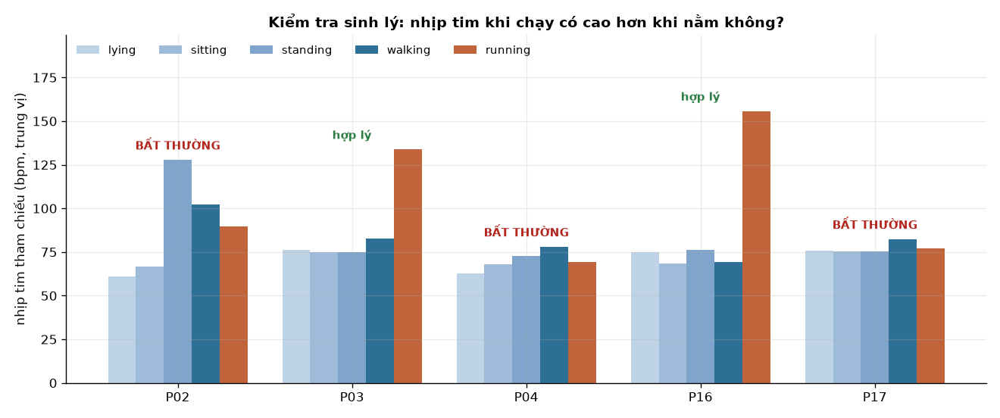
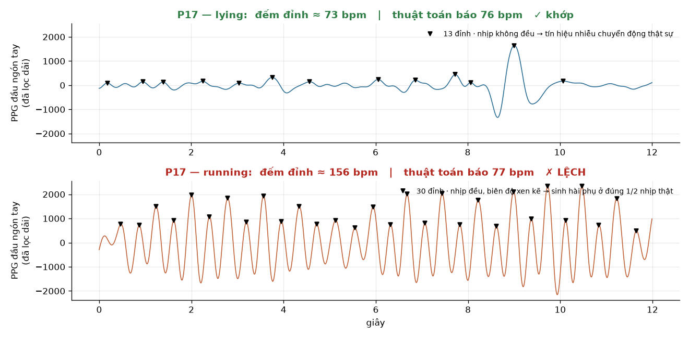
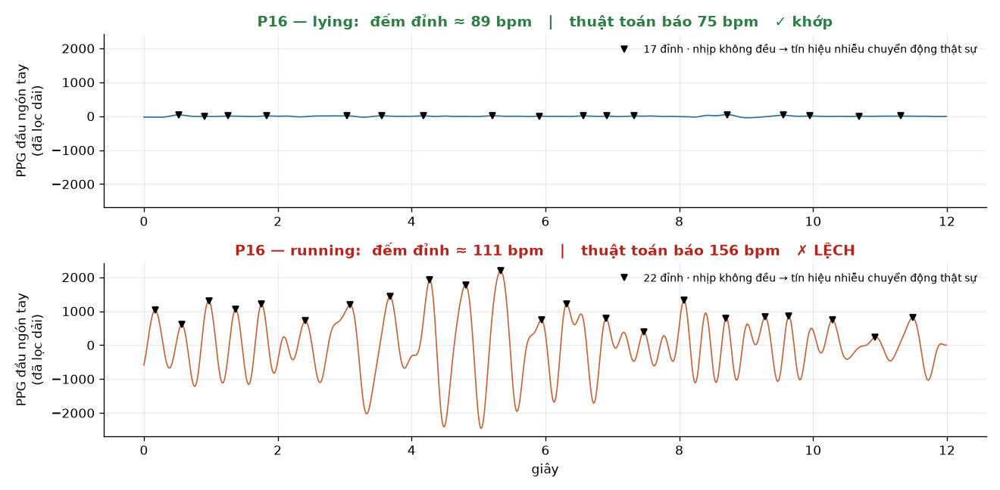
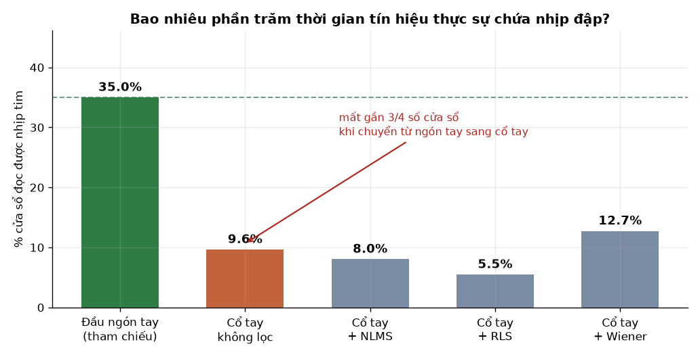
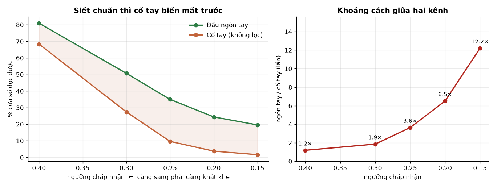

# Subsystem B — Khử nhiễu chuyển động cho PPG cổ tay: LMS, RLS và Wiener

> **Ghi chú về tác giả (để tự kiểm tra trước khi nộp):** kết luận cốt lõi của báo cáo
> này — *"tín hiệu cổ tay gần như không mang thông tin nhịp tim để mà khôi phục"* — là
> phán đoán của Giang, đưa ra trước khi có bằng chứng. Claude thiết kế các phép thử để
> kiểm chứng phán đoán đó, viết code, và soạn phần diễn giải. Giang cần đọc kỹ §4 và §5
> đủ để giải thích lại được cơ chế octave error trước khi nộp.
>
> **Nguồn số liệu:** `lms_denoise_mvp.py`, `check_ground_truth_sanity.py`,
> `hr_estimator_v2.py`, `lms_denoise_v2.py`. Chạy lại theo `paper/EVIDENCE_GUIDE.md`.
> Ngày chạy: 2026-08-15. Tài liệu này thay thế
> `adaptive_filter_comparison_OUTLINE.md`.

---

## 1. Câu hỏi nghiên cứu và câu trả lời

Proposal (mục 8) đặt câu hỏi:

> *Trên phần cứng cỡ ESP32 chạy FreeRTOS, thuật toán adaptive filter nào — LMS, RLS hay
> Wiener — khử nhiễu chuyển động khỏi PPG cổ tay tốt nhất, và kết quả có đạt độ chính
> xác nhịp tim dùng được trên lâm sàng không?*

**Câu trả lời: câu hỏi đặt sai tiền đề.**

Trong khoảng **90% thời gian**, tín hiệu PPG cổ tay ở cấu hình phần cứng này không chứa
nhịp đập nào có thể phát hiện được. Một adaptive filter *tách* tín hiệu ra khỏi nhiễu —
nó không *tạo ra* tín hiệu. Khi không có nhịp đập trong dữ liệu đầu vào, việc xếp hạng
ba thuật toán là vô nghĩa chứ không phải khó.

Kết luận này chỉ đạt được sau khi phát hiện rằng **thước đo dùng để chấm điểm ba bộ lọc
tự nó đã hỏng**, và phải sửa lại trước. Phần lớn báo cáo này nói về chuyện đó.

---

## 2. Thiết kế thí nghiệm

**Dữ liệu:** 5 participant có đủ PPG hai kênh (P02, P03, P04, P16, P17). Mỗi người một
phiên ~7.5 phút, 5 hoạt động theo thứ tự cố định (nằm, ngồi, đứng, đi bộ, chạy).

| Thành phần | Cấu hình |
| :--- | :--- |
| Kênh đo | MAX30102 mặt lưng cổ tay, chế độ phản xạ, IR 940nm |
| Kênh tham chiếu | MAX30102 kẹp đầu ngón tay, chế độ xuyên thấu |
| Tín hiệu tham chiếu cho bộ lọc | Magnitude gia tốc 3 trục, đã lọc dải |
| Bandpass | 0.7–3.5 Hz (42–210 bpm) |
| Bộ lọc so sánh | Baseline (không lọc), NLMS, RLS, Wiener — đều 8 tap |
| Cửa sổ | 8 giây, trượt mỗi 2 giây |

Ba bộ lọc dùng **chung một số tap** để so sánh công bằng, không tinh chỉnh riêng từng
thuật toán.

---

## 3. Kết quả ban đầu — và vì sao không dùng được

Vòng phân tích đầu tiên cho MAE (sai số tuyệt đối trung bình) so với tham chiếu đầu ngón
tay:

| Bộ lọc | MAE gộp (bpm) |
| :--- | ---: |
| Baseline (không lọc) | 26.95 |
| NLMS | 26.96 |
| RLS | 29.83 |
| Wiener | 29.96 |

Không bộ lọc nào thắng được việc không lọc gì. Nhưng trước khi kết luận, có một câu hỏi
chưa ai đặt ra: **cái thước này có đúng không?**

Proposal mô tả kênh đầu ngón tay là *"clean ground truth — transmissive PPG, minimal
motion artifact"*. Đó là một **giả định**, không phải một phép đo, và nó chưa từng được
kiểm chứng.

Phép thử rẻ nhất có thể nghĩ ra: **nhịp tim lúc chạy phải cao hơn lúc nằm.** Bất kỳ tham
chiếu nào không thể hiện được điều đó thì không đang đo nhịp tim, bất kể nó in ra số gì.

| Participant | Nằm | Đứng | Chạy | Chạy − Nằm |
| :--- | ---: | ---: | ---: | ---: |
| P02 | 61.2 | **127.7** | 89.7 | +28.5 |
| P03 | 76.4 | 74.8 | 133.8 | +57.5 |
| P04 | 62.8 | 72.6 | 69.5 | **+6.7** |
| P16 | 74.9 | 76.4 | 155.8 | +80.9 |
| P17 | 76.0 | 75.3 | 77.0 | **+1.0** |

P02 ghi nhận **đứng yên 127.7 bpm nhưng chạy chỉ 89.7 bpm**. P17 chạy xong nhịp tim tăng
**1 nhịp**. Tham chiếu trượt phép thử ở 3/5 participant.

**Hệ quả:** cả bốn con số MAE ở trên đều đo bằng một cái thước cong. Chúng không trả lời
được câu hỏi nghiên cứu theo hướng nào cả.

---

## 4. Nguyên nhân gốc của lỗi tham chiếu

Có hai khả năng, dẫn tới hai kết luận hoàn toàn khác nhau: **cảm biến** đầu ngón tay
hỏng, hay **thuật toán** đọc nhịp tim từ nó hỏng?

Phép phân định: vẽ dạng sóng thô ra và đếm đỉnh bằng mắt.

Với P17 lúc chạy, dạng sóng **rất sạch** — 30 đỉnh trong 12 giây, tức **155.6 bpm**.
Thuật toán báo **77.0 bpm**, đúng bằng một nửa. **Cảm biến không hỏng. Thuật toán hỏng.**

### Cơ chế: octave error

Đã loại trừ cách giải thích cạnh tranh — rằng mỗi nhịp tạo hai đỉnh (đỉnh tâm thu cộng
dicrotic notch), khiến số đếm bị nhân đôi. Nếu vậy khoảng cách giữa các đỉnh phải **so
le** dài-ngắn:

| Chỉ số đo trên P17 lúc chạy | Giá trị | Ý nghĩa |
| :--- | ---: | :--- |
| Khoảng cách giữa các đỉnh | 0.386 s ± 0.017 s | Rất đều |
| Tỉ lệ khoảng lẻ / khoảng chẵn | **1.03** | Không so le → **không phải** dicrotic notch |
| Tỉ lệ biên độ lẻ / chẵn | **2.22** | Biên độ mới là thứ so le |

Vậy cơ chế thật là: **biên độ các nhịp cao–thấp xen kẽ** khiến dạng sóng lặp lại sau mỗi
*hai* nhịp. Một tín hiệu lặp sau mỗi hai nhịp có thành phần phổ mạnh ở **đúng một nửa**
nhịp thật. Bộ ước lượng dựa trên đỉnh phổ FFT bám vào thành phần đó. Đây chính là lỗi
**octave error** kinh điển trong các thuật toán dò cao độ.

### Vì sao lỗi sống sót nhiều tuần: nhầm vai trò giữa hai tầng

Hệ thống có hai công việc tách biệt:

| Tầng | Nhiệm vụ | Input → Output |
| :--- | :--- | :--- |
| **Measurement layer** | Từ 8 giây sóng này, nhịp tim là bao nhiêu? | waveform → một con số |
| **Tracking layer** | Trong dãy số theo thời gian, số nào đáng tin? | dãy số → dãy số đã làm mượt |

Ràng buộc `MAX_JUMP_BPM = 25` thuộc tracking layer. Sai số xảy ra ở measurement layer.

Tracking layer nhận vào dãy `77, 77, 77, …` — **nhất quán hoàn hảo**. Nó chỉ kiểm tra các
số có ăn khớp với nhau không, nó không có cách nào biết cả dãy đều sai. Tệ hơn: khi
measurement layer thỉnh thoảng nhả ra giá trị gần 156, tracking layer **gạt đi** vì
"nhảy quá 25 bpm". Nó chủ động bảo vệ sai số.

**Nguyên tắc rút ra:** một bộ làm mượt khử được *noise*, không khử được *bias*. Nó sẽ bám
theo một sai số hệ thống một cách mượt mà và trông đáng tin hơn cả trước khi lọc. Vì thế
tracking layer chỉ được phép điều chỉnh *độ mượt của quỹ đạo*, tuyệt đối không được phép
đè lên *giá trị đo*.

Đây cũng là lý do một Kalman filter — thứ trực giác đầu tiên nghĩ tới để chặn các bước
nhảy phi sinh lý — **sẽ không sửa được bug này**. Nó nằm sai tầng.

---

## 5. Sửa thước đo và kiểm chứng

`hr_estimator_v2.py` thay đổi ba điểm:

1. **Đo trong miền thời gian**: lấy **trung vị** khoảng cách giữa các nhịp. Trung vị chứ
   không phải trung bình, để vài nhịp bị sót hoặc đếm nhân đôi không kéo lệch kết quả.
   Biên độ so le vô hại với phép đo này.
2. **Trả về "không đọc được"** khi các nhịp quá không đều (hệ số biến thiên > 0.25), thay
   vì cố đoán một con số. Bộ cũ **luôn luôn** trả về một giá trị — đó chính là cách các
   ước lượng rác lan khắp phép so sánh mà không ai thấy.
3. **Bỏ hoàn toàn ràng buộc liên tục giữa các cửa sổ.**

**Kiểm chứng ngược lại bằng số đếm thủ công:**

| Kiểm chứng | v1 (cũ) | v2 (mới) | Đếm bằng mắt |
| :--- | ---: | ---: | ---: |
| P17 lúc chạy | 77.0 | **156.9** | 155.6 |
| P16 lúc chạy | 155.8 | **118.9** | 111.3 |
| Số người qua sanity check sinh lý | 2/5 | **4/5** | — |

Cả hai ca đếm tay đều khớp v2 và lệch v1. Đáng chú ý là v2 sửa sai số theo **cả hai
chiều** — P17 bị đọc thiếu một nửa, P16 bị đọc thừa — nên đây không phải một phép hiệu
chỉnh một chiều tình cờ trúng.

**Một chỗ đi lùi cần ghi nhận:** P03 trước qua sanity check, với v2 thì trượt (+17.4 bpm,
sát ngưỡng +20). v2 tốt hơn rõ rệt nhưng không hoàn hảo.

---

## 6. Kết quả thật sau khi sửa

Chạy lại toàn bộ so sánh, **không đổi gì ở các bộ lọc** — cùng NLMS, cùng RLS, cùng
Wiener, cùng số tap, cùng tín hiệu tham chiếu, cùng participant. Chỉ đổi cách đọc nhịp
tim ra khỏi dạng sóng.

Chỉ số quan trọng nhất không phải MAE, mà là **bao nhiêu phần trăm thời gian đọc được ra
một nhịp đập**:

| Tín hiệu | Tỉ lệ cửa sổ đọc được |
| :--- | ---: |
| Đầu ngón tay (tham chiếu) | **35.0%** |
| Cổ tay, không lọc | **9.6%** |
| Cổ tay + NLMS | 8.0% |
| Cổ tay + RLS | 5.5% |
| Cổ tay + Wiener | 12.7% |

Có thể phản biện rằng ngưỡng 0.25 là do người viết tự chọn. Nên quét toàn dải ngưỡng:

| Ngưỡng chấp nhận | Đầu ngón tay | Cổ tay | Tỉ số |
| :--- | ---: | ---: | ---: |
| CV ≤ 0.40 (lỏng) | 81.0% | 68.3% | 1.2× |
| CV ≤ 0.30 | 50.7% | 27.4% | 1.9× |
| CV ≤ 0.25 | 35.0% | 9.6% | 3.6× |
| CV ≤ 0.20 | 24.4% | 3.7% | 6.5× |
| CV ≤ 0.15 (chặt) | 19.6% | **1.6%** | **12.2×** |

**Càng đòi hỏi khắt khe thế nào là một nhịp đập thật, tín hiệu cổ tay càng biến mất.** Kết
luận không phụ thuộc vào ngưỡng — chiều của nó giữ nguyên trên toàn dải.

**Bộ lọc làm tình hình tệ đi.** Cả tỉ lệ đọc được (9.6% → 8.0% với NLMS, → 5.5% với RLS)
lẫn sai số đều xấu đi:

| Bộ lọc | MAE (bpm) | Số cửa sổ so được |
| :--- | ---: | ---: |
| Baseline (không lọc) | 16.38 | 29 |
| Wiener | 21.44 | 38 |
| NLMS | 47.27 | 32 |
| RLS | 58.28 | 19 |

Cơ chế hợp lý: khi PPG gần như hoàn toàn là nhiễu chuyển động, nghiệm "tối ưu" của một
adaptive filter là trừ đi gần hết mọi thứ tương quan với tín hiệu tham chiếu — kể cả phần
nhịp đập ít ỏi còn sót lại. Wiener ít hại hơn vì nó là bộ lọc batch, không thích nghi
liên tục.

**Cảnh báo bắt buộc:** chỉ có 19–38 cửa sổ mà cả hai kênh cùng đọc được. **Không đủ để
xếp hạng bốn bộ lọc bằng thống kê.** Con số nên trích dẫn từ báo cáo này là **tỉ lệ đọc
được**, không phải bảng MAE.

---

## 7. Vì sao câu hỏi đặt sai — nguyên nhân nằm ở front-end

Proposal chốt MAX30102 với hai bước sóng 660nm (đỏ) và 940nm (hồng ngoại), đeo mặt lưng
cổ tay ở chế độ phản xạ.

PPG hoạt động dựa trên việc **máu hấp thụ ánh sáng**: mỗi nhịp tim đẩy thêm máu vào mao
mạch, hấp thụ nhiều hơn, ánh sáng dội về ít đi. Tín hiệu là **phần thay đổi** đó.

| Bước sóng | Máu hấp thụ | Phù hợp với |
| :--- | :--- | :--- |
| ~525nm (xanh lá) | **Rất mạnh** | Đo phản xạ ở cổ tay |
| 660nm (đỏ) | Yếu | SpO2, đo xuyên thấu |
| 940nm (hồng ngoại) | Yếu | SpO2, đo xuyên thấu |

Đỏ và hồng ngoại có mặt trên MAX30102 để đo **SpO2** (bắt buộc cần đúng hai bước sóng đó)
và để đo **xuyên thấu** ở đầu ngón tay, nơi mật độ mạch máu rất dày. Ở cổ tay, chúng
xuyên sâu nhưng gần như không bị máu hấp thụ, nên nhịp đập chỉ là gợn sóng rất nhỏ trên
một nền lớn — và vì đi sâu, chúng còn thu cả chuyển động của mô sâu khi người dùng cử
động. Thiết bị đeo cổ tay thương mại dùng LED xanh lá vì lý do này.

Đây là dùng **đúng cảm biến cho sai vị trí**. Vị trí đeo mặt lưng cổ tay không sai — đồng
hồ thương mại cũng đeo ở đó. Sai ở bước sóng.

Hồ sơ dự án có một quyết định ghi rõ *"không cần module LED xanh — bộ lọc LMS sẽ xử lý
độ chính xác ở cổ tay"*. Kết quả ở §6 cho thấy quyết định đó sai theo kiểu không thuật
toán nào bù được: **bộ lọc không thể khôi phục thông tin mà front-end chưa bao giờ ghi
lại.**

---

## 8. Giới hạn của nghiên cứu này

- **N = 5**, mỗi người một phiên duy nhất ~7.5 phút. Không có test-retest, không có phép
  đo độ ổn định dài hạn.
- **Chỉ 19–38 cửa sổ** có đồng thời cả hai kênh đọc được → không xếp hạng được các bộ lọc.
- **Tham chiếu vẫn chưa phải chuẩn lâm sàng.** v2 tốt hơn v1 rõ rệt nhưng vẫn trượt sanity
  check ở P03. Chuẩn thật phải là ECG, không phải PPG đầu ngón tay.
- **Ngưỡng CV = 0.25 do người viết chọn.** Đã quét toàn dải để chứng minh kết luận không
  đổi chiều, nhưng con số tuyệt đối (9.6%, 35.0%) thì phụ thuộc ngưỡng.
- **Mỗi bộ lọc chỉ chạy một bộ tham số duy nhất** (step size của NLMS, forgetting factor
  của RLS, hệ số regularization của Wiener), số tap cố định 8 cho cả ba.
- **Chưa loại trừ được yếu tố tiếp xúc cơ học** — lực ép của dây đeo lên da ảnh hưởng lớn
  tới PPG phản xạ, và biến này không được kiểm soát hay ghi lại trong lúc thu.

Giới hạn nào có thể **lật ngược** kết luận? Theo đánh giá của nhóm: chỉ có **bước sóng**.
Tăng N, tinh chỉnh tham số, hay kéo dài phiên đo đều không thay đổi được việc tín hiệu
đầu vào không chứa nhịp đập. Đổi sang LED xanh lá thì mới có khả năng.

---

## 9. Kết luận và hướng tiếp theo

Câu hỏi nghiên cứu **đã được trả lời**, chỉ là câu trả lời hoá ra nằm ở tầng thấp hơn tầng
câu hỏi nhắm tới:

1. So sánh ban đầu **không hợp lệ** — thước đo tham chiếu hỏng ở 3/5 participant.
2. Nguyên nhân đã được truy tận gốc: octave error ở measurement layer, bị một ràng buộc
   thuộc tracking layer khoá lại.
3. Sau khi sửa và kiểm chứng, kết quả thật là: PPG cổ tay ở 660/940nm chứa nhịp đập phát
   hiện được trong **dưới 10%** thời gian.
4. Vì vậy việc xếp hạng LMS/RLS/Wiener là **vô nghĩa** với bộ dữ liệu này — và ba bộ lọc
   còn làm tín hiệu tệ đi.
5. Nguyên nhân nằm ở **lựa chọn bước sóng**, tức tầng thu tín hiệu, không phải tầng xử lý.

**Hướng tiếp theo, theo thứ tự ưu tiên:**

1. **Đổi front-end trước, mọi thứ khác sau.** LED xanh lá (~525nm) — hoặc một AFE như
   MAX86141 cho phép chọn LED rời và ghép nhiều cặp phát/thu. Chưa làm bước này thì mọi
   cải tiến thuật toán đều vô ích.
2. **Kiểm chứng vật lý trước khi thu dữ liệu quy mô.** Đeo, ngồi im, nhìn dạng sóng thô,
   xác nhận nhịp đập nhìn thấy được. Rồi mới thu 5 người.
3. **Dùng ECG làm chuẩn**, hoặc ít nhất một thiết bị thương mại đã được kiểm định, thay
   cho PPG đầu ngón tay.
4. **Ghi lại lực ép dây đeo** như một biến của thí nghiệm.
5. Chỉ khi bốn bước trên xong mới quay lại câu hỏi bộ lọc nào tốt nhất. Lúc đó câu hỏi
   mới có nghĩa.

**Về hướng dùng model AI thay cho bộ lọc cổ điển:** đây là cách các thiết bị thương mại
làm, nhưng áp vào đây ở thời điểm này sẽ tệ hơn. Một model huấn luyện trên chính bộ nhãn
tham chiếu của dự án sẽ học rất giỏi cách tái tạo **con số sai** — với loss thấp và biểu
đồ đẹp, tức là không còn cơ chế nào để phát hiện lỗi như báo cáo này vừa làm. Model học
máy chỉ đáng theo đuổi **sau khi** có front-end tốt và một ground truth đáng tin.

---

## Reproducibility checklist

- [x] `python lms_denoise_mvp.py` ra đúng 26.95 / 26.96 / 29.83 / 29.96 — xác nhận 2026-08-15
- [x] `python check_ground_truth_sanity.py` ra đúng bảng §3 và các hình dạng sóng
- [x] `python hr_estimator_v2.py` ra đúng bảng kiểm chứng §5
- [x] `python lms_denoise_v2.py` ra đúng bảng tỉ lệ đọc được §6
- [ ] Giang đọc hiểu §4 đủ để giải thích lại cơ chế octave error khi advisor hỏi
- [ ] Giang tự đếm đỉnh trên `figures/gt_waveform_P17.png` để tự xác nhận con số 156
- [ ] Đối chiếu báo cáo với rubric thật của môn học — Claude không truy cập được rubric
