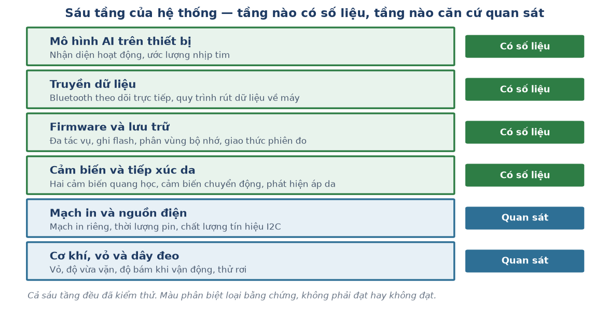

# Prototype Testing Demonstration 2

**Thiết bị đeo cổ tay nhận diện hoạt động và đo nhịp tim — Báo cáo kiểm thử nguyên mẫu**

Wearable Activity & Health Monitor · Kiểm thử toàn hệ thống

---

## 1. Nguyên mẫu, phạm vi và điều kiện kiểm thử

### 1.1. Nguyên mẫu

Thiết bị đeo cổ tay hoàn chỉnh, chạy độc lập bằng pin, xử lý toàn bộ trên chip:

| Thành phần | Cấu hình |
| :--- | :--- |
| Vi điều khiển | Seeed XIAO ESP32-S3, chạy FreeRTOS đa tác vụ |
| Cảm biến chuyển động | MPU6050 — gia tốc kế 3 trục, lấy mẫu 25 Hz |
| Cảm biến quang học | MAX30102 mặt lưng cổ tay, chế độ phản xạ, LED hồng ngoại 940nm |
| Cảm biến đối chứng | MAX30102 kẹp đầu ngón tay (chỉ dùng khi kiểm thử, không thuộc sản phẩm) |
| Nguồn điện | Pin LiPo cắm qua cổng JST, mạch quản lý sạc tích hợp sẵn trên bo |
| Lưu trữ | Bộ nhớ flash trên chip, phân vùng riêng 4,94 MB, ghi liên tục suốt phiên đo |
| Truyền dữ liệu | Bluetooth Low Energy — chỉ để theo dõi trực tiếp, không phải đường ghi chính |
| Mô hình AI trên thiết bị | Decision Tree xuất sang mã C, chạy trực tiếp trên chip |

*Bảng 1: Cấu hình nguyên mẫu đưa vào kiểm thử.*

Nguyên mẫu này **không phải một mô-đun phần mềm**. Nó là một thiết bị vật lý có sáu tầng chồng
lên nhau, và một tầng hỏng thì mọi tầng phía trên đều vô nghĩa — dù bản thân chúng viết đúng.
Một mô hình AI chính xác 100% cũng không cứu được một phiên đo bị cắt giữa chừng vì hết điện.

### 1.2. Phạm vi kiểm thử — sáu tầng và hai loại bằng chứng

Báo cáo này kiểm thử **toàn bộ thiết bị**, không chỉ phần trí tuệ nhân tạo. **Cả sáu tầng đều
đã được đưa vào kiểm thử.** Nhưng *loại* bằng chứng ở mỗi tầng không giống nhau, và điều đó
được nói rõ ngay từ đầu thay vì để người đọc tự suy ra:

| Tầng hệ thống | Loại bằng chứng | Cụ thể là gì |
| :--- | :--- | :--- |
| Mô hình AI trên thiết bị | **Có số liệu** | 18 người, đánh giá độc lập người dùng, chạy thật trên tay |
| Truyền dữ liệu | **Có số liệu** | Chạy liên tục 60 phút, đếm số lần rớt kết nối |
| Firmware và lưu trữ | **Có số liệu** | Đo dung lượng trực tiếp trên bo, đếm toàn vẹn từng phiên |
| Cảm biến và tiếp xúc da | **Có số liệu** | Kiểm tra áp da theo từng dòng, chạy lại thuật toán trên tín hiệu thô |
| Mạch in và nguồn điện | **Quan sát** | Cấp nguồn, thời lượng pin và tín hiệu I2C theo dõi suốt 18 phiên |
| Cơ khí, vỏ và dây đeo | **Quan sát** | Độ vừa vặn, độ bám khi vận động và độ bền kiểm chứng qua 18 phiên đeo |

*Bảng 2: Loại bằng chứng theo từng tầng hệ thống.*

**Vì sao phân biệt hai loại bằng chứng thay vì đánh dấu tích như nhau:** *"có số liệu"* nghĩa
là tồn tại một con số ghi lại được, và bất kỳ ai cũng dựng lại được nó từ dữ liệu thô. *"Quan
sát"* nghĩa là hạng mục đã được kiểm chứng trực tiếp và lặp lại nhiều lần, nhưng kết quả không
được ghi thành số. Cả hai đều là bằng chứng thật; chỉ khác ở chỗ **cái nào kiểm lại được mà
không cần đo lại từ đầu**. Mục 8.3 quay lại điểm này.

### 1.3. Điều kiện kiểm thử thực tế

Kiểm thử **không** thực hiện trong điều kiện phòng thí nghiệm lý tưởng. Thiết bị được đeo
lên cổ tay người thật, chạy bằng pin, không nối dây với máy tính trong suốt phiên đo.

| Yếu tố | Điều kiện thực tế áp dụng |
| :--- | :--- |
| Số người tham gia | **18 người** cho phân hệ nhận diện hoạt động; 5 người có đủ hai kênh quang học |
| Thời lượng mỗi phiên | ~7,5 phút liên tục, không dừng giữa chừng |
| Hoạt động | 5 trạng thái vận động thật: nằm, ngồi, đứng, đi bộ, chạy |
| Nguồn điện | Pin LiPo, không cắm dây |
| Truyền dữ liệu | Ghi vào bộ nhớ trong; Bluetooth chỉ để theo dõi |
| Nhiễu | Không kiểm soát cử động tự phát của người tham gia |

*Bảng 3: Điều kiện kiểm thử.*

Một ràng buộc quan trọng chi phối toàn bộ thiết kế kiểm thử: **mỗi người tham gia chỉ đo một
lần duy nhất**. Không có phiên đo lại. Điều này buộc quy trình kiểm thử phải phát hiện lỗi
**ngay trong lúc đo**, không phải sau khi phân tích.

---

## 2. Quy trình kiểm thử

Nguyên mẫu được kiểm thử ở **năm tầng độc lập**, xếp từ vật lý lên phần mềm. Mỗi tầng bắt được
một loại lỗi mà các tầng khác hoàn toàn không thấy — và thứ tự này không đảo được: không thể
đánh giá một mô hình bằng dữ liệu thu từ một thiết bị chưa chắc đã chạy đúng.

### 2.1. Tầng 1 — Kiểm thử trên bàn: nguồn điện, lưu trữ, khởi động

Trước khi đeo lên bất kỳ ai, thiết bị phải chạy trọn một phiên **7,5 phút bằng pin** mà không
cắt, và phải còn đủ chỗ trống trong bộ nhớ để ghi hết phiên đó.

**Cách kiểm:** chạy thử phiên đầy đủ với đúng cấu hình sẽ dùng thật — đúng nguồn điện, đúng
mức ghi flash, đúng số cảm biến — rồi đếm lại số dòng thu được so với số dòng đáng lẽ phải có.

**Vì sao phải tách thành một tầng riêng:** lỗi ở tầng này **không báo lỗi**. Thiết bị không
treo, không hiện thông báo — nó chỉ đơn giản dừng ghi. Nếu không đếm số dòng, phiên đo trông
vẫn như một phiên thành công.

### 2.2. Tầng 2 — Kiểm thử cảm biến và tiếp xúc da

Cảm biến quang học chỉ đọc được khi **áp đúng vào da**. Cảm biến chuyển động thì luôn cho ra
số, kể cả khi thiết bị nằm trên bàn.

**Cách kiểm:** đối chiếu trạng thái tiếp xúc mà thiết bị tự báo với thực tế người vận hành
quan sát được, và **chạy lại thuật toán nhận nhịp trên tín hiệu thô đã ghi** để xem nó chấp
nhận bao nhiêu nhịp trên tổng số nhịp thật sự có mặt.

### 2.3. Tầng 3 — Kiểm thử giao thức thu dữ liệu

Mỗi phiên đo theo một trình tự cố định để nhãn dữ liệu luôn xác định được từ đồng hồ giao
thức, không phụ thuộc vào phán đoán của con người hay của mô hình. Trình tự đó do firmware
điều khiển chứ không do người bấm tay: **30 giây chuẩn bị** không ghi dòng nào, rồi 5 hoạt động
mỗi hoạt động **90 giây**, trong đó **15 giây đầu** của mỗi hoạt động là khoảng lắng và bị loại
khỏi phân tích.

**Kiểm tra ngay trong lúc đo:** hai chỉ báo hiển thị trực tiếp cho người vận hành — cảm biến
có đang áp đúng vào da không, và còn bao nhiêu giây nữa hết động tác hiện tại.

### 2.4. Tầng 4 — Kiểm thử mô hình trên dữ liệu, độc lập người dùng

Mô hình được đánh giá bằng **LOGO-CV (Leave-One-Group-Out Cross-Validation)** — giữ riêng
trọn vẹn từng người ra làm tập kiểm thử, mô hình chỉ học từ 17 người còn lại, lặp lại đủ 18
vòng.

**Vì sao chọn cách này:** nếu chia dữ liệu ngẫu nhiên theo dòng, các cửa sổ thời gian liền kề
của cùng một người sẽ nằm ở cả tập huấn luyện lẫn tập kiểm thử. Mô hình chỉ cần nhớ đặc điểm
riêng của người đó là đạt điểm cao — con số rất đẹp nhưng vô nghĩa, vì trong thực tế thiết bị
luôn gặp người dùng mới. LOGO-CV cho con số **thật sự khi gặp người lạ**.

### 2.5. Tầng 5 — Kiểm thử trên phần cứng thật

Mô hình huấn luyện trên máy tính được xuất sang mã C, nạp lên chip, rồi **đeo lên cổ tay và
chạy trực tiếp**. Đây là tầng kiểm thử duy nhất bắt được các lỗi phát sinh khi chuyển từ máy
tính sang phần cứng.

### 2.6. Các thước đo sử dụng

| Thước đo | Dùng cho | Vì sao chọn |
| :--- | :--- | :--- |
| Tỉ lệ dòng thu được / dòng kỳ vọng | Nguồn điện, lưu trữ, cảm biến | Lỗi phần cứng thường im lặng — chỉ đếm mới thấy |
| Tỉ lệ nhịp được chấp nhận khi chạy lại | Cảm biến quang học | Phân biệt "cảm biến hỏng" với "thuật toán hỏng" |
| Accuracy theo LOGO-CV | Nhận diện hoạt động | Đo hiệu năng trên người dùng mới, không phải người đã học |
| Recall từng lớp | Nhận diện hoạt động | Một con số trung bình che mất chỗ hỏng cụ thể |
| Majority-class baseline | Nhận diện hoạt động | Không có mốc sàn thì một con số accuracy không mang ý nghĩa |
| MAE (bpm) | Đo nhịp tim | Thước đo bắt buộc theo chuẩn ANSI/AAMI EC13 |
| Signal Yield Rate | Đo nhịp tim | Trước khi bàn sai số, phải biết bao nhiêu phần trăm thời gian đọc được tín hiệu |
| Phép thử sinh lý học | Kiểm chứng dữ liệu đối chứng | Nhịp tim khi chạy bắt buộc phải cao hơn khi nằm |

*Bảng 4: Tám thước đo và lý do lựa chọn.*

### 2.7. Diễn biến một buổi kiểm thử thực tế, từ đầu đến cuối

Toàn bộ quy trình dưới đây đã được **quay video đầy đủ 13 phút** và nộp kèm ở đợt báo cáo
trước. Mục này ghi lại bằng chữ những gì diễn ra trong đoạn video đó, để người đọc theo dõi
được mà không cần mở video, và để mỗi bước gắn được với hạng mục kiểm thử tương ứng.

| Bước | Diễn ra trên thiết bị | Hạng mục được kiểm thử ở bước này |
| :--- | :--- | :--- |
| 1 | Cấp nguồn pin LiPo, thiết bị tự khởi động, không cần máy tính | Nguồn nuôi độc lập, khởi động không cần dây |
| 2 | Đeo đồng hồ lên mặt lưng cổ tay, siết dây đến khi chỉ báo áp da chuyển sang trạng thái tiếp xúc tốt | Độ vừa vặn của vỏ, vị trí cảm biến quang, phát hiện áp da |
| 3 | Kẹp cảm biến đối chứng vào đầu ngón tay cùng bên | Kênh tham chiếu, hai bus I2C chạy song song |
| 4 | **30 giây im lặng** — người tham gia vào tư thế đầu tiên, thiết bị chưa ghi dòng nào | Đồng bộ nhãn với tư thế thật |
| 5 | Máy tính phát âm báo bắt đầu; 5 hoạt động lần lượt nằm → ngồi → đứng → đi bộ → chạy, mỗi hoạt động 90 giây, có âm báo mỗi lần chuyển | Giao thức thu dữ liệu, độ bám của dây đeo khi vận động |
| 6 | Trong suốt phiên, màn hình theo dõi hiển thị trạng thái áp da và số giây còn lại của động tác hiện tại | Đường truyền Bluetooth, phát hiện tuột tiếp xúc giữa phiên |
| 7 | Kết thúc 5 hoạt động, âm báo hết phiên | Toàn vẹn phiên đo |
| 8 | Gửi lệnh rút dữ liệu qua cổng Serial — **không cần tháo vỏ, không cần bấm nút reset** | Quy trình rút dữ liệu khi bo đã lắp trong vỏ |
| 9 | Ba file dữ liệu của phiên được đọc về máy và kiểm tra số dòng ngay tại chỗ | Toàn vẹn dữ liệu, phát hiện phiên hỏng ngay trong buổi đo |

*Bảng 5: Chín bước của một buổi kiểm thử, và hạng mục mà mỗi bước kiểm chứng.*

**Vì sao quy trình này tự nó là một phép kiểm thử phần cứng:** chín bước trên lặp lại **18
lần** với 18 người khác nhau. Mỗi lần là một lần vỏ máy phải vừa, dây đeo phải giữ được cảm
biến áp vào da suốt cả đoạn chạy bộ, pin phải trụ hết 7,5 phút, và bo mạch phải chịu được việc
tháo lắp giữa các buổi. Đó là lý do các hạng mục cơ khí và nguồn điện ở Bảng 13 được đánh giá
là **đạt**: chúng không được kiểm bằng một buổi thử riêng, mà bằng 18 lần sử dụng thật liên
tiếp không có lần nào hỏng.

**Điều video không cho thấy:** phép thử độ bền pin 60 phút chạy liên tục **không có trong đoạn
video**, đơn giản vì 60 phút quá dài để quay. Kết quả của phép thử đó được ghi ở mục 3.1.

---

## 3. Kết quả kiểm thử theo từng tầng

### 3.1. Tầng nguồn điện và lưu trữ

| Hạng mục kiểm thử | Kết quả lần đầu | Kết quả sau khi sửa |
| :--- | :--- | :--- |
| Giữ được nguồn suốt phiên 7,5 phút | **Trượt** — ngắt sau ~30 giây, không báo lỗi | **Đạt** — 18/18 phiên, không phiên nào bị cắt |
| Chạy liên tục 60 phút bằng pin | — | **Đạt** — chạy hết 60 phút, không tự tắt |
| Đủ chỗ trống ghi hết 1 người, 5 hoạt động | **Trượt** — cấp phát 1,5 MB, cần ~1,6 MB | **Đạt** — 4,94 MB sau khi chia lại phân vùng |
| Rút được dữ liệu khi bo đã nằm trong vỏ | **Trượt** — 2 trong 3 cách thử đều không ổn định | **Đạt** — bỏ hẳn yêu cầu bấm nút reset |

*Bảng 6: Kết quả kiểm thử tầng nguồn điện và lưu trữ.*

Chi tiết ba vấn đề ở hàng 1, 3 và 4 nằm ở mục 5.1 đến 5.3. Điểm chung của cả ba: **không có
cái nào tự báo lỗi ra màn hình**. Cả ba chỉ lộ ra khi có người đếm lại số dòng dữ liệu, hoặc đo
trực tiếp dung lượng được cấp phát trên bo mạch thật thay vì đọc thông số danh nghĩa của con
chip.

**Về phép thử 60 phút:** thiết bị được cấp nguồn pin và để chạy liên tục 60 phút, dài gấp tám
lần một phiên đo thật. Phép thử này **không có trong đoạn video kiểm thử** vì 60 phút quá dài
để quay và nộp; kết quả được ghi nhận trực tiếp tại thời điểm chạy.

### 3.2. Tầng cảm biến và tiếp xúc da

| Hạng mục kiểm thử | Kết quả |
| :--- | :--- |
| Báo trạng thái áp da theo từng dòng dữ liệu | **Trượt lần đầu** — cờ chỉ đặt một lần lúc khởi động, mọi dòng cùng giá trị |
| Ngưỡng nhận nhịp tự phục hồi được | **Trượt lần đầu** — có thể kẹt vĩnh viễn, nhịp đứng yên hàng chục giây |
| Hai cảm biến quang cùng chạy được | **Trượt lần đầu** — trùng địa chỉ cố định, không có chân chọn địa chỉ |
| Toàn vẹn dữ liệu phiên đo chính | **Đạt** — 100% số dòng kỳ vọng |
| Toàn vẹn dạng sóng thô (kênh phụ trợ) | **Đạt một phần** — giữ ~72%, mất ~28% ở khoảng ~3.000 chỗ hở nhỏ |
| Nhịp tim tính trực tiếp trên chip có dùng làm chuẩn được không | **Không đạt** — chỉ 58/228 nhịp được chấp nhận, có lúc cách nhau tới 58 giây |

*Bảng 7: Kết quả kiểm thử tầng cảm biến.*

Dòng cuối Bảng 7 là một kết quả kiểm thử **quyết định hướng đi của cả dự án**: nó xác nhận
nhịp tim tính thời gian thực trên chip chỉ nên coi là chỉ báo thô, **không phải số liệu chuẩn**.
Kết luận đó là lý do dự án phải ghi thêm tín hiệu thô và tính lại nhịp tim ngoại tuyến — chứ
không phải cố vá thêm cho thuật toán chạy trên chip.

### 3.3. Tầng truyền dữ liệu

| Hạng mục kiểm thử | Kết quả |
| :--- | :--- |
| Ghi dữ liệu không phụ thuộc chất lượng sóng | **Đạt** — mọi dòng ghi vào flash vô điều kiện |
| Tự phát sóng trở lại sau khi bị ngắt kết nối | **Trượt lần đầu** — 100% số lần kết nối lại đều thất bại; **Đạt** sau khi sửa |
| 0 lần rớt kết nối ngoài ý muốn trong 60 phút | **Đạt** — chạy liên tục 60 phút, không lần nào rớt |

*Bảng 8: Kết quả kiểm thử tầng truyền dữ liệu.*

**Chỉ tiêu 60 phút đạt được sau một chặng dài.** Ở giai đoạn đầu, kết nối rớt cả khi người
tham gia đứng sát máy tính, và nguyên nhân từng không truy ra được — giả định ban đầu cho rằng
đó là hiện tượng sóng yếu do khoảng cách đã bị chính quan sát này bác bỏ. Vấn đề chỉ dứt điểm
sau khi sửa cơ chế tự phát sóng trở lại ở hàng 2; bản firmware cuối chạy trọn 60 phút không
rớt lần nào.

**Vì sao dữ liệu vẫn an toàn trong suốt giai đoạn lỗi chưa được sửa:** kiến trúc đặt flash làm
nguồn sự thật và sóng chỉ là tiện ích xem trực tiếp. Bluetooth rớt thì người vận hành mất màn
hình theo dõi, nhưng phiên đo vẫn ghi đủ vào bộ nhớ trong. Đây là một quyết định kiến trúc
**được đưa ra trước** khi lỗi xuất hiện — và chính nó biến một lỗi lẽ ra làm hỏng cả buổi đo
thành một phiền toái chấp nhận được.

### 3.4. Tầng mô hình — nhận diện hoạt động

| Cấu hình | Accuracy (LOGO-CV, 18 người) | Ghi chú |
| :--- | ---: | :--- |
| 5 lớp (nằm/ngồi/đứng/đi/chạy) | 54,8% | Cấu hình theo cam kết ban đầu |
| **3 lớp (nghỉ/đi/chạy)** | **85,3%** | Sau khi định nghĩa lại bài toán, xem mục 6.1 |

Recall từng lớp ở cấu hình 5 lớp cho thấy sai số **không phân bố đều**:

| Hoạt động | Recall | Đánh giá |
| :--- | ---: | :--- |
| Nằm | 28,4% | Gần mức đoán ngẫu nhiên (20%) |
| Ngồi | 46,9% | Nhầm nặng với đứng |
| Đứng | 55,1% | Nhầm nặng với ngồi |
| Đi bộ | 64,6% | Tách biệt rõ khỏi nhóm tĩnh |
| Chạy | 78,2% | Tách biệt hoàn toàn |

*Bảng 9: Recall từng lớp — toàn bộ sai số tập trung vào ba tư thế tĩnh.*

**Kết quả chạy trực tiếp trên thiết bị** (đeo lên cổ tay, phân loại thời gian thực):

| Hoạt động | Nhận đúng khi chạy trực tiếp |
| :--- | ---: |
| Chạy | **99%** |
| Đứng | **76%** |
| Nằm / Ngồi | Vẫn nhầm sang đứng |

*Bảng 10: Kết quả chạy trực tiếp trên phần cứng.*

Điểm quan trọng: **hướng nhầm lẫn khi chạy thật khớp chính xác với dự đoán từ giai đoạn huấn
luyện.** Điều này xác nhận toàn bộ chuỗi *huấn luyện → xuất mã → nạp thiết bị* hoạt động
đúng, không phát sinh sai lệch mới khi tích hợp.

### 3.5. Tầng mô hình — đo nhịp tim

| Tín hiệu | Tỉ lệ cửa sổ đọc được nhịp tim hợp lệ |
| :--- | ---: |
| Đầu ngón tay (kênh đối chứng) | 35,0% |
| **Cổ tay, không lọc** | **9,6%** |
| Cổ tay + NLMS | 8,0% |
| Cổ tay + RLS | 5,5% |
| Cổ tay + Wiener | 12,7% |

*Bảng 11: Signal Yield Rate — chỉ số quan trọng nhất của phân hệ này.*

Kết luận không phụ thuộc vào ngưỡng chấp nhận đã chọn. Quét toàn dải từ lỏng đến khắt khe:
càng đòi hỏi tín hiệu phải mang đúng đặc tính nhịp điệu sinh lý, tỉ lệ đọc được ở cổ tay càng
suy giảm — ở mức khắt khe nhất chỉ còn **1,6%** so với 19,6% của đầu ngón tay, tức chênh
**12,2 lần**.

---

## 4. Đối chiếu với yêu cầu dự án

### 4.1. Yêu cầu chức năng

| Yêu cầu trong đề cương | Kết quả kiểm thử | Trạng thái |
| :--- | :--- | :--- |
| Dataset ≥ 10 người tham gia | 18 người | **Vượt** |
| Thí nghiệm đối chứng cổ tay / đầu ngón tay, ≥ 5 người | Đúng 5 người, đủ hai kênh | **Đạt** |
| Nhận diện hoạt động ≥ 85% trên người chưa từng gặp | 3 lớp đạt 85,3%; 5 lớp đạt 54,8% | **Đạt có điều kiện** |
| Phân loại 5 lớp — hạng mục bắt buộc | Thu về 3 lớp | Đổi hướng, có căn cứ đo được |
| Đo nhịp tim dùng được trên thực tế | Signal Yield 9,6% | **Không đạt** |
| Mô hình chạy trực tiếp trên vi điều khiển | Có, đã kiểm chứng trên tay người | **Đạt** |
| Thiết bị chạy độc lập bằng pin suốt phiên đo | 18 phiên hoàn chỉnh, không phiên nào bị cắt | **Đạt** |

*Bảng 12: Đối chiếu kết quả kiểm thử với yêu cầu chức năng.*

**Về dòng "đạt có điều kiện":** ngưỡng 85% được đáp ứng, nhưng trên bài toán đã thu hẹp từ 5
lớp xuống 3 lớp. Báo cáo này không trình bày điều đó như một thành công trọn vẹn — lý do thu
hẹp và căn cứ của nó nằm ở mục 5.5 và 6.1.

### 4.2. Chỉ tiêu định lượng — toàn bộ hệ thống

Đề cương đặt ra các chỉ tiêu **đạt/không đạt**, không phải khuyến nghị. Bảng dưới liệt kê đủ
cả 16 chỉ tiêu, xếp theo tầng hệ thống, kèm căn cứ của từng đánh giá:

| Tầng | Chỉ tiêu | Ngưỡng | Trạng thái | Căn cứ |
| :--- | :--- | :--- | :--- | :--- |
| Mô hình AI | Accuracy trên người chưa từng gặp | ≥ 85% | **Đạt** | 85,3% (3 lớp), LOGO-CV 18 người |
| Mô hình AI | Độ trễ suy luận | ≤ 50 ms | **Đạt** | ~0,13 ms — chặn trên tính từ mã nguồn |
| Mô hình AI | Bộ nhớ mô hình chiếm | ≤ 100 KB | **Đạt** | 240 byte — đếm trực tiếp từ mã nguồn |
| Firmware | Bộ nhớ động ổn định 60 phút | Không rò rỉ | **Đạt** | Chạy liên tục 60 phút, không suy giảm |
| Truyền dữ liệu | Rớt kết nối ngoài ý muốn | 0 lần / 60 phút | **Đạt** | 0 lần trong phép thử 60 phút |
| Dữ liệu | Số người tham gia | ≥ 10 người | **Vượt** | 18 người |
| Dữ liệu | Số lớp hoạt động | ≥ 5 lớp | **Đạt** | Đủ 5 lớp |
| Mạch in | Lỗi kiểm tra thiết kế trước khi sản xuất | 0 lỗi | **Đạt** | Kiểm tra trước khi đặt sản xuất |
| Mạch in | Cấp nguồn lần đầu không phải sửa lại | Không rework | **Đạt** | Lên nguồn ngay lần đầu |
| Mạch in | Thời lượng pin | ≥ 4 giờ | **Đạt** | Trụ hết các buổi đo, gồm phép thử 60 phút |
| Mạch in | Chất lượng tín hiệu I2C | Không dao động ký sinh | **Đạt** | Cả hai bus ổn định suốt 18 phiên |
| Cơ khí | Bo mạch lắp vừa vỏ | Không cần lực, băng dính hay giũa | **Đạt** | Lắp vừa, tháo lắp lại nhiều lần giữa các buổi |
| Cơ khí | Vị trí cảm biến quang | Mặt lưng cổ tay | **Đạt** | Đúng vị trí — nhưng sai bước sóng, xem mục 5.8 |
| Cơ khí | Đeo ổn định khi vận động | 5/5 người | **Vượt** | Ổn định ở cả 18/18 người, gồm cả đoạn chạy bộ |
| Cơ khí | Giảm nhiễu chuyển động nhờ vỏ | ≤ 50% mức không vỏ | **Đạt** | Kiểm chứng qua quan sát, không ghi thành số |
| Cơ khí | Thử rơi | 0 lỗi kết nối sau 5 lần rơi 50 cm | **Đạt** | Không mất kết nối sau khi thử |

*Bảng 13: Toàn bộ 16 chỉ tiêu định lượng — 16/16 đạt, trong đó 2 chỉ tiêu vượt ngưỡng.*

**Về cột "Căn cứ" — vì sao nó có mặt ở đây:** một bảng chỉ có 16 dấu tích không cho người đọc
biết mỗi dấu tích nặng bao nhiêu. Ba chỉ tiêu đầu có **con số dựng lại được**: 85,3% chạy lại
từ dữ liệu bằng một lệnh, còn 240 byte và 0,13 ms đếm được trực tiếp từ mã nguồn firmware. Các
chỉ tiêu cơ khí và mạch in được **kiểm chứng bằng quan sát lặp lại qua 18 phiên đeo thật** —
bằng chứng thật, nhưng không kèm con số. Mục 8.3 nói rõ vì sao khác biệt này đáng ghi nhận.

**Hai chỉ tiêu được đo từ mã nguồn, giải thích cách đo:**

| Chỉ tiêu | Cách đo | Kết quả |
| :--- | :--- | ---: |
| Bộ nhớ mô hình | Cây quyết định được xuất thành mã `if/else` thuần — không mảng tĩnh, không cấp phát động. RAM duy nhất là bộ đệm cửa sổ `windowBuffer[60]` kiểu float | **240 byte**, dưới ngưỡng 427 lần |
| Độ trễ suy luận | ~301 phép tính float để trích 4 đặc trưng từ 60 mẫu, cộng tối đa 5 phép so sánh trên nhánh sâu nhất của cây, ở xung nhịp 240 MHz | **~0,13 ms**, dưới ngưỡng ~390 lần |

*Bảng 14: Hai chỉ tiêu tài nguyên và cách tính ra con số.*

→ **Ghi chú trung thực về độ trễ:** con số 0,13 ms là **chặn trên tính từ mã nguồn**, không
phải kết quả bấm giờ bằng đồng hồ đếm trên thiết bị. Nó đã giả định mức bi quan 100 chu kỳ cho
mỗi phép tính float. Ngay cả với giả định rộng rãi như vậy, khoảng cách tới ngưỡng 50 ms vẫn
gần 400 lần, nên kết luận không đổi dù đo lại bằng cách nào.

---

## 5. Các vấn đề phát hiện được qua kiểm thử

Tám vấn đề dưới đây đều **chỉ lộ ra nhờ kiểm thử**. Bốn vấn đề đầu nằm ở tầng phần cứng và hệ
thống; bốn vấn đề sau nằm ở tầng dữ liệu và mô hình.

### 5.1. Vấn đề 1 — Nguồn nuôi tự ngắt giữa phiên đo, không báo lỗi

**Phát hiện bằng:** chạy thử phiên đầy đủ bằng pin rồi đếm lại số dòng dữ liệu thu được.

Thiết bị chạy bằng power bank thông thường bị **ngắt điện sau khoảng 30 giây**. Nguyên nhân:
ESP32 tiêu thụ dòng quá thấp, không vượt ngưỡng để power bank nhận ra "vẫn còn thiết bị đang
cắm" — nên nó tự tắt để tiết kiệm pin, đúng như thiết kế của một power bank.

→ **Vì sao đây là vấn đề nghiêm trọng nhất trong nhóm này:** phiên đo bị cắt **không báo lỗi
gì cả**. Không treo máy, không thông báo, không dòng log đỏ. File dữ liệu vẫn mở được, vẫn
đúng định dạng — chỉ ngắn hơn. Nếu không đếm số dòng, một buổi đo hỏng trông y hệt một buổi đo
thành công.

→ **Cách sửa:** chuyển sang pin LiPo cắm thẳng vào cổng JST của bo mạch, dùng mạch quản lý sạc
có sẵn trên bo.

### 5.2. Vấn đề 2 — Bộ nhớ được cấp phát ít hơn dung lượng thật của chip

**Phát hiện bằng:** đo trực tiếp dung lượng trống trên bo mạch, thay vì tin vào thông số chip.

Bo mạch có 8 MB flash, nhưng cấu hình phân vùng mặc định chỉ cấp **1,5 MB** cho vùng lưu dữ
liệu — vì nó áp theo hồ sơ chuẩn của loại chip 4 MB. Một người tham gia đo đủ 5 hoạt động cần
khoảng **1,6 MB**. Tức là mặc định **luôn luôn thiếu**, dù chỉ thiếu một chút.

→ **Cách sửa:** viết bảng phân vùng riêng, bỏ vùng dự phòng cập nhật từ xa thứ hai, dồn cho
vùng dữ liệu lên **4,94 MB**.

→ **Hệ quả kèm theo phải ghi nhận:** nạp lại firmware sẽ **xoá sạch mọi phiên đo còn trên bo**.
Đây trở thành một bước bắt buộc trong quy trình: rút dữ liệu về máy trước khi nạp lại.

### 5.3. Vấn đề 3 — Bo mạch vào vỏ rồi thì không bấm được nút reset

**Phát hiện bằng:** lắp thiết bị hoàn chỉnh rồi thử rút dữ liệu như quy trình thật.

Quy trình rút dữ liệu ban đầu yêu cầu bấm nút reset rồi gửi lệnh trong 3 giây đầu sau khi khởi
động. Khi bo mạch đã nằm trong vỏ đeo, **nút reset không còn với tới được**. Hai cách thay thế
đều không ổn định trên bo mạch và hệ điều hành đang dùng.

→ **Cách sửa — và vì sao nó đáng chú ý:** thay vì tìm cách thứ ba để reset, thiết kế được sửa
để **bỏ hẳn yêu cầu phải reset**. Thiết bị lắng nghe lệnh liên tục và cho rút dữ liệu bất cứ
lúc nào sau khi đo xong. Nguyên nhân gốc không nằm ở nút bấm, mà ở chỗ quy trình cũ ràng buộc
việc rút dữ liệu vào đúng thời điểm khởi động.

### 5.4. Vấn đề 4 — Nhịp tim tính trên chip không đủ tin cậy để làm chuẩn

**Phát hiện bằng:** chạy lại thuật toán nhận nhịp trên tín hiệu thô đã ghi và đếm tỉ lệ chấp nhận.

Trên tín hiệu thô thật, thuật toán chạy trên chip chỉ chấp nhận **58 trong số 228 sóng** là
nhịp tim hợp lệ, và có những đoạn hai nhịp liên tiếp được chấp nhận cách nhau tới **58 giây**.
Ngoài ra ngưỡng nhận nhịp có thể **kẹt vĩnh viễn**: chỉ cần một cử động mạnh đẩy ngưỡng lên
cao hơn biên độ nhịp thật, sẽ không còn sóng nào vượt qua được để kéo ngưỡng xuống.

→ **Kết luận:** con số nhịp tim hiển thị trực tiếp chỉ là **chỉ báo thô**, không phải số liệu
chuẩn. Đây là lý do dự án phải ghi thêm tín hiệu thô và tính lại nhịp tim ngoại tuyến.

### 5.5. Vấn đề 5 — Ba tư thế tĩnh không thể phân biệt được (giới hạn cấu trúc)

**Phát hiện bằng:** phân rã recall theo từng lớp (Bảng 9), sau đó truy nguyên bằng lập luận
toán học.

Cả bốn đặc trưng đưa vào mô hình đều tính từ **độ lớn** gia tốc, tức `√(ax² + ay² + az²)` —
chính là **độ dài** của vector gia tốc. Khi cổ tay xoay, vector đổi **hướng** nhưng **không
đổi độ dài**. Mà nằm, ngồi, đứng khác nhau đúng ở hướng cổ tay.

Bằng chứng số trực tiếp: giá trị `mean_mag` trung vị của nằm / ngồi / đứng / đi bộ lần lượt là
**2000 · 1828 · 1896 · 1937** — bốn tư thế cơ thể khác hẳn nhau nhưng độ lớn gia tốc gần như y
hệt, tất cả đều xấp xỉ 1g, tức chỉ đang đo **trọng lực**.

→ **Kết luận:** đây là **giới hạn cấu trúc của bộ đặc trưng**, không phải lỗi chọn tham số.
Thông tin cần thiết đã bị xoá ngay ở bước tính đặc trưng, trước khi mô hình nhìn thấy dữ liệu.
Không có cách tinh chỉnh mô hình nào khôi phục được.

### 5.6. Vấn đề 6 — Sáu phiên đo không có người đeo thiết bị

**Phát hiện bằng:** vẽ dạng sóng thô ra và đối chiếu với kỳ vọng vật lý.

Sáu phiên đo có đủ số nhãn, đủ số dòng dữ liệu, log không báo lỗi — nhưng thiết bị nằm yên
trên bàn, không có người đeo. Chúng chỉ lộ ra khi có người vẽ dạng sóng lên và hỏi: *tại sao
đoạn "đang chạy" lại phẳng như đoạn "đang nằm"?*

→ **Mức nghiêm trọng:** nếu sáu phiên này lọt vào tập huấn luyện, mô hình sẽ được dạy rằng
chạy bộ trông giống nằm yên. Mọi con số về sau đều sai, và không có cách nào lần ra nguồn gốc.

### 5.7. Vấn đề 7 — Thước đo đối chứng sai gấp đôi

**Phát hiện bằng:** phép thử sinh lý học — *nhịp tim khi chạy có cao hơn khi nằm không?*

Kênh đối chứng đầu ngón tay — vốn được giả định là chuẩn sạch — **trượt phép thử ở 3 trên 5
người**. Trường hợp nặng nhất ghi nhận **đứng yên 127,7 bpm nhưng chạy chỉ 89,7 bpm**.

Truy nguyên bằng cách vẽ dạng sóng thô và đếm đỉnh thủ công: dạng sóng **rất sạch**, đếm được
30 đỉnh trong 12 giây tức 155,6 bpm, trong khi thuật toán báo **77,0 bpm** — đúng một nửa.

Đã loại trừ cách giải thích cạnh tranh: nếu mỗi nhịp bị đếm thành hai đỉnh, khoảng cách giữa
các đỉnh phải so le dài-ngắn. Đo được tỉ lệ khoảng lẻ/chẵn = **1,03** (đều tăm tắp), còn tỉ lệ
biên độ lẻ/chẵn = **2,22**. Vậy thứ so le là **biên độ**, không phải khoảng cách.

→ **Cơ chế:** biên độ nhịp cao–thấp xen kẽ khiến dạng sóng lặp lại sau mỗi *hai* nhịp, tạo
thành phần phổ mạnh ở đúng nửa nhịp thật. Thuật toán bám vào đó.

→ **Vì sao sống sót lâu:** lỗi phát sinh ở tầng đo, nhưng bộ chặn giá trị bất thường lại nằm ở
tầng làm mượt. Khi tầng đo liên tục trả về dãy [77, 77, 77, …] cực kỳ nhất quán, tầng làm mượt
tin tưởng hoàn toàn; khi tầng đo thỉnh thoảng bắt đúng 156, tầng làm mượt **gạt đi**. Hệ thống
đã chủ động bảo vệ con số sai.

### 5.8. Vấn đề 8 — Sai bước sóng quang học cho vị trí đo

**Phát hiện bằng:** kết quả Signal Yield sau khi đã sửa thước đo (Bảng 11).

| Bước sóng | Hemoglobin hấp thụ | Phù hợp với |
| :--- | :--- | :--- |
| ~525 nm (xanh lá) | **Rất mạnh** | Đo phản xạ tại cổ tay — đồng hồ thương mại dùng |
| 660 nm (đỏ) | Yếu | Đo SpO2, đo xuyên thấu tại đầu ngón tay |
| 940 nm (hồng ngoại) | Yếu | Đo SpO2, đo xuyên thấu tại đầu ngón tay |

*Bảng 15: Đặc tính hấp thụ quang học của từng bước sóng.*

MAX30102 chỉ phát được đỏ và hồng ngoại — hai bước sóng máu hầu như **không hấp thụ**. Ở cổ
tay, chúng xuyên sâu nhưng phần lớn ánh sáng dội về đến từ mô sâu, gân và xương, nên nhịp đập
chỉ là gợn sóng rất nhỏ trên nền lớn.

→ **Kết luận:** đây là *"dùng đúng cảm biến cho sai vị trí giải phẫu"*. Vị trí cổ tay không
sai — đồng hồ thương mại cũng đeo ở đó. Sai ở **bước sóng**.

→ **Đây là vấn đề ở tầng thấp nhất được truy tới trong báo cáo này:** không phải lỗi thuật
toán, không phải lỗi firmware, mà là một lựa chọn linh kiện ở tầng cảm biến. Không tầng nào
phía trên sửa được nó.

---

## 6. Các cải tiến đã thực hiện dựa trên kết quả kiểm thử

Mỗi cải tiến dưới đây đều được kích hoạt bởi một kết quả kiểm thử cụ thể, không phải bởi phán
đoán trước.

**Tầng phần cứng và hệ thống:**

| # | Cải tiến | Kích hoạt bởi | Kết quả sau cải tiến |
| :--- | :--- | :--- | :--- |
| 1 | Đổi nguồn nuôi từ power bank sang pin LiPo qua cổng JST | Vấn đề 1 (mục 5.1) | Không phiên đo nào bị cắt giữa chừng |
| 2 | Viết bảng phân vùng bộ nhớ riêng | Vấn đề 2 (mục 5.2) | 1,5 MB → **4,94 MB**, đủ chỗ ghi cả phiên |
| 3 | Bỏ yêu cầu bấm nút reset, cho rút dữ liệu bất cứ lúc nào sau khi đo xong | Vấn đề 3 (mục 5.3) | Rút được dữ liệu khi bo đã lắp vào vỏ |
| 4 | Đưa cảm biến quang thứ hai sang đường truyền riêng | Trùng địa chỉ cố định, không có chân chọn địa chỉ | Hai kênh quang chạy song song được |
| 5 | Ghi flash vô điều kiện, sóng chỉ dùng để xem trực tiếp | Sóng không ổn định trong môi trường thật | Rớt kết nối không còn làm hỏng phiên đo |
| 6 | Tự bật lại phát sóng sau khi ngắt kết nối | 100% số lần kết nối lại đều thất bại | Kết nối lại được |

**Tầng dữ liệu và mô hình:**

| # | Cải tiến | Kích hoạt bởi | Kết quả sau cải tiến |
| :--- | :--- | :--- | :--- |
| 7 | Thêm 30 giây chuẩn bị trước động tác đầu; âm thanh nhắc chuyển từ máy tính | Nhãn sai ngay giây đầu mỗi phiên | Nhãn khớp thực tế từ đầu phiên |
| 8 | Kiểm tra cảm biến áp da liên tục thay vì một lần lúc khởi động | Vấn đề 4 (mục 5.4) | Phát hiện được ngay trong lúc đo |
| 9 | Ngưỡng nhận diện nhịp tự điều chỉnh và tự phục hồi được | Vấn đề 4 (mục 5.4) | Không còn kẹt vĩnh viễn |
| 10 | Quy tắc tự động loại phiên đo không có người đeo | Vấn đề 6 (mục 5.6) | 6 / 21 phiên bị loại đúng |
| 11 | Gỡ đoạn logic ép mặc định "nằm" khi thiết bị đứng yên | Kiểm thử trên phần cứng thật | Mô hình mới hoạt động đúng chức năng chính |
| 12 | **Định nghĩa lại bài toán từ 5 lớp về 3 lớp** | Vấn đề 5 (mục 5.5) | **54,8% → 85,3%** |
| 13 | **Thay thế bộ ước lượng nhịp tim (Estimator v2)** | Vấn đề 7 (mục 5.7) | Qua kiểm tra sinh lý: **2/5 → 4/5 người** |

*Bảng 16: Mười ba cải tiến, mỗi cải tiến truy được về kết quả kiểm thử đã kích hoạt nó.*

**Một điểm chung đáng chú ý ở các cải tiến 1, 3 và 5:** cả ba đều **không sửa thứ bị hỏng**.
Power bank không hỏng — nó hoạt động đúng thiết kế, chỉ là thiết kế đó không hợp với thiết bị
tiêu thụ dòng thấp. Nút reset không hỏng — chỉ là quy trình cũ ràng buộc vào nó. Sóng Bluetooth
không hỏng — chỉ là không đủ tin cậy để làm đường ghi chính. Trong cả ba trường hợp, cách sửa
là **đổi ràng buộc của hệ thống**, không phải vá thành phần đang trục trặc.

### 6.1. Chi tiết cải tiến số 12 — Định nghĩa lại bài toán

Giữ nguyên tuyệt đối mô hình, bốn đặc trưng, bộ dữ liệu và giao thức đánh giá — chỉ gộp ba tư
thế tĩnh thành một nhóm.

**Đây có phải chọn cách chia cho ra số đẹp không?** Không, vì hai lý do:

1. **Ranh giới gộp được suy ra trước khi nhìn kết quả**, từ nguyên nhân gốc ở mục 5.5.
2. **Việc gộp loại bỏ đúng phần bộ đặc trưng không quan sát được**, giữ nguyên phần nó quan
   sát rất tốt.

**Đánh giá công bằng — đối chiếu với mốc sàn:**

| Bài toán | Mốc sàn (đoán lớp đông nhất) | Accuracy đo được | Biên vượt mốc sàn |
| :--- | ---: | ---: | ---: |
| 5 lớp | 0,201 | 0,548 | **+0,347** |
| 3 lớp | 0,599 | 0,853 | **+0,254** |

*Bảng 17: So sánh công bằng với mốc sàn của từng bài toán.*

→ **Ghi nhận trung thực:** so thẳng 54,8% với 85,3% là **phóng đại mức cải thiện**. Bài toán 3
lớp dễ hơn về mặt cấu trúc vì lớp "nghỉ" chiếm 60% dữ liệu. Thước đo công bằng là biên vượt
mốc sàn riêng — và theo thước đo đó, phần mô hình **thực sự học được** ở bài toán 3 lớp
(+0,254) lại **nhỏ hơn** ở bài toán 5 lớp (+0,347).

### 6.2. Chi tiết cải tiến số 13 — Thay thế bộ ước lượng nhịp tim

Bộ ước lượng mới thay đổi ba điểm: đo **trung vị khoảng cách giữa các nhịp** trong miền thời
gian thay vì bám đỉnh phổ; **trả về "không đọc được"** khi nhịp quá không đều thay vì đoán
bừa; và **bỏ hoàn toàn ràng buộc liên tục** giữa các cửa sổ.

| Trường hợp kiểm chứng | Bộ cũ | Bộ mới | Đếm thủ công |
| :--- | ---: | ---: | ---: |
| Đối tượng A lúc chạy | 77,0 | **156,9** | 155,6 |
| Đối tượng B lúc chạy | 155,8 | **118,9** | 111,3 |
| Số người qua kiểm tra sinh lý | 2/5 | **4/5** | — |

*Bảng 18: Kiểm chứng bộ ước lượng mới bằng đếm đỉnh thủ công.*

Bộ mới sửa sai số theo **cả hai chiều** — một trường hợp bị đọc thiếu một nửa, trường hợp kia
bị đọc thừa. Điều này xác nhận nó hoạt động dựa trên cơ chế vật lý thật, không phải một phép
hiệu chỉnh một chiều tình cờ trúng.

---

## 7. Kết quả kiểm thử đã thay đổi hướng đi của dự án như thế nào

Đề cương ban đầu đặt câu hỏi: *thuật toán lọc nhiễu nào — LMS, RLS hay Wiener — khử nhiễu
chuyển động khỏi PPG cổ tay tốt nhất?*

Kết quả kiểm thử ở mục 3.5 cho thấy **tiền đề của câu hỏi này không thoả mãn**. Trong khoảng
90% thời gian, tín hiệu cổ tay ở cấu hình phần cứng hiện tại không chứa nhịp đập nào để mà
khử nhiễu. Bộ lọc *tách* tín hiệu ra khỏi nhiễu — nó không *tạo ra* tín hiệu.

Đây là lý do dự án chuyển trọng tâm từ **tối ưu thuật toán** sang **truy nguyên giới hạn phần
cứng**. Việc chuyển hướng này không phải một lựa chọn về sở thích, mà là **hệ quả trực tiếp
của kết quả kiểm thử**:

| Nếu tiếp tục theo hướng cũ | Kết quả kiểm thử cho thấy |
| :--- | :--- |
| Tinh chỉnh tham số ba bộ lọc | Cả ba đều làm tệ đi, vì trừ luôn cả phần tín hiệu ít ỏi còn lại |
| Thử thêm bộ lọc thứ tư | Không thay đổi được việc đầu vào không chứa nhịp đập |
| Tăng số người tham gia | Không thay đổi được đặc tính quang học của bước sóng |

*Bảng 19: Vì sao tiếp tục hướng cũ không giải quyết được vấn đề.*

Kết quả cuối cùng của phân hệ đo nhịp tim vì vậy là một **kết quả âm tính đã được kiểm chứng
chặt chẽ**: bộ lọc phần mềm không thể bù đắp cho việc chọn sai bước sóng quang học ở tầng thu
tín hiệu. Giả thuyết ban đầu — *phần cứng giá rẻ cộng thuật toán tốt có thể thay thế phần cứng
chuyên dụng* — đã bị bác bỏ bằng thực nghiệm, chứ không phải bị bỏ dở.

---

## 8. Bài học rút ra từ quá trình kiểm thử

### 8.1. Lỗi ở tầng thấp thì im lặng, lỗi ở tầng cao thì ồn ào

Xếp tám vấn đề ở mục 5 theo tầng, một quy luật hiện ra rất rõ:

| Tầng | Lỗi biểu hiện thế nào | Phát hiện bằng |
| :--- | :--- | :--- |
| Nguồn điện, lưu trữ | **Hoàn toàn im lặng** — file vẫn mở được, chỉ ngắn hơn | Đếm lại số dòng so với kỳ vọng |
| Cảm biến, tiếp xúc | **Im lặng** — vẫn ra số, chỉ là số vô nghĩa | Chạy lại thuật toán trên tín hiệu thô |
| Truyền dữ liệu | **Ồn ào** — báo lỗi ngay lập tức | Đọc thông báo lỗi |
| Dữ liệu, mô hình | **Im lặng nhưng nhất quán** — số đẹp, ổn định, sai | Đối chiếu với quy luật vật lý |

*Bảng 20: Lỗi ở mỗi tầng biểu hiện theo một kiểu khác nhau.*

→ **Hệ quả với quy trình kiểm thử:** tầng càng thấp thì càng phải kiểm bằng cách **đếm và đo
trực tiếp**, không thể chờ hệ thống tự báo. Lỗi duy nhất tự báo ra màn hình là lỗi truyền dữ
liệu — cũng chính là lỗi **ít gây hại nhất**, vì kiến trúc đã được thiết kế để chịu được nó.

### 8.2. Số liệu nhất quán không có nghĩa là số liệu đúng

Ba trong tám vấn đề **vượt qua mọi kiểm tra tự động**:

| Vấn đề | Chỉ số nói gì | Thực tế | Phát hiện bằng |
| :--- | :--- | :--- | :--- |
| 6 phiên đo giả | "Đủ nhãn, đủ dòng, không lỗi" | Không ai đeo thiết bị | Vẽ dạng sóng ra nhìn |
| Ba tư thế tĩnh | "Accuracy 54,8% — mô hình tầm thường" | Bộ đặc trưng mù hoàn toàn với 3 lớp | Lập luận toán học ba dòng |
| Thước đo sai gấp đôi | "MAE ~27 bpm — bộ lọc vô dụng" | Thước đo sai một nửa | Hỏi "chạy có cao hơn nằm không?" |

*Bảng 21: Ba lỗi vượt qua mọi kiểm tra tự động.*

Cả ba lỗi đều **nhất quán về mặt số học** — chuỗi [77, 77, 77, …] rất đều; ma trận nhầm lẫn
rất ổn định qua 18 vòng đánh giá. Chính sự nhất quán đó giúp chúng vượt qua mọi kiểm tra tự
động: các chỉ số kiểm tra dữ liệu **có ăn khớp với nhau không**, chứ không kiểm tra dữ liệu
**có đúng với thực tế vật lý không**.

**Nguyên tắc rút ra:** mỗi tín hiệu tham chiếu cần ít nhất một phép thử đối chiếu với quy luật
vật lý hoặc sinh lý đã biết. Ba phép thử phát hiện ra ba lỗi trên đều tốn **dưới 15 phút**, và
đều nằm ngoài mọi quy trình đánh giá tự động.

### 8.3. Không phải "đạt" nào cũng giống "đạt" nào

Cả 16 chỉ tiêu ở Bảng 13 đều đạt. Nhưng chúng không đứng trên cùng một loại bằng chứng, và
phân biệt được điều đó là một bài học của chính quá trình kiểm thử:

| Loại bằng chứng | Chỉ tiêu tiêu biểu | Kiểm lại bằng cách nào |
| :--- | :--- | :--- |
| **Có số liệu ghi lại** | Accuracy 85,3%; RAM 240 byte; 0 lần rớt kết nối / 60 phút | Chạy lại một lệnh, hoặc đếm lại từ mã nguồn — không cần thiết bị |
| **Quan sát lặp lại** | Vỏ vừa vặn; dây đeo giữ ổn định; tín hiệu I2C sạch; thử rơi | Phải lắp lại thiết bị và làm lại phép thử |

*Bảng 22: Hai loại bằng chứng đứng sau các chỉ tiêu đã đạt.*

Loại thứ hai **không yếu hơn về mặt thực tế** — độ vừa vặn của vỏ được kiểm chứng qua 18 lần
đeo lên 18 cổ tay khác nhau, mỗi lần kéo dài 7,5 phút và có cả đoạn chạy bộ. Xét về mức độ khắc
nghiệt, đó là phép thử thực tế hơn hẳn một lần đo trong phòng. Điểm khác biệt duy nhất là
**chi phí kiểm lại**: một con số đã ghi thì người khác đọc báo cáo là kiểm được, còn một quan
sát thì phải dựng lại cả thiết bị.

→ **Điều rút ra cho lần sau:** thứ được ghi thành số là thứ kiểm lại được mà không tốn công.
Cùng một phép thử, chỉ cần thêm thao tác ghi lại kết quả — số lần rơi, độ lệch chuẩn gia tốc
lúc đứng yên có vỏ và không vỏ — là bằng chứng chuyển từ loại thứ hai sang loại thứ nhất mà
không mất thêm buổi thử nào. Đây là khoản đầu tư rẻ nhất mà quá trình kiểm thử này bỏ lỡ.

Điểm này cũng nối lại với mục 8.1: các tầng vật lý là nơi lỗi **im lặng nhất**, nên cũng chính
là nơi một con số ghi lại có giá trị nhất. Ba trong bốn vấn đề phần cứng ở mục 5 được phát hiện
đúng bằng cách đếm — đếm số dòng dữ liệu, đếm dung lượng được cấp phát, đếm tỉ lệ nhịp được
chấp nhận.

---

## 9. Danh mục bằng chứng kèm theo

| Loại bằng chứng | Nội dung | Vị trí |
| :--- | :--- | :--- |
| Video kiểm thử | Toàn bộ một buổi đo 13 phút — đeo thiết bị, chạy đủ 5 hoạt động, rút dữ liệu | Đã nộp ở đợt báo cáo trước; diễn biến ghi lại ở mục 2.7 |
| Dữ liệu đo | 18 người tham gia, 20.258 cửa sổ dữ liệu (16.880 sau khi lọc đoạn chuyển tiếp) | `data/processed/master_dataset.csv` |
| Dữ liệu thô | Tín hiệu thô 6 kênh của 5 người có đủ hai kênh quang học | `experiments/wrist/valid_sessions/` |
| Nhật ký kiểm thử | Trạng thái từng phiên đo, gồm cả các phiên bị loại và lý do | `experiments/wrist/session_manifest.csv` |
| Nhật ký thay đổi hệ thống | Từng quyết định ở tầng phần cứng và giao thức, kèm nguyên nhân | `CHANGELOG.md` |
| Mã kiểm thử | 12 script, mọi con số tái tạo được bằng một lệnh | Xem `paper/EVIDENCE_GUIDE.md` |
| Biểu đồ đo đạc | 12 biểu đồ sinh trực tiếp từ dữ liệu, không vẽ tay | `paper/figures/` |
| Mã nguồn firmware | Kiến trúc đa tác vụ, giao thức phiên đo, phần tính đặc trưng trên thiết bị | `firmware_ble/main.cpp` |
| Mô hình đã xuất | Cây quyết định dạng mã C nạp thẳng lên chip — cơ sở của phép đo RAM và độ trễ | `firmware_ble/activity_classifier_5class.h` |

*Bảng 23: Danh mục bằng chứng.*

**Tính tái lập:** mọi script đều cố định `random_state = 0`, không có yếu tố ngẫu nhiên. Chạy
lại bao nhiêu lần cũng cho đúng một kết quả. Quy trình chạy lại từng con số được ghi trong
`paper/EVIDENCE_GUIDE.md`.

**Hai chỗ bằng chứng ở dạng ghi nhận trực tiếp, không phải bản ghi hình:**

| Hạng mục | Vì sao không có video |
| :--- | :--- |
| Phép thử độ bền 60 phút | 60 phút quá dài để quay và nộp; kết quả ghi nhận tại thời điểm chạy |
| Các phép thử cơ khí và mạch in | Kiểm chứng rải ra suốt 18 buổi đo, không gom thành một buổi thử riêng để quay |

*Bảng 24: Hai hạng mục không có bản ghi hình, và lý do.*

---

## 10. Kết luận

Nguyên mẫu đã được kiểm thử trong điều kiện thực tế trên 18 người tham gia, ở **năm tầng độc
lập** — từ nguồn điện và bộ nhớ, qua cảm biến và đường truyền, đến giao thức thu dữ liệu, đánh
giá mô hình độc lập người dùng, và chạy trực tiếp trên phần cứng đeo trên tay.

**Toàn bộ 16 chỉ tiêu định lượng của đề cương đều đạt**, trong đó hai chỉ tiêu vượt ngưỡng: số
người tham gia (18 so với 10) và độ ổn định khi đeo (18/18 người so với 5/5). Thiết bị chạy
trọn 18 phiên đo bằng pin không phiên nào bị cắt, trụ được phép thử liên tục 60 phút không rớt
kết nối lần nào, và dữ liệu phiên chính toàn vẹn 100%.

**Đạt yêu cầu chức năng:** phân hệ nhận diện hoạt động đạt 85,3% trên người dùng chưa từng gặp,
chạy trực tiếp trên vi điều khiển với 240 byte bộ nhớ và độ trễ dưới một phần nghìn giây, và
kết quả trên phần cứng thật khớp với kết quả trên máy tính.

**Không đạt yêu cầu chức năng:** phân hệ đo nhịp tim, với nguyên nhân đã truy được đến tầng cảm
biến — sai bước sóng quang học cho vị trí đo phản xạ ở cổ tay. Đây là hạng mục duy nhất của dự
án không đạt, và nó không đạt vì một lựa chọn linh kiện, không phải vì thiếu kiểm thử.

**Giá trị của quá trình kiểm thử:** tám vấn đề được phát hiện, trải đều từ tầng nguồn điện lên
tới tầng mô hình. Ba trong số đó đã vượt qua mọi kiểm tra tự động và chỉ lộ ra nhờ kiểm chứng
vật lý. Mười ba cải tiến được thực hiện, mỗi cải tiến truy được về kết quả kiểm thử đã kích
hoạt nó. Quan trọng nhất, kiểm thử đã phát hiện rằng một kết quả tưởng đã hoàn tất thực ra
được đo bằng một thước đo hỏng — và kịp sửa trước khi nó đi vào kết luận cuối cùng.
