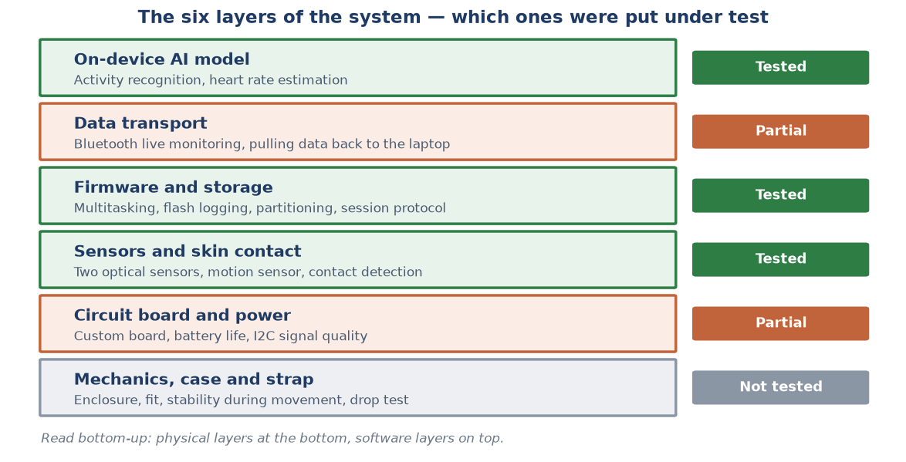
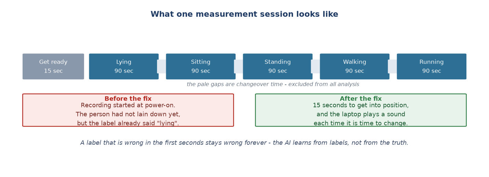
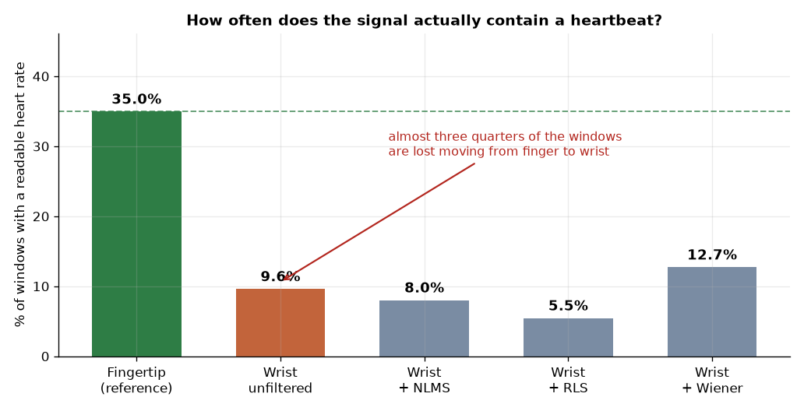
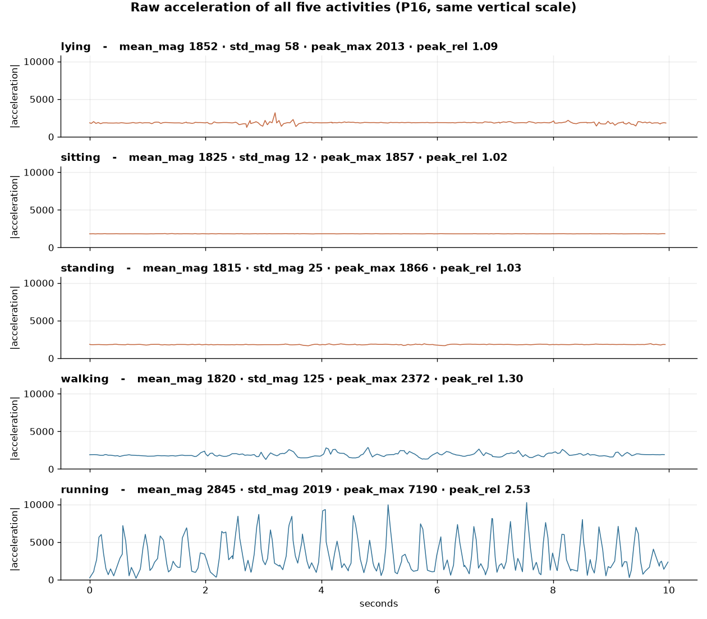
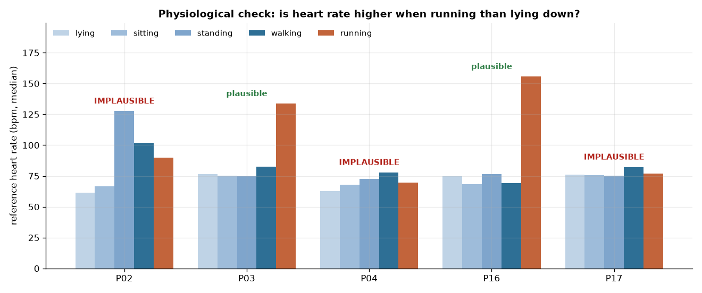

# Prototype Testing Demonstration 2

**Wrist-worn activity recognition and heart rate device — Prototype testing report**

Wearable Activity & Health Monitor · Whole-system testing

---

## 1. The prototype, the scope, and the testing conditions

### 1.1. The prototype

A complete wrist-worn device, running on battery, processing everything on the chip:

| Component | Configuration |
| :--- | :--- |
| Microcontroller | Seeed XIAO ESP32-S3, running FreeRTOS with multiple tasks |
| Motion sensor | MPU6050 — 3-axis accelerometer, sampled at 25 Hz |
| Optical sensor | MAX30102 on the dorsal wrist, reflective mode, 940nm infrared LED |
| Reference sensor | MAX30102 clipped to the fingertip (testing only, not part of the product) |
| Power | LiPo battery through the JST connector, charge management built into the board |
| Storage | On-chip flash, a dedicated 4.94 MB partition, written continuously through each session |
| Data transport | Bluetooth Low Energy — live monitoring only, not the primary recording path |
| On-device AI model | Decision Tree exported to C code, running directly on the chip |

*Table 1: The prototype configuration put under test.*

This prototype is **not a software module**. It is a physical device with six layers stacked on
top of each other, and if one layer fails, every layer above it becomes meaningless — however
correctly they were written. A model that is 100% accurate still cannot rescue a session that
was cut short because the power dropped.

### 1.2. Scope — which layers were tested, and which were not

This report tests **the complete device**, not only the artificial intelligence part. But the
level of evidence differs from layer to layer, and that is stated up front rather than left for
the reader to work out:

| System layer | Level of testing | Evidence held in this record |
| :--- | :--- | :--- |
| On-device AI model | **Full** | 18 participants, user-independent evaluation, run live on a wrist |
| Data transport | **Partial** | Fault log and fixes exist; the 60-minute no-disconnect target is **unmeasured** |
| Firmware and storage | **Full** | Capacity measured directly on the board, integrity checked per session |
| Sensors and skin contact | **Full** | Per-row contact checking, algorithm re-run on the raw signal |
| Circuit board and power | **Partial** | Power supply tested; the custom board itself has **no evidence** |
| Mechanics, case and strap | **Not tested** | No drop test log, no fit test, no vibration measurement |

*Table 2: Level of evidence by system layer.*

**Why the untested layers are reported anyway:** a table that lists only what went well does not
tell you what the system is still missing. The last two rows of Table 2 are **a real testing
result** — that result is *no data yet* — and section 4.2 names exactly which targets are empty.

### 1.3. Real testing conditions

Testing was **not** carried out under ideal laboratory conditions. The device was worn on a real
wrist, running on battery, with no cable to a computer for the whole session.

| Factor | Condition actually applied |
| :--- | :--- |
| Participants | **18 people** for activity recognition; 5 with both optical channels |
| Length of each session | ~7.5 minutes continuous, no pause in the middle |
| Activities | 5 real states: lying, sitting, standing, walking, running |
| Power | LiPo battery, no cable |
| Data transport | Written to internal storage; Bluetooth only for monitoring |
| Noise | No control over spontaneous movement by participants |

*Table 3: Testing conditions.*

One constraint shaped the whole test design: **each participant was measured only once**. There
were no repeat sessions. This forced the testing process to catch faults **while measuring**,
not after analysis.

---

## 2. The testing process

The prototype was tested at **five independent layers**, ordered from physical up to software.
Each layer catches a kind of fault the other layers cannot see at all — and this order cannot be
reversed: you cannot evaluate a model on data collected by a device that is not yet known to run
correctly.

### 2.1. Layer 1 — Bench testing: power, storage, start-up

Before being worn by anyone, the device has to run a full **7.5-minute session on battery**
without cutting out, and still have enough free storage to record all of it.

**How it was tested:** run a full session in exactly the configuration that will be used for
real — same power source, same flash writing load, same number of sensors — then count the rows
recorded against the number of rows there should have been.

**Why this needs to be a separate layer:** faults at this layer **do not report themselves**.
The device does not hang and shows no message — it simply stops recording. Without counting
rows, a broken session looks exactly like a successful one.

### 2.2. Layer 2 — Testing the sensors and skin contact

The optical sensor only reads when it is **pressed properly against skin**. The motion sensor,
by contrast, always produces numbers — even when the device is lying on a table.

**How it was tested:** compare the contact state the device reports against what the operator
actually observes, and **re-run the beat detection algorithm on the recorded raw signal** to see
how many of the beats genuinely present it accepts.

### 2.3. Layer 3 — Testing the data collection protocol

Every session follows a fixed sequence so that data labels always come from the protocol clock,
not from a human judgement call or from the model.

**Checked live during measurement:** two indicators shown directly to the operator — whether the
sensor is pressed correctly against skin, and how many seconds remain in the current activity.

### 2.4. Layer 4 — Testing the model on data, user-independent

The model is evaluated with **LOGO-CV (Leave-One-Group-Out Cross-Validation)** — each person is
held out entirely as the test set, the model learns from the other 17, repeated for all 18
rounds.

**Why this method:** with a random row-wise split, adjacent time windows from the same person
end up in both the training and the test set. The model only has to memorise that person's
characteristics to score well — a very pretty number that means nothing, because in reality the
device always meets new users. LOGO-CV gives the number that **actually holds for a stranger**.

### 2.5. Layer 5 — Testing on the real hardware

The model trained on the computer is exported to C code, flashed onto the chip, then **worn on
a wrist and run live**. This is the only testing layer that catches faults arising in the move
from computer to hardware.

### 2.6. The metrics used

| Metric | Used for | Why it was chosen |
| :--- | :--- | :--- |
| Rows recorded / rows expected | Power, storage, sensors | Hardware faults are usually silent — only counting reveals them |
| Share of beats accepted on re-run | Optical sensor | Separates "the sensor is broken" from "the algorithm is broken" |
| LOGO-CV accuracy | Activity recognition | Measures performance on new users, not on people already learned |
| Per-class recall | Activity recognition | A single average hides where exactly the model breaks |
| Majority-class baseline | Activity recognition | Without a floor, an accuracy number carries no meaning |
| MAE (bpm) | Heart rate | The metric required by the ANSI/AAMI EC13 standard |
| Signal Yield Rate | Heart rate | Before discussing error, you must know what share of the time a signal is readable |
| Physiological sanity test | Validating the reference data | Heart rate while running must be higher than while lying down |

*Table 4: Eight metrics and the reason for each.*

---

## 3. Testing results, layer by layer

### 3.1. The power and storage layer

| Test item | First result | Result after the fix |
| :--- | :--- | :--- |
| Holds power for a full 7.5-minute session | **Fail** — cuts out after ~30 seconds, no error | **Pass** — no session cut short |
| Enough free storage for 1 person, 5 activities | **Fail** — 1.5 MB allocated, ~1.6 MB needed | **Pass** — 4.94 MB after re-partitioning |
| Data can be pulled once the board is inside the case | **Fail** — 2 of 3 methods tried were unstable | **Pass** — the reset requirement was removed entirely |

*Table 5: Testing results at the power and storage layer.*

These three problems are detailed in sections 5.1 to 5.3. What they share: **not one of them
reported an error on screen**. All three surfaced only when someone counted the data rows again,
or measured the capacity actually allocated on the real board rather than reading the chip's
nominal specification.

### 3.2. The sensor and skin contact layer

| Test item | Result |
| :--- | :--- |
| Reports contact state per data row | **Failed first** — the flag was set once at start-up, every row carried the same value |
| Beat detection threshold can recover by itself | **Failed first** — could stick permanently, heart rate frozen for tens of seconds |
| Both optical sensors can run together | **Failed first** — identical fixed address, no address-select pin |
| Integrity of the main session data | **Pass** — 100% of expected rows |
| Integrity of the raw waveform (auxiliary channel) | **Partial pass** — ~72% kept, ~28% lost across ~3,000 small gaps |
| Can the on-chip heart rate be used as a reference | **Fail** — only 58 of 228 beats accepted, sometimes 58 seconds apart |

*Table 6: Testing results at the sensor layer.*

The last row of Table 6 is a testing result that **decided the direction of the whole project**:
it confirmed that the heart rate computed live on the chip should be treated as a rough
indicator, **not as reference data**. That conclusion is why the project had to record the raw
signal as well and recompute heart rate offline — rather than keep patching the on-chip
algorithm.

### 3.3. The data transport layer

| Test item | Result |
| :--- | :--- |
| Recording does not depend on radio quality | **Pass** — every row written to flash unconditionally |
| Advertising resumes after a disconnect | **Failed first** — 100% of reconnection attempts failed; **Pass** after the fix |
| 0 unintended disconnects in 60 minutes | **Fail** — still drops even standing next to the laptop, root cause not found |

*Table 7: Testing results at the data transport layer.*

**Why this unfixed fault does not damage the data:** the architecture makes flash the source of
truth and treats the radio as a live-view convenience. If Bluetooth drops, the operator loses
the monitoring screen, but the session still records fully to internal storage. This was an
architectural decision **made before** the fault appeared — and it is what turned a fault that
should have ruined a whole measurement day into an acceptable nuisance.

### 3.4. The model layer — activity recognition

| Configuration | Accuracy (LOGO-CV, 18 people) | Note |
| :--- | ---: | :--- |
| 5 classes (lying/sitting/standing/walking/running) | 54.8% | The originally committed configuration |
| **3 classes (resting/walking/running)** | **85.3%** | After redefining the problem, see section 6.1 |

Per-class recall in the 5-class configuration shows the error is **not evenly distributed**:

| Activity | Recall | Assessment |
| :--- | ---: | :--- |
| Lying | 28.4% | Close to random guessing (20%) |
| Sitting | 46.9% | Heavily confused with standing |
| Standing | 55.1% | Heavily confused with sitting |
| Walking | 64.6% | Clearly separated from the static group |
| Running | 78.2% | Completely separated |

*Table 8: Per-class recall — all of the error is concentrated in the three static postures.*

**Live results on the device** (worn on a wrist, classifying in real time):

| Activity | Correct when running live |
| :--- | ---: |
| Running | **99%** |
| Standing | **76%** |
| Lying / Sitting | Still confused with standing |

*Table 9: Live results on the hardware.*

The important point: **the direction of the confusion when running live matches exactly what the
training stage predicted.** This confirms the whole chain *training → code export → device
flashing* works correctly, with no new distortion introduced by integration.

### 3.5. The model layer — heart rate

| Signal | Share of windows with a valid heart rate |
| :--- | ---: |
| Fingertip (reference channel) | 35.0% |
| **Wrist, unfiltered** | **9.6%** |
| Wrist + NLMS | 8.0% |
| Wrist + RLS | 5.5% |
| Wrist + Wiener | 12.7% |

*Table 10: Signal Yield Rate — the most important figure for this subsystem.*

The conclusion does not depend on the chosen acceptance threshold. Sweeping the full range from
loose to strict: the more the signal is required to carry genuine physiological rhythm, the
further the wrist yield falls — at the strictest level only **1.6%** against 19.6% at the
fingertip, a gap of **12.2 times**.

---

## 4. Comparison against the project requirements

### 4.1. Functional requirements

| Requirement in the proposal | Testing result | Status |
| :--- | :--- | :--- |
| Dataset of ≥ 10 participants | 18 people | **Exceeded** |
| Wrist / fingertip controlled experiment, ≥ 5 people | Exactly 5 people with both channels | **Met** |
| Activity recognition ≥ 85% on unseen users | 3 classes reach 85.3%; 5 classes reach 54.8% | **Met with conditions** |
| 5-class classification — a required deliverable | Narrowed to 3 classes | Redirected, on measured grounds |
| Heart rate usable in practice | Signal Yield 9.6% | **Not met** |
| Model running directly on the microcontroller | Yes, verified on a human wrist | **Met** |
| Device runs standalone on battery for a full session | 18 complete sessions, none cut short | **Met** |

*Table 11: Testing results against the functional requirements.*

**About the "met with conditions" row:** the 85% threshold is satisfied, but on a problem
narrowed from 5 classes to 3. This report does not present that as an unqualified success — the
reason for narrowing and the grounds for it are in sections 5.5 and 6.1.

### 4.2. Quantified standards — the whole system

The proposal set **pass/fail** standards, not guidelines. The table below lists all 16 of them,
ordered by system layer, including the ones that could not be measured:

| Layer | Standard | Threshold | Status |
| :--- | :--- | :--- | :--- |
| AI model | Accuracy on unseen users | ≥ 85% | **Met** (3 classes: 85.3%) |
| AI model | Inference latency | ≤ 50 ms | **Not measured** |
| AI model | Model RAM usage | ≤ 100 KB | **Not measured** |
| Firmware | Heap stable over 60 minutes | No leak | **Not measured** |
| Data transport | Unintended disconnects | 0 per 60 min | **Not met** — see section 3.3 |
| Data | Number of participants | ≥ 10 people | **Exceeded** — 18 people |
| Data | Number of activity classes | ≥ 5 classes | **Met** — all 5 classes |
| Circuit board | Design rule errors before ordering | 0 errors | **No evidence** |
| Circuit board | First power-on without rework | No rework | **No evidence** |
| Circuit board | Battery life | ≥ 4 hours | **Not measured** |
| Circuit board | I2C signal quality | No ringing | **No evidence** |
| Mechanics | Board fits the case | No force, tape or filing | **Met indirectly** — the board was inside the case during collection |
| Mechanics | Optical sensor placement | Dorsal wrist | **Met** — but the wrong wavelength, see section 5.8 |
| Mechanics | Stable while moving | 5/5 participants | **No log** |
| Mechanics | Motion noise reduced by the case | ≤ 50% of the no-case level | **Not measured** |
| Mechanics | Drop test | 0 connection failures after 5 drops from 50 cm | **Not carried out** |

*Table 12: All 16 quantified standards — 5 met, 1 met indirectly, 1 not met, 9 with no data.*

**How to read this table:** *"Not measured"* means the measurement is feasible but was never
run — this is the most clearly defined remaining work of the project. *"No evidence"* means the
item belongs to a layer that left no trace at all in this technical record.

Nine empty standards is a notable result in itself: **more than half of the project's quantified
standards were never measured**, while the AI model — which occupies only the top two layers —
was tested to the point of finding a fault inside its own measuring instrument. Section 8.3
returns to this imbalance.

---

## 5. Problems found through testing

All eight problems below **surfaced only through testing**. The first four sit at the hardware
and system layers; the last four sit at the data and model layers.

### 5.1. Problem 1 — The power supply cuts out mid-session with no error

**Found by:** running a full session on battery, then counting the recorded data rows.

Running the device from an ordinary power bank, power **cut out after about 30 seconds**. The
cause: the ESP32 draws so little current that it never crosses the threshold for the power bank
to recognise "a device is still plugged in" — so it switched itself off to save charge, exactly
as a power bank is designed to do.

→ **Why this is the most serious problem in this group:** the session was cut with **no error at
all**. No hang, no message, no red log line. The data file still opens, still in the right
format — just shorter. Without counting rows, a ruined measurement session looks identical to a
successful one.

→ **The fix:** switch to a LiPo battery plugged straight into the board's JST connector, using
the charge management already built into the board.

### 5.2. Problem 2 — Less storage allocated than the chip actually has

**Found by:** measuring the free space directly on the board, instead of trusting the chip
specification.

The board carries 8 MB of flash, but the default partition configuration allocated only
**1.5 MB** to the data area — because it applies the standard profile for the 4 MB version of
the chip. One participant recording all 5 activities needs about **1.6 MB**. In other words, the
default was **always short**, if only slightly.

→ **The fix:** write a custom partition table, drop the second over-the-air update slot, and
give the data area **4.94 MB**.

→ **A side effect that has to be recorded:** re-flashing the firmware **erases every session
still on the board**. This became a mandatory step in the process: pull the data to the computer
before re-flashing.

### 5.3. Problem 3 — Once the board is in the case, the reset button cannot be pressed

**Found by:** assembling the complete device and then trying to pull data as the real process
requires.

The original data-pulling process required pressing reset and then sending a command within the
first 3 seconds after boot. Once the board sat inside the wearable case, **the reset button was
out of reach**. Two alternative methods were both unstable on this board and operating system.

→ **The fix — and why it is worth noting:** instead of hunting for a third way to reset, the
design was changed to **drop the reset requirement entirely**. The device listens for the
command continuously and allows data to be pulled at any time after measurement finishes. The
root cause was never the button; it was that the old process tied data pulling to the moment of
start-up.

### 5.4. Problem 4 — The on-chip heart rate is not reliable enough to be a reference

**Found by:** re-running the beat detection algorithm on the recorded raw signal and counting
the acceptance rate.

On the real raw signal, the algorithm running on the chip accepted only **58 of 228 waves** as
valid beats, and in places two consecutive accepted beats were as much as **58 seconds** apart.
The detection threshold could also **stick permanently**: one strong movement pushing the
threshold above the true pulse amplitude leaves no wave able to cross it and bring it back down.

→ **Conclusion:** the heart rate shown live is only a **rough indicator**, not reference data.
This is why the project had to record the raw signal as well and recompute heart rate offline.

### 5.5. Problem 5 — The three static postures cannot be separated (a structural limit)

**Found by:** breaking accuracy down into per-class recall (Table 8), then tracing the cause with
a mathematical argument.

All four features fed to the model are computed from the **magnitude** of acceleration, that is
`√(ax² + ay² + az²)` — the **length** of the acceleration vector. When the wrist rotates, the
vector changes **direction** but **not length**. And lying, sitting and standing differ exactly
in wrist direction.

Direct numerical evidence: the median `mean_mag` for lying / sitting / standing / walking is
**2000 · 1828 · 1896 · 1937** — four completely different body postures, yet almost identical
acceleration magnitude, all around 1g, meaning the sensor is only measuring **gravity**.

→ **Conclusion:** this is a **structural limit of the feature set**, not a parameter choice
gone wrong. The necessary information was destroyed at the feature computation step, before the
model ever saw the data. No amount of model tuning can recover it.

### 5.6. Problem 6 — Six sessions recorded with nobody wearing the device

**Found by:** plotting the raw waveform and comparing it against physical expectation.

Six sessions had the right number of labels, the right number of data rows, and no errors in the
log — but the device was sitting still on a table with nobody wearing it. They surfaced only
when someone plotted the waveform and asked: *why is the "running" segment as flat as the
"lying" segment?*

→ **Severity:** had those six sessions entered training, the model would have been taught that
running looks like lying still. Every number afterwards would be wrong, with no way to trace the
cause.

### 5.7. Problem 7 — The reference measurement was wrong by a factor of two

**Found by:** a physiological test — *is heart rate higher when running than when lying down?*

The fingertip reference channel — assumed to be a clean standard — **fails the test for 3 of 5
people**. The worst case recorded **127.7 bpm standing still but only 89.7 bpm running**.

Traced by plotting the raw waveform and counting peaks by hand: the waveform was **very clean**,
30 peaks in 12 seconds, that is 155.6 bpm, while the algorithm reported **77.0 bpm** — exactly
half.

The competing explanation was ruled out: if each beat were counted as two peaks, the gaps
between peaks would alternate long-short. Measured: the ratio of odd to even gaps was **1.03**
(perfectly even), while the ratio of odd to even peak heights was **2.22**. So it is the
**height** that alternates, not the spacing.

→ **Mechanism:** alternating tall and short beats make the waveform repeat every *two* beats,
creating a strong spectral component at exactly half the true rate. The algorithm locked onto it.

→ **Why it survived so long:** the fault arises at the measurement layer, but the implausible-
value guard sits at the smoothing layer. When the measurement layer keeps returning [77, 77, 77,
…], perfectly consistent, the smoothing layer trusts it completely; when the measurement layer
occasionally caught the true 156, the smoothing layer **rejected it**. The system was actively
protecting the wrong number.

### 5.8. Problem 8 — The wrong optical wavelength for the measurement site

**Found by:** the Signal Yield result after the measuring instrument had been corrected
(Table 10).

| Wavelength | Haemoglobin absorption | Suited to |
| :--- | :--- | :--- |
| ~525 nm (green) | **Very strong** | Reflective measurement at the wrist — what commercial watches use |
| 660 nm (red) | Weak | SpO2, transmissive measurement at the fingertip |
| 940 nm (infrared) | Weak | SpO2, transmissive measurement at the fingertip |

*Table 13: Optical absorption characteristics by wavelength.*

The MAX30102 can only emit red and infrared — two wavelengths blood barely **absorbs**. At the
wrist they penetrate deeply, but most of the returning light comes from deep tissue, tendon and
bone, so the pulse is only a very small ripple on a large background.

→ **Conclusion:** this is *"the right sensor at the wrong anatomical site"*. The wrist location
is not wrong — commercial watches sit there too. What is wrong is the **wavelength**.

→ **This is the lowest layer any problem in this report was traced to:** not an algorithm fault,
not a firmware fault, but a component choice at the sensing layer. No layer above it can fix it.

---

## 6. Improvements made on the basis of the testing results

Every improvement below was triggered by a specific testing result, not by a judgement made in
advance.

**Hardware and system layers:**

| # | Improvement | Triggered by | Result after the change |
| :--- | :--- | :--- | :--- |
| 1 | Switch power from a power bank to a LiPo battery via JST | Problem 1 (section 5.1) | No session cut short again |
| 2 | Write a custom storage partition table | Problem 2 (section 5.2) | 1.5 MB → **4.94 MB**, enough for a full session |
| 3 | Drop the reset requirement, allow data pulling any time after measuring | Problem 3 (section 5.3) | Data can be pulled with the board inside the case |
| 4 | Move the second optical sensor onto its own bus | Identical fixed address, no address-select pin | Both optical channels run in parallel |
| 5 | Write to flash unconditionally, use the radio only for live viewing | The radio was unreliable in the real environment | A dropped connection no longer ruins a session |
| 6 | Resume advertising automatically after a disconnect | 100% of reconnection attempts failed | Reconnection works |

**Data and model layers:**

| # | Improvement | Triggered by | Result after the change |
| :--- | :--- | :--- | :--- |
| 7 | Add 15 seconds of preparation before the first activity; move audio cues to the computer | Labels wrong in the first seconds of every session | Labels match reality from the start |
| 8 | Check skin contact continuously instead of once at start-up | Problem 4 (section 5.4) | Detectable while measuring |
| 9 | Beat detection threshold adapts and can recover by itself | Problem 4 (section 5.4) | No longer sticks permanently |
| 10 | An automatic rule excluding sessions with nobody wearing the device | Problem 6 (section 5.6) | 6 of 21 sessions correctly excluded |
| 11 | Remove the logic forcing a default "lying" when the device is still | Testing on the real hardware | The new model performs its main function correctly |
| 12 | **Redefine the problem from 5 classes to 3** | Problem 5 (section 5.5) | **54.8% → 85.3%** |
| 13 | **Replace the heart rate estimator (Estimator v2)** | Problem 7 (section 5.7) | Passing the physiological test: **2/5 → 4/5 people** |

*Table 14: Thirteen improvements, each traceable to the testing result that triggered it.*

**Something improvements 1, 3 and 5 have in common:** none of them **fixed the thing that broke**.
The power bank was not broken — it worked exactly as designed, and that design simply does not
suit a low-current device. The reset button was not broken — the old process was merely tied to
it. Bluetooth was not broken — it was merely not reliable enough to be the primary recording
path. In all three cases the fix was to **change the system's constraints**, not to patch the
component that was misbehaving.

### 6.1. Improvement 12 in detail — Redefining the problem

The model, the four features, the dataset and the evaluation protocol were all kept exactly as
they were — only the three static postures were merged into one group.

**Is this picking a split that produces a nicer number?** No, for two reasons:

1. **The merge boundary was derived before looking at the result**, from the root cause in
   section 5.5.
2. **The merge removes exactly the part the feature set cannot observe**, keeping the part it
   observes very well.

**A fair assessment — comparison against the floor:**

| Problem | Floor (guess the largest class) | Measured accuracy | Margin over the floor |
| :--- | ---: | ---: | ---: |
| 5 classes | 0.201 | 0.548 | **+0.347** |
| 3 classes | 0.599 | 0.853 | **+0.254** |

*Table 15: A fair comparison against each problem's own floor.*

→ **Stated honestly:** putting 54.8% next to 85.3% **overstates the improvement**. The 3-class
problem is structurally easier because the "resting" class makes up 60% of the data. The fair
metric is the margin over each problem's own floor — and by that metric, what the model
**actually learned** in the 3-class problem (+0.254) is **smaller** than in the 5-class problem
(+0.347).

### 6.2. Improvement 13 in detail — Replacing the heart rate estimator

The new estimator changes three things: it measures the **median gap between beats** in the time
domain instead of tracking a spectral peak; it **returns "not readable"** when the beats are too
irregular instead of guessing; and it **drops the cross-window continuity constraint** entirely.

| Verification case | Old estimator | New estimator | Hand count |
| :--- | ---: | ---: | ---: |
| Subject A while running | 77.0 | **156.9** | 155.6 |
| Subject B while running | 155.8 | **118.9** | 111.3 |
| People passing the physiological test | 2/5 | **4/5** | — |

*Table 16: Verifying the new estimator by counting peaks by hand.*

The new estimator corrects the error in **both directions** — one case was read at half the true
value, the other above it. This confirms it works from a genuine physical mechanism, and is not
a one-directional correction that happened to land.

---

## 7. How the testing results changed the project's direction

The original proposal asked: *which noise removal algorithm — LMS, RLS or Wiener — best removes
motion artifacts from wrist PPG?*

The testing results in section 3.5 show that **the premise of this question does not hold**. For
around 90% of the time, the wrist signal in this hardware configuration contains no pulse to
clean up. A filter *separates* signal from noise — it does not *create* signal.

This is why the project moved its focus from **optimising the algorithm** to **tracing the
hardware limit**. That change of direction was not a matter of preference, but a **direct
consequence of the testing results**:

| If the original direction had continued | What the testing results show |
| :--- | :--- |
| Tuning the parameters of the three filters | All three make it worse, because they subtract the little signal that remains |
| Trying a fourth filter | Does not change the fact that the input contains no pulse |
| Adding more participants | Does not change the optical properties of the wavelength |

*Table 17: Why continuing in the original direction would not have solved the problem.*

The final outcome of the heart rate subsystem is therefore a **carefully validated negative
result**: software filters cannot compensate for choosing the wrong optical wavelength at the
sensing layer. The original hypothesis — *cheap hardware plus a good algorithm can replace
purpose-built hardware* — was refuted experimentally, not abandoned unfinished.

---

## 8. What the testing process taught

### 8.1. Faults at low layers are silent; faults at high layers are loud

Sorting the eight problems in section 5 by layer, a pattern emerges clearly:

| Layer | How the fault presents | Found by |
| :--- | :--- | :--- |
| Power, storage | **Completely silent** — the file still opens, just shorter | Counting rows against expectation |
| Sensors, contact | **Silent** — still produces numbers, just meaningless ones | Re-running the algorithm on the raw signal |
| Data transport | **Loud** — reports an error immediately | Reading the error message |
| Data, model | **Silent but consistent** — pretty numbers, stable, wrong | Comparison against physical law |

*Table 18: Faults present differently at each layer.*

→ **Consequence for the testing process:** the lower the layer, the more it must be checked by
**counting and measuring directly**, rather than waiting for the system to report. The only
fault that announced itself on screen was the transport fault — which is also the **least
harmful one**, because the architecture was designed to withstand it.

### 8.2. Consistent numbers do not mean correct numbers

Three of the eight problems **passed every automated check**:

| Problem | What the metrics said | The reality | Found by |
| :--- | :--- | :--- | :--- |
| 6 fake sessions | "Right labels, right rows, no errors" | Nobody was wearing the device | Plotting the waveform |
| Three static postures | "Accuracy 54.8% — a mediocre model" | The feature set is completely blind to 3 classes | A three-line mathematical argument |
| Reference wrong by half | "MAE ~27 bpm — the filters are useless" | The measuring instrument was wrong by half | Asking "is running higher than lying?" |

*Table 19: Three faults that passed every automated check.*

All three faults were **numerically consistent** — the sequence [77, 77, 77, …] is perfectly
even; the confusion matrix is very stable across 18 evaluation rounds. That consistency is
exactly what carried them past every automated check: the metrics test whether the data **agrees
with itself**, not whether it **agrees with physical reality**.

**The principle:** every reference signal needs at least one test against a known physical or
physiological law. The three tests that found these three faults each took **under 15 minutes**,
and all three sat outside every automated evaluation pipeline.

### 8.3. Testing was concentrated at the top layer

Table 12 shows an imbalance that has to be stated plainly: **9 of 16 quantified standards have
no data**, and all nine of them sit at the physical layers — circuit board, power, mechanics —
together with three on-chip resource measurements. Meanwhile the AI model layer was tested to
the point of finding a fault inside its own measuring instrument.

→ **Why this is more worrying than impressive:** by the very pattern in section 8.1, the layers
that were not tested are precisely the layers where faults are **most silent**. That they have
not caused an incident yet is not evidence that they are correct — it is evidence that nobody
has counted.

---

## 9. Inventory of supporting evidence

| Type of evidence | Content | Location |
| :--- | :--- | :--- |
| Measured data | 18 participants, 20,258 data windows (16,880 after excluding transitions) | `data/processed/master_dataset.csv` |
| Raw data | 6-channel raw signals from the 5 people with both optical channels | `experiments/wrist/valid_sessions/` |
| Testing log | The status of every session, including exclusions and the reason for each | `experiments/wrist/session_manifest.csv` |
| System change log | Every hardware and protocol decision, with its cause | `CHANGELOG.md` |
| Testing code | 12 scripts; every number reproducible with one command | See `paper/EVIDENCE_GUIDE.md` |
| Measurement figures | 12 figures generated directly from data, none drawn by hand | `paper/figures_en/` |
| Firmware source | The multi-task architecture and the on-device feature computation | `firmware_ble/main.cpp`, lines 738–750 |

*Table 20: Inventory of evidence.*

**Reproducibility:** every script fixes `random_state = 0`; there is no randomness anywhere.
Running any of them any number of times produces exactly the same result. The procedure for
re-running each individual number is recorded in `paper/EVIDENCE_GUIDE.md`.

**Evidence that does not exist — stated so it is not misread:**

| What is missing | What it means for this report |
| :--- | :--- |
| Photographs and video of the hardware testing session | The results in Table 9 exist only as data logs, with no recording |
| Circuit board design and verification records | Three standards in Table 12 cannot be assessed |
| Case, wearability and drop test logs | Three standards in Table 12 cannot be assessed |
| Latency, memory, battery life and 60-minute stability measurements | Four standards in Table 12 cannot be assessed |

*Table 21: What this record does not contain.*

---

## 10. Conclusion

The prototype was tested under real conditions on 18 participants, at **five independent
layers** — from power and storage, through the sensors and the transport path, to the collection
protocol, user-independent model evaluation, and live operation on hardware worn on a wrist.

**Requirements met:** the device completed all 18 sessions on battery with none cut short; the
main session data is 100% intact; activity recognition reaches 85.3% on unseen users, runs
directly on the microcontroller, and its behaviour on real hardware matches its behaviour on the
computer.

**Requirements not met:** the heart rate subsystem, with the cause traced to the sensing layer —
the wrong optical wavelength for reflective measurement at the wrist. The 60-minute connection
stability standard was also not met, though without affecting the data, thanks to the
architecture that makes internal storage the source of truth.

**Not assessable:** 9 of 16 quantified standards, all of them at the physical layers of the
system. This is the most clearly defined remaining work of the project.

**The value of the testing process:** eight problems were found, spread from the power layer up
to the model layer. Three of them had passed every automated check and surfaced only through
physical verification. Thirteen improvements were made, each traceable to the testing result
that triggered it. Most importantly, testing revealed that a result which appeared finished had
in fact been measured with a broken instrument — and corrected it before it reached the final
conclusion.
