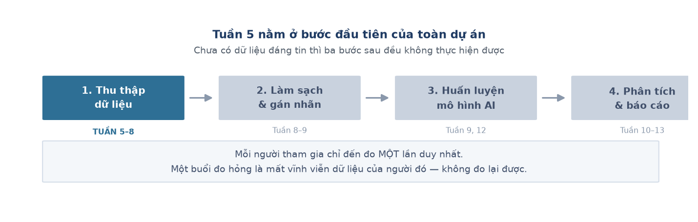
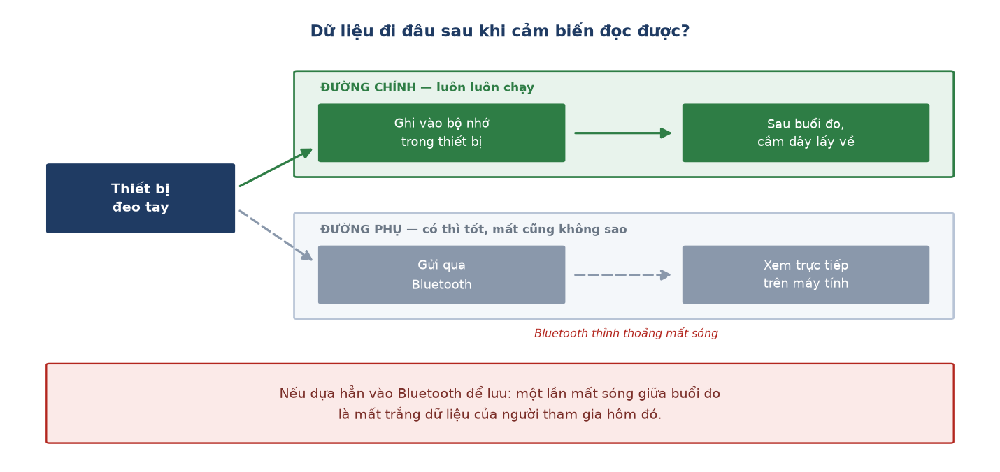
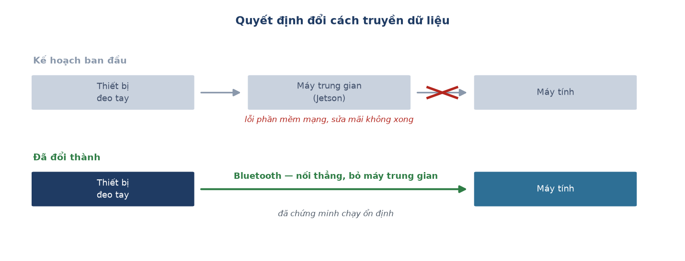

# Week 5 Report — Dựng nền móng thu thập dữ liệu

## Tuần này làm gì — nhìn tổng quan

**Giai đoạn:** Phase 2 của dự án — *Edge AI Integration* (Tuần 5–9). Nhưng cụ thể tuần
này chưa đụng tới AI: toàn bộ công sức dồn vào **xây dựng hệ thống thu thập dữ liệu cho
đáng tin**.

**Một câu tóm tắt:** tuần này không tạo ra tính năng nào người dùng nhìn thấy được, mà
tạo ra thứ khiến mọi tuần sau có cái để làm — một quy trình thu dữ liệu chạy được trọn
vẹn từ đầu đến cuối mà không đứt giữa chừng.

**Vì sao bước này quan trọng đến vậy:** mô hình AI ở bước 3 học từ dữ liệu do bước 1 thu
được. Nếu dữ liệu sai hoặc thiếu, mô hình sẽ học đúng cái sai đó — và điều tệ nhất là nó
vẫn cho ra kết quả trông rất đẹp, khiến không ai phát hiện được vấn đề cho tới rất muộn.

Thêm một ràng buộc khiến việc này khó hơn bình thường: **mỗi người tham gia chỉ đến đo
một lần duy nhất**. Không có chuyện "hỏng thì mai đo lại". Một buổi đo bị đứt giữa chừng
là mất vĩnh viễn dữ liệu của người đó. Vì vậy toàn bộ quyết định kỹ thuật trong tuần này
đều xoay quanh một câu hỏi: *làm sao để một buổi đo không thể hỏng?*

---

## Nhóm việc 1 — Quyết định lớn nhất: dữ liệu được lưu ở đâu?

Đây là quyết định kiến trúc quan trọng nhất của cả tuần, và nó bảo vệ toàn bộ dữ liệu sẽ
thu trong các tuần sau.

- **Chọn bộ nhớ trong thiết bị làm nguồn lưu chính, Bluetooth chỉ để xem** (07-07). Mọi
  dòng dữ liệu được ghi thẳng vào bộ nhớ trong của thiết bị một cách vô điều kiện; sóng
  không dây chỉ dùng để theo dõi trực tiếp.
  → **Ý nghĩa:** dữ liệu được lưu vào bộ nhớ riêng của thiết bị (giống ghi vào ổ cứng)
  trước, còn Bluetooth chỉ để xem cho biết. Lý do: Bluetooth thỉnh thoảng mất sóng — nếu
  lỡ dựa hẳn vào nó để lưu thì một lần mất sóng giữa buổi đo là mất luôn dữ liệu của
  người tham gia hôm đó.

- **Bỏ phương án truyền qua máy trung gian, chuyển hẳn sang Bluetooth** (07-10). Kế hoạch
  ban đầu là truyền qua WiFi thông qua một máy tính trung gian (Jetson), nhưng gặp lỗi
  phần mềm mạng khó sửa. Nhánh cũ được giữ lại, không xoá.
  → **Ý nghĩa:** đây là một quyết định đánh đổi có chủ đích — bỏ phương án mới nhiều rủi
  ro để chọn phương án đã chứng minh chạy ổn định, tránh trễ tiến độ thu dữ liệu. Giữ
  song song cả hai hướng sẽ chỉ làm loãng thời gian.

- **Gói tin Bluetooth do chính thiết bị tạo đầy đủ** (07-10), thay vì để máy tính nhận tự
  suy ra.
  → **Ý nghĩa:** tránh trường hợp đồng hồ của thiết bị và đồng hồ của máy tính lệch nhau
  vài giây, làm sai lệch nhãn hoạt động đã gắn. Chỉ có **một** nguồn quyết định "dòng dữ
  liệu này thuộc về hoạt động nào, vào lúc nào" — là chính thiết bị.

---

## Nhóm việc 2 — Đảm bảo một buổi đo không bị đứt giữa chừng

Hai lỗi dưới đây đều có chung một đặc điểm nguy hiểm: chúng làm hỏng buổi đo mà **không
báo lỗi gì cả**.

- **Đổi nguồn điện: pin dự phòng thông thường → pin chuyên dụng cắm thẳng** (07-07). Pin
  dự phòng tự ngắt sau khoảng 30 giây vì thiết bị này rút quá ít điện.
  → **Ý nghĩa:** pin sạc dự phòng kiểu sạc điện thoại "tưởng" rằng không có thiết bị nào
  đang cắm nên tự tắt, làm thiết bị tắt đột ngột giữa lúc đang đo. Đổi sang loại pin cắm
  thẳng để mỗi buổi đo chạy trọn vẹn.

- **Sửa lỗi thiết bị không tự kết nối lại sau khi rớt Bluetooth** (07-10). Thêm cơ chế tự
  phát tín hiệu tìm kết nối và tự quét lại từ phía máy tính.
  → **Ý nghĩa:** trước đó, mỗi lần rớt kết nối phải tắt-mở thiết bị bằng tay giữa lúc
  người tham gia đang đo. Sau khi sửa, thiết bị tự phục hồi.

---

## Nhóm việc 3 — Bắt lỗi ngay tại chỗ, thay vì phát hiện sau khi đã muộn

Nhóm việc này xuất phát từ cùng một nguyên tắc: **một buổi đo hỏng mà phát hiện ngay thì
còn cứu được, phát hiện sau khi người tham gia đã về thì mất trắng.**

- **Hiển thị 2 thông tin ngay trong lúc đo** (07-10): cảm biến có đang áp đúng vị trí trên
  da không, và còn bao nhiêu giây nữa hết bài tập hiện tại.
  → **Ý nghĩa:** người vận hành biết ngay tại chỗ nếu cảm biến bị lệch để chỉnh lại kịp
  thời, thay vì phát hiện sau khi buổi đo đã kết thúc và dữ liệu đã hỏng không cứu được.

- **Công cụ vẽ biểu đồ kiểm tra bằng mắt** (`visualize_session.py`, 07-10), dựa trên một
  kỳ vọng vật lý đơn giản: cường độ vận động phải tăng dần theo thứ tự nằm → ngồi → đứng
  → đi bộ → chạy.
  → **Ý nghĩa:** kiểm tra xem một lần đo có "hợp lý" không trước khi đưa vào huấn luyện
  AI. Ví dụ: lúc đi bộ thiết bị phải rung nhiều hơn lúc nằm yên — nếu không thì buổi đo
  đó có vấn đề. Công cụ này về sau **thực sự phát hiện ra 6 buổi đo hỏng** ở Tuần 8.

- **Viết hướng dẫn để đồng đội nộp dữ liệu không cần biết lập trình** (07-11), qua giao
  diện web thông thường.
  → **Ý nghĩa:** cả nhóm cùng tham gia thu dữ liệu được, không bị nghẽn ở chỗ chỉ một
  người biết dùng công cụ chuyên môn.

---

## Kết quả cuối tuần

Một quy trình thu dữ liệu hoàn chỉnh, chạy được từ đầu đến cuối, với ba tính chất:

| Tính chất | Nghĩa là |
| :--- | :--- |
| Không mất dữ liệu khi mất sóng | Dữ liệu nằm trong thiết bị, sóng chỉ để xem |
| Không đứt giữa buổi đo | Nguồn điện ổn định, tự kết nối lại khi rớt |
| Phát hiện lỗi sớm | Cảnh báo ngay lúc đo, kiểm tra lại bằng biểu đồ sau đó |

## Khác biệt so với kế hoạch gốc

Kế hoạch gốc ghi *"TFLite Micro setup and Gerber files"* — tức là bắt đầu phần AI
và phần PCB. Thực tế tuần này **không đụng tới AI**.

Lý do là một đánh giá thứ tự ưu tiên: chưa có dữ liệu đáng tin thì chưa có gì để đưa vào
mô hình. Dồn công vào AI trước khi hạ tầng thu dữ liệu ổn định sẽ dẫn tới việc huấn luyện
trên dữ liệu hỏng — và như Tuần 8 về sau chứng minh, dữ liệu hỏng có thể vượt qua mọi
kiểm tra tự động mà không ai biết.

**Dẫn tới chương nào của thesis:** Chương 2 mục 2.1 (kiến trúc thiết bị và firmware) và
mục 2.2 (giao thức thu dữ liệu).

---
[Weekly reports index](README.md) · [Week 6 →](week_06.md)
