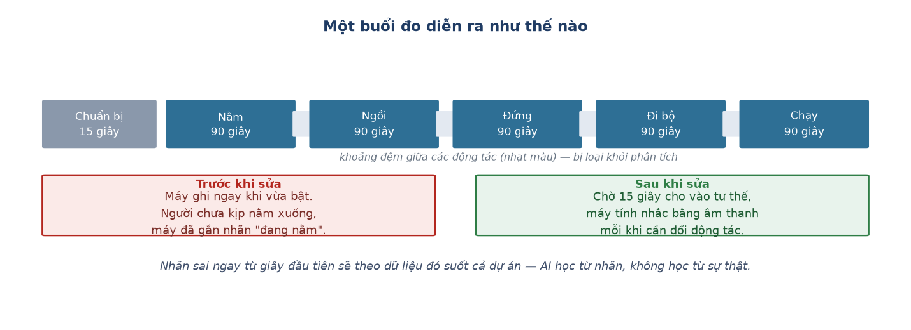

# Week 6 Report — Làm chắc quy trình thu dữ liệu

## Tuần này làm gì — nhìn tổng quan

**Giai đoạn:** Phase 2 — *Edge AI Integration* (Tuần 5–9), vẫn đang ở bước 1 của dự án:
thu thập dữ liệu.

**Một câu tóm tắt:** Tuần 5 đã dựng được quy trình thu dữ liệu chạy được. Tuần này đi sâu
hơn một tầng — sửa những lỗi khiến dữ liệu thu được **trông thì đúng nhưng thực ra sai**.

**Ý nghĩa trong tổng thể:** đây là loại lỗi nguy hiểm nhất trong cả dự án. Một buổi đo bị
đứt giữa chừng thì ai cũng thấy ngay. Nhưng một buổi đo chạy trọn vẹn, ghi đủ số dòng, mà
nhãn lại gắn sai vài giây đầu — thì không ai thấy, và AI sẽ học đúng cái sai đó.

---

## Nhóm việc 1 — Sửa nhãn dữ liệu cho khớp với thực tế

- **Thêm 15 giây chuẩn bị trước động tác đầu tiên, và chuyển âm thanh nhắc sang phát từ
  máy tính** (07-14).
  → **Ý nghĩa:** trước đó máy bắt đầu ghi ngay khi vừa bật, người tham gia chưa kịp nằm
  xuống thì máy đã tính là "đang nằm" — gắn nhãn sai ngay từ giây đầu tiên. Âm thanh nhắc
  đổi động tác chuyển sang phát từ máy tính vì loa nhỏ trên thiết bị gặp lỗi khi chạy pin.
  Đây là cải thiện trực tiếp cho **độ chính xác của nhãn** — nền tảng để AI học đúng.

- **Kiểm tra cảm biến áp da liên tục, thay vì chỉ kiểm tra một lần lúc bật máy** (07-14).
  → **Ý nghĩa:** cảm biến đo nhịp tim phải áp sát da mới đo đúng. Trước đó hệ thống chỉ
  kiểm tra đúng một lần lúc khởi động rồi coi như đúng suốt cả buổi — dù người tham gia có
  thể làm lệch cảm biến giữa chừng mà không ai biết. Sửa để kiểm tra lại theo từng khoảng
  thời gian, ghi kết quả vào cả dữ liệu lưu lẫn màn hình theo dõi.

## Nhóm việc 2 — Đo nhịp tim ổn định hơn

- **Ngưỡng nhận diện nhịp đập tự điều chỉnh theo từng người** (07-15).
  → **Ý nghĩa:** hệ thống nhận ra từng nhịp tim bằng cách theo dõi thay đổi của ánh sáng
  phản xạ trên da. Ngưỡng nhận diện cũ là một con số cố định, không phù hợp với biên độ
  tín hiệu khác nhau ở từng người — dẫn tới có lúc máy "không thấy nhịp nào" suốt hàng
  chục giây dù tim vẫn đập bình thường. Sửa để ngưỡng tự co giãn theo tín hiệu thực tế.
  Thêm một cột dữ liệu đánh dấu thời điểm một nhịp thật sự vừa được nhận ra, để sau này
  phân biệt được "máy vừa đo được" với "máy đang lặp lại số cũ".

## Nhóm việc 3 — Chuẩn bị nền cho hướng nghiên cứu về sau

- **Lấy dữ liệu ra không cần bấm nút trên thiết bị nữa** (07-14).
  → **Ý nghĩa:** trước đó phải bấm một nút vật lý trên thiết bị để lấy dữ liệu ra sau mỗi
  buổi đo — nhưng khi thiết bị được lắp vào vỏ hộp thì nút đó bị che mất. Sửa để ra lệnh
  được từ máy tính, không cần chạm vào thiết bị.

- **Bắt đầu ghi thêm luồng tín hiệu thô, song song với luồng dữ liệu chính** (07-15).
  → **Ý nghĩa:** ngoài hai mục tiêu chính (nhận diện hoạt động và đo nhịp tim), dự án còn
  một hướng nghiên cứu riêng: so sánh ba phương pháp lọc nhiễu do cử động tay gây ra. Muốn
  so sánh công bằng thì phải chạy các thuật toán trên **tín hiệu thô chưa qua xử lý**, chứ
  không phải trên con số nhịp tim đã tính sẵn. Tuần này bắt đầu ghi luồng thô đó, đặt nền
  cho công việc ở Tuần 10.

---

## Kết quả cuối tuần

| Trước tuần này | Sau tuần này |
| :--- | :--- |
| Nhãn sai vài giây đầu mỗi động tác | Có 15 giây chuẩn bị, nhãn khớp thực tế |
| Chỉ kiểm tra cảm biến áp da một lần | Kiểm tra liên tục suốt buổi đo |
| Nhịp tim đứng yên hàng chục giây | Ngưỡng tự điều chỉnh theo từng người |
| Chỉ lưu số nhịp tim đã tính | Lưu thêm tín hiệu thô cho nghiên cứu |

## Khác biệt so với kế hoạch gốc

Kế hoạch gốc ghi *"Model training, quantization, and PCB order"*. Thực tế chưa đủ dữ liệu
để huấn luyện mô hình — tuần này tiếp tục làm chắc phần thu thập trước. Phần đặt PCB nằm
ngoài phạm vi repo này.

**Dẫn tới chương nào của thesis:** Chương 2 mục 2.1 và 2.2 (kiến trúc thiết bị, giao thức
thu dữ liệu).

---
[← Week 5](week_05.md) · [Weekly reports index](README.md) · [Week 7 →](week_07.md)
