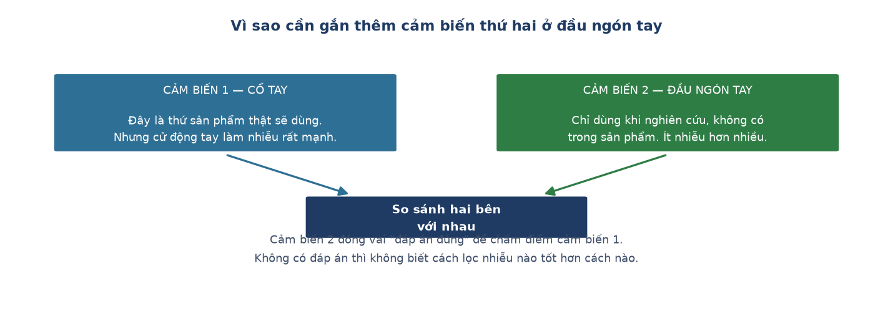

# Week 7 Report — Gắn thêm cảm biến thứ hai làm đáp án đối chiếu

## Tuần này làm gì — nhìn tổng quan

**Giai đoạn:** Phase 2 — *Edge AI Integration* (Tuần 5–9), vẫn ở bước 1: thu thập dữ liệu.

**Một câu tóm tắt:** dựng hạ tầng cho **hướng nghiên cứu về lọc nhiễu** — gắn thêm một cảm
biến thứ hai ở đầu ngón tay để làm "đáp án đúng", và mở rộng bộ nhớ thiết bị cho đủ chỗ
lưu tín hiệu thô.

**Ý nghĩa trong tổng thể:** hướng nghiên cứu của dự án là so sánh ba cách lọc nhiễu xem
cách nào đo nhịp tim chính xác nhất. Nhưng muốn nói "chính xác" thì phải có gì đó để đối
chiếu. Tuần này dựng đúng cái đó. *(Về sau, ở Tuần 13, chính "đáp án đúng" này lại bị phát
hiện là sai — nhưng đó là câu chuyện của tuần cuối.)*

---

## Nhóm việc 1 — Đáp án đối chiếu

- **Thêm cảm biến đo nhịp tim thứ hai, đặt ở đầu ngón tay** (07-16). Hai cảm biến cùng
  loại nên có địa chỉ trùng nhau, không dùng chung một đường truyền được — con thứ hai
  phải đi trên một đường riêng, với một tiến trình xử lý riêng.
  → **Ý nghĩa:** đo nhịp tim ở đầu ngón tay cho tín hiệu sạch hơn nhiều so với đo ở cổ tay,
  vì ngón tay có mật độ mạch máu dày hơn và ít bị cử động làm nhiễu hơn. Cảm biến này
  **không phải một tính năng của sản phẩm** — nó là thiết bị đo dùng riêng cho nghiên cứu,
  chỉ để làm chuẩn chấm điểm cho cảm biến chính ở cổ tay.

## Nhóm việc 2 — Đủ chỗ lưu tín hiệu thô

- **Cấu hình lại bộ nhớ trong thiết bị** (07-17). Cấu hình mặc định chỉ cấp phát một phần
  nhỏ so với dung lượng thật của chip, không đủ chứa tín hiệu thô của một người đo đủ 5
  động tác.
  → **Ý nghĩa:** nếu không sửa, dữ liệu của một buổi đo sẽ bị cắt cụt giữa chừng vì hết
  chỗ lưu — và điều tệ nhất là nó **không báo lỗi gì**, chỉ đơn giản là thiếu mất phần
  cuối. Chỉnh lại để dùng đúng hết dung lượng sẵn có.

## Nhóm việc 3 — Ghi nhận trung thực hai giới hạn chưa khắc phục

Hai mục dưới đây không phải thành tựu, mà là **hai vấn đề đã đo được và ghi lại** thay vì
bỏ qua.

- **Tín hiệu thô mất khoảng 28% số mẫu** (07-17). Đo trên một lần chạy thử 8 phút: luồng
  tín hiệu thô tốc độ cao chỉ giữ được khoảng 72% số mẫu kỳ vọng, nghi do thiết bị phải
  dừng lại lưu vào bộ nhớ theo chu kỳ.
  → **Ý nghĩa:** điều quan trọng nhất ở đây là **phạm vi ảnh hưởng**: giới hạn này chỉ
  chạm tới luồng tín hiệu thô phụ trợ cho nghiên cứu, **không** chạm tới dữ liệu chính
  dùng để nhận diện hoạt động — luồng chính vẫn nguyên vẹn 100%. Ghi rõ ra để về sau không
  ai nhầm lẫn hai luồng này với nhau.

- **Con số nhịp tim hiển thị trực tiếp chỉ nên coi là chỉ báo thô** (07-17). Chạy lại thuật
  toán nhận nhịp trên tín hiệu thô cho thấy chỉ **58 trên 228** sóng được chấp nhận là một
  nhịp thật.
  → **Ý nghĩa:** con số nhịp tim hiện ngay trên màn hình lúc đang đo không đủ tin cậy để
  dùng làm số liệu nghiên cứu. Số chính xác phải tính lại sau, từ tín hiệu thô. Ghi nhận
  này về sau hoá ra rất quan trọng — nó là dấu hiệu đầu tiên cho thấy việc đo nhịp tim ở
  cổ tay khó hơn nhiều so với dự kiến ban đầu.

- **Bluetooth rớt kết nối dù đứng sát máy tính** (07-17). Chưa rõ nguyên nhân, quyết định
  gác lại.
  → **Ý nghĩa:** nhờ quyết định nền tảng từ Tuần 5 — luôn ghi vào bộ nhớ trong trước — lỗi
  này **không làm mất dữ liệu nào**, chỉ ảnh hưởng phần xem trực tiếp. Vì vậy quyết định
  không dừng việc thu dữ liệu để sửa một lỗi không ảnh hưởng kết quả.

---

## Kết quả cuối tuần

Hai kênh đo nhịp tim chạy song song (cổ tay và đầu ngón tay), đủ dung lượng lưu tín hiệu
thô trọn vẹn cho một người tham gia. Hai giới hạn đã biết được ghi lại rõ ràng kèm phạm vi
ảnh hưởng.

## Khác biệt so với kế hoạch gốc

Kế hoạch gốc ghi *"adaptive PPG peak detection, LMS filter, đo sai số nhịp tim giữa cổ tay
và đầu ngón tay"*. Tuần này mới dựng **hạ tầng đo**, chưa có kết quả đo — kết quả thật cần
dữ liệu của nhiều người tham gia, đến ở Tuần 10.

**Dẫn tới chương nào của thesis:** Chương 2 mục 2.2 và Chương 4 mục 4.1 (kênh tham chiếu).

---
[← Week 6](week_06.md) · [Weekly reports index](README.md) · [Week 8 →](week_08.md)
