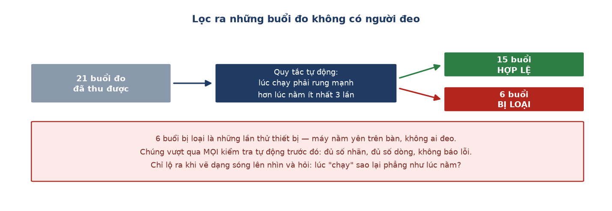

# Week 8 Report — Kiểm soát chất lượng dữ liệu và phát hiện 6 buổi đo giả

## Tuần này làm gì — nhìn tổng quan

**Giai đoạn:** Phase 2 — *Edge AI Integration* (Tuần 5–9). Tuần này chuyển từ bước 1 (thu
dữ liệu) sang **bước 2 của dự án: làm sạch và gán nhãn**.

**Một câu tóm tắt:** đặt ra quy tắc lưu trữ dữ liệu, rồi phát hiện ra **6 trên 21 buổi đo
thực ra không có ai đeo thiết bị** — máy chỉ nằm yên trên bàn.

**Ý nghĩa trong tổng thể:** nếu 6 buổi đo đó lọt vào phần huấn luyện, AI sẽ được dạy rằng
"chạy bộ" trông giống hệt "nằm yên". Mọi con số về sau đều sẽ sai, và không có cách nào
biết được sai từ đâu.

---

## Nhóm việc 1 — Đặt ra quy tắc: dữ liệu gốc là bất khả xâm phạm

- **Tách bạch dữ liệu gốc và dữ liệu đã xử lý** (07-22). Từ nay dữ liệu thu trực tiếp từ
  thiết bị được giữ nguyên vẹn, không ai được sửa tay; mọi bước lọc và xử lý phải làm bằng
  chương trình chạy lại được.
  → **Ý nghĩa:** giống như giữ bản gốc của một tài liệu quan trọng rồi chỉ làm việc trên
  bản sao. Nếu sau này phát hiện một bước xử lý bị sai, có thể chạy lại từ đầu trên dữ liệu
  gốc — thay vì phát hiện ra rằng bản gốc cũng đã bị sửa và không thể phục hồi. *(Quy tắc
  này về sau cứu cả dự án ở Tuần 13, khi phải tính lại toàn bộ nhịp tim từ đầu.)*

- **Quyết định giữ nguyên dữ liệu "bất thường tự nhiên", không lọc bỏ** (07-22). Kiểm tra
  cho thấy 6.34% số dòng có những đợt tăng vọt bất chợt, rải đều chứ không tập trung.
  → **Ý nghĩa:** một đánh đổi có tính toán chứ không phải đoán. Lọc bỏ chúng sẽ cho ra bộ
  dữ liệu "sạch" hơn, nhưng mục tiêu là AI hoạt động tốt **ngoài đời thật** — nơi người
  dùng cử động bất chợt liên tục — chứ không phải chỉ tốt trên dữ liệu phòng thí nghiệm.
  Tương tự, cân nhắc tăng khoảng đệm giữa các động tác từ 15 lên 20 giây nhưng quyết định
  giữ 15 giây, vì tăng lên sẽ ăn mất trọn dữ liệu của những buổi đo bị mất điện giữa chừng.

## Nhóm việc 2 — Phát hiện 6 buổi đo không có người đeo

- **Phát hiện qua biểu đồ, rồi mã hoá thành quy tắc tự động** (07-22). Một buổi đo có nhãn
  "đang chạy" nhưng đường tín hiệu phẳng tuyệt đối — thiết bị nằm yên trên bàn. Từ quan sát
  đó, viết một quy tắc: *mức rung lúc chạy phải cao hơn lúc nằm ít nhất 3 lần*. Quét toàn
  bộ 21 buổi đo: **6 buổi bị đánh dấu**, tách riêng ra; 15 buổi còn lại dùng để huấn luyện.
  → **Ý nghĩa:** điểm đáng chú ý không phải là tìm ra 6 buổi hỏng, mà là **chúng đã vượt
  qua mọi kiểm tra tự động trước đó**: đủ số nhãn, đủ số dòng, log không báo lỗi gì. Chúng
  chỉ lộ ra khi có người vẽ dạng sóng lên và hỏi một câu rất đơn giản: *lúc "chạy" sao lại
  phẳng như lúc nằm?*

## Nhóm việc 3 — Bắt đầu điều tra vấn đề nhầm lẫn ba tư thế tĩnh

- **Thử hai cách sửa, đo kết quả trên từng người riêng biệt** (07-23). Vấn đề đã biết từ
  trước: AI hay nhầm giữa nằm / ngồi / đứng, nhưng không nhầm giữa đi bộ và chạy. Thử dùng
  giá trị từng trục cảm biến thay vì giá trị tổng hợp: đạt **68.2%** nhưng riêng một người
  rớt xuống **46.8%**. Thử biến thể thứ hai: đạt **66.1%**, sửa được người đó nhưng lại làm
  hỏng một người khác.
  → **Ý nghĩa:** đây là điều tra khoa học có hệ thống — đưa ra giả thuyết, đo, đối chiếu —
  chứ không phải thử cho có. Và kết luận rút ra rất quan trọng: **cách sửa nào cũng giúp
  được người này nhưng làm hỏng cho người khác**, tức là cả hai đều chưa chạm tới nguyên
  nhân thật. Nếu chỉ nhìn con số trung bình thì đã tưởng là thành công. Nguyên nhân gốc rễ
  tìm ra ở Tuần 9.

---

## Kết quả cuối tuần

| Hạng mục | Kết quả |
| :--- | :--- |
| Buổi đo hợp lệ | 15 trên 21 |
| Buổi đo bị loại | 6 — thiết bị nằm yên, không ai đeo |
| Quy tắc lưu trữ | Dữ liệu gốc bất khả xâm phạm, xử lý bằng chương trình chạy lại được |
| Vấn đề nhầm ba tư thế tĩnh | Đã thử 2 cách, cả hai đều chưa chạm nguyên nhân thật |

## Khác biệt so với kế hoạch gốc

Kế hoạch gốc ghi *"Full system integration"* — tích hợp toàn hệ thống. Việc này thực tế
xảy ra muộn hơn nhiều, ở Tuần 11.

**Dẫn tới chương nào của thesis:** Chương 2 mục 2.2 (bộ dữ liệu) và Chương 5 mục 5.3 — 6
buổi đo giả là **lần đầu tiên** trong ba lần dự án mắc cùng một dạng lỗi: tin vào một biểu
diễn của thực tế thay vì kiểm tra chính thực tế.

---
[← Week 7](week_07.md) · [Weekly reports index](README.md) · [Week 9 →](week_09.md)
