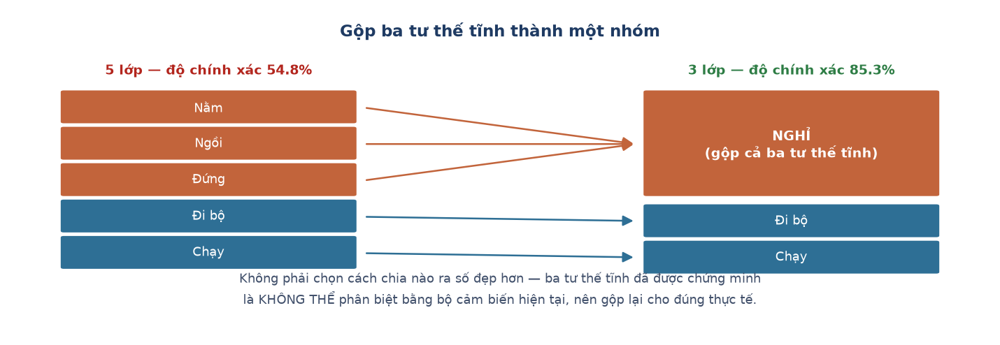

# Week 9 Report — Từ mô hình đầu tiên đến AI chạy trên thiết bị thật

## Tuần này làm gì — nhìn tổng quan

**Giai đoạn:** Phase 2 — *Edge AI Integration*, tuần cuối của giai đoạn này. Dự án chuyển
sang **bước 3: huấn luyện mô hình AI**, rồi đi thẳng tới bước đưa nó lên phần cứng. Khớp
với mốc **M3** và **M6** của kế hoạch.

**Một câu tóm tắt:** huấn luyện được mô hình đầu tiên, tìm ra **nguyên nhân toán học**
giải thích vì sao nó không thể tốt hơn, định nghĩa lại bài toán cho khớp năng lực cảm biến
— rồi nạp lên thiết bị và **đeo lên tay thử thật**.

**Ý nghĩa trong tổng thể:** đây là tuần bước ngoặt của phân hệ nhận diện hoạt động. Trước
tuần này, việc AI hay nhầm ba tư thế tĩnh là một *lỗi cần sửa*. Sau tuần này, nó trở thành
một *kết quả đã giải thích được* — và điều đó thay đổi hoàn toàn cách đặt bài toán.

---

## Nhóm việc 1 — Tự động hoá toàn bộ đường đi của dữ liệu

- **Chương trình tự phân loại và sắp xếp dữ liệu sau mỗi buổi đo** (07-28). Tự áp quy tắc
  phát hiện buổi đo giả từ Tuần 8, tự chuyển file vào đúng thư mục, tự thêm dòng vào sổ ghi
  người tham gia.
- **Chương trình dựng bộ dữ liệu huấn luyện từ dữ liệu gốc** (07-28), tự thêm sẵn cột gộp
  nhóm để về sau huấn luyện được cả bản 5 lớp lẫn bản 3 lớp mà không phải chạy lại.
  → **Ý nghĩa:** từ tuần này, đường đi *thu dữ liệu → xử lý → huấn luyện* chạy được từ đầu
  đến cuối **không cần sửa tay ở bước nào**. Đây là điều kiện để mọi con số trong báo cáo về
  sau đều tái tạo được.

- **Thêm người tham gia mới**, bộ dữ liệu chốt ở **18 người**.

## Nhóm việc 2 — Cách chấm điểm AI cho công bằng

Mô hình được chấm bằng cách **giữ riêng từng người ra làm bài kiểm tra**: AI học từ 17
người, rồi bị kiểm tra trên người thứ 18 mà nó chưa từng thấy. Lặp lại cho đến khi mọi
người đều một lần làm bài kiểm tra, rồi lấy trung bình.

→ **Ý nghĩa:** nếu trộn chung dữ liệu của cùng một người vào cả phần học lẫn phần kiểm tra,
AI chỉ cần "nhớ mặt" người đó là được điểm cao — điểm rất đẹp nhưng hoàn toàn vô nghĩa, vì
ngoài đời AI luôn gặp người mới.

## Nhóm việc 3 — Kết quả, và vì sao một con số trung bình chưa đủ

**Kết quả: độ chính xác trung bình 54.8%.** Nhưng con số này che mất chuyện thật:

| Hoạt động | Nhận đúng | |
| :--- | ---: | :--- |
| Nằm | 28.4% | gần bằng đoán mò (20%) |
| Ngồi | 46.9% | |
| Đứng | 55.1% | |
| Đi bộ | 64.6% | tốt |
| Chạy | 78.2% | rất tốt |

→ **Ý nghĩa:** mô hình **không hề kém đều**. Nó rất tốt ở hai hoạt động động, và gần như mù
ở một tư thế tĩnh. Nếu chỉ báo cáo con số 54.8% thì người đọc sẽ nghĩ "mô hình tầm thường,
cần chỉnh thêm" — trong khi sự thật là có một chỗ hỏng rất cụ thể.

### Vì sao ba tư thế tĩnh không thể phân biệt được

Cả bốn đặc trưng đưa vào mô hình đều tính từ **độ lớn** của gia tốc, tức là
`√(ax² + ay² + az²)` — chính là **độ dài** của mũi tên gia tốc trong không gian.

Khi người đeo xoay cổ tay, mũi tên đó đổi **hướng** nhưng **không đổi độ dài**. Mà nằm,
ngồi, đứng thì khác nhau đúng ở **hướng** cổ tay, chứ gần như không khác nhau ở mức độ
chuyển động.

→ **Kết luận:** thông tin cần để phân biệt ba tư thế đó **đã bị xoá sạch ngay ở bước tính
đặc trưng**, trước khi mô hình kịp nhìn thấy dữ liệu. Đây là giới hạn **cấu trúc**, không
phải lỗi chọn tham số. Không có cách chỉnh mô hình nào cứu được.

- **Đóng lại hướng sửa bằng đặc trưng từng trục** (07-28). Sau ba biến thể thử trên 4 rồi 6
  người, kết quả **phức tạp hơn chứ không sáng ra**: cách sửa mới làm một người tụt từ 62.2%
  xuống 35.0%. Quyết định dừng thử thêm, báo cáo trung thực vấn đề như một kết quả đã giải
  thích được. Hướng sửa thật — thêm cảm biến con quay hồi chuyển và một bước hiệu chuẩn —
  ghi lại cho lần thu dữ liệu sau, vì không áp ngược được vào dữ liệu đã thu.

## Nhóm việc 4 — Định nghĩa lại bài toán cho khớp năng lực cảm biến

- **Giữ nguyên tuyệt đối mọi thứ khác, chỉ đổi cách gộp nhãn**: cùng mô hình, cùng bốn đặc
  trưng, cùng bộ dữ liệu, cùng cách chấm điểm. Chỉ gộp nằm / ngồi / đứng thành một nhóm.

| Bài toán | Độ chính xác | Nhận đúng nhóm "nghỉ" |
| :--- | ---: | ---: |
| 5 lớp | 54.8% | — |
| **3 lớp** | **85.3%** | **95.1%** |

**Gộp lớp như vậy có phải chọn cách chia ra số đẹp không?** Không, vì hai lý do. Thứ nhất,
**ranh giới gộp được suy ra trước khi nhìn kết quả**, từ nguyên nhân gốc ở nhóm việc 3 —
đây là giới hạn cấu trúc, không phải may rủi. Thứ hai, **việc gộp loại bỏ đúng phần mà bộ
đặc trưng không quan sát được**, và giữ nguyên phần nó quan sát rất tốt.

**Điều này không tuyên bố:** việc gộp lớp **không** làm mô hình phân biệt được nằm, ngồi,
đứng. Thông tin đó vẫn mất. Chỉ là bài toán đã được định nghĩa lại cho đúng với năng lực
đo thật của phần cứng.

- **Quyết định báo cáo cả hai con số**, giữ bản 5 lớp làm số chính vì nó vẫn mang thông tin
  về ba tư thế tĩnh, có giá trị thực tế hơn cho ứng dụng cuối.

## Nhóm việc 5 — Đưa AI lên thiết bị và thử trên tay người

- **Viết công cụ tự động dịch mô hình sang mã chip hiểu được** (07-28).
  → **Ý nghĩa:** mô hình được huấn luyện bằng Python trên máy tính, nhưng con chip trong
  thiết bị đeo tay không đủ mạnh để chạy Python. Cần "dịch" mô hình thành mã chạy trực tiếp
  trên chip.

- **Phát hiện: đã dịch xong nhưng chưa ai nối vào chương trình đang chạy** (07-28). Nạp thử
  lên thiết bị mới thấy chương trình vẫn gọi mô hình **cũ**.
  → **Ý nghĩa:** loại lỗi rất hay gặp ở hệ thống nhiều phần — từng phần đều đúng, nhưng
  quên bước cắm chúng vào nhau. Không nạp thử lên thiết bị thật thì lỗi này không bao giờ
  lộ ra.

- **Gỡ một đoạn logic cũ suýt phá hỏng mô hình mới** (07-28). Chương trình cũ có quy tắc:
  *khi thiết bị gần như đứng yên thì mặc định coi là "nằm"*. Đúng với mô hình cũ, nhưng
  **sai hoàn toàn** với mô hình mới — vì đứng yên chính là lúc mô hình mới cần làm việc
  nhất.

- **Nạp lên thiết bị, đeo lên tay, thu một buổi đo kiểm tra** (07-29). Kết quả: **chạy nhận
  đúng 99%, đứng nhận đúng 76%** ngay tại chỗ. Nằm và ngồi vẫn bị nhầm sang đứng.
  → **Ý nghĩa:** hướng nhầm lẫn **khớp chính xác** với dự đoán từ lúc huấn luyện. Điều này
  xác nhận toàn bộ chuỗi *huấn luyện → dịch → nạp lên thiết bị* hoạt động đúng, không có sai
  lệch phát sinh khi tích hợp.

- **Thấy kết quả lạ, điều tra ra là lỗi thao tác chứ không phải lỗi AI** (07-29). Đoạn "đi
  bộ" bị nhận thành "đứng" tới 95%; kiểm tra lại thấy mức rung chỉ bằng khoảng một phần mười
  so với đi bộ thật — người thử nghiệm đang **đứng yên chỉnh lại thiết bị**. Loại buổi đo
  này khỏi bộ dữ liệu chính.

---

## Kết quả cuối tuần

| Hạng mục | Kết quả |
| :--- | :--- |
| Bộ dữ liệu cuối cùng | 18 người tham gia |
| Mô hình 5 lớp | 54.8% |
| Mô hình 3 lớp | 85.3% (nhóm "nghỉ" đạt 95.1%) |
| Chạy trên phần cứng thật | Có — kết quả tại chỗ khớp kết quả trên máy tính |

Vấn đề nhầm ba tư thế tĩnh chính thức chuyển từ "lỗi tồn đọng" thành **"kết quả đã giải
thích được nguyên nhân"**.

## Khác biệt so với kế hoạch gốc

Chưa có bài kiểm tra chạy liên tục 60 phút, và chưa thử nghiệm với người hoàn toàn ngoài
nhóm — toàn bộ người tham gia hiện tại đều là người quen biết.

**Dẫn tới chương nào của thesis:** Chương 3 mục 3.2–3.5 (kết quả, nguyên nhân gốc, tái
thiết kế), Chương 2 mục 2.4 (cách chấm điểm), Chương 5 mục 5.1 (kiến trúc tích hợp).

---
[← Week 8](week_08.md) · [Weekly reports index](README.md) · [Week 10 →](week_10.md)
