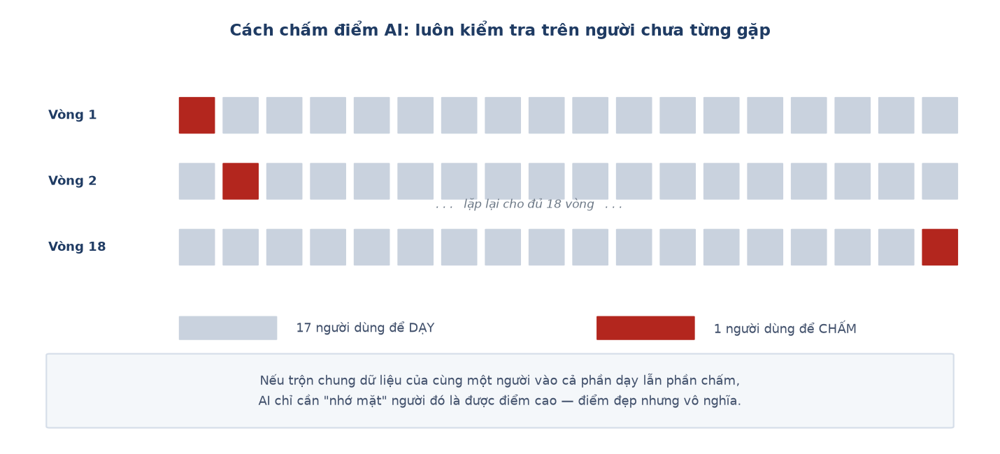

# Week 9 Report — Huấn luyện mô hình đầu tiên và tìm ra nguyên nhân gốc

## Tuần này làm gì — nhìn tổng quan

**Giai đoạn:** Phase 2 — *Edge AI Integration*, tuần cuối của giai đoạn này. Dự án chuyển
sang **bước 3: huấn luyện mô hình AI**. Khớp với mốc **M3** của kế hoạch.

**Một câu tóm tắt:** huấn luyện được mô hình đầu tiên (độ chính xác 54.8%), và quan trọng
hơn — **tìm ra nguyên nhân toán học** giải thích vì sao nó không thể tốt hơn với bộ cảm
biến hiện tại.

**Ý nghĩa trong tổng thể:** đây là tuần bước ngoặt. Trước tuần này, việc AI hay nhầm ba tư
thế tĩnh là một *lỗi cần sửa*. Sau tuần này, nó trở thành một *kết quả đã giải thích được*
— và điều đó thay đổi hoàn toàn hướng đi của phần còn lại dự án.

---

## Nhóm việc 1 — Tự động hoá toàn bộ đường đi của dữ liệu

- **Chương trình tự phân loại và sắp xếp dữ liệu sau mỗi buổi đo** (07-28). Tự áp quy tắc
  phát hiện buổi đo giả từ Tuần 8, tự chuyển file vào đúng thư mục, tự thêm dòng vào sổ
  ghi người tham gia.
- **Chương trình dựng bộ dữ liệu huấn luyện từ dữ liệu gốc** (07-28), tự thêm sẵn cột gộp
  nhóm để về sau huấn luyện được cả bản 5 lớp lẫn bản 3 lớp mà không phải chạy lại.
  → **Ý nghĩa:** từ tuần này, đường đi *thu dữ liệu → xử lý → huấn luyện* chạy được từ đầu
  đến cuối **không cần sửa tay ở bước nào**. Đây là điều kiện để mọi con số trong báo cáo
  về sau đều tái tạo được.

- **Thêm 2 người tham gia mới**, bộ dữ liệu lên 17 người.

## Nhóm việc 2 — Cách chấm điểm AI cho công bằng

Mô hình được chấm bằng cách **giữ riêng từng người ra làm bài kiểm tra**: AI học từ 17
người, rồi bị kiểm tra trên người thứ 18 mà nó chưa từng thấy. Lặp lại cho đến khi mọi
người đều một lần làm bài kiểm tra, rồi lấy trung bình.

→ **Ý nghĩa:** nếu trộn chung dữ liệu của cùng một người vào cả phần học lẫn phần kiểm
tra, AI chỉ cần "nhớ mặt" người đó là được điểm cao — điểm rất đẹp nhưng hoàn toàn vô
nghĩa, vì ngoài đời AI luôn gặp người mới. Cách chấm này cho biết con số **thật sự** khi
gặp một người lạ.

## Nhóm việc 3 — Kết quả, và vì sao một con số trung bình chưa đủ

**Kết quả: độ chính xác trung bình 54.8%.** Nhưng con số này che mất chuyện thật:

| Hoạt động | Nhận đúng | |
| :--- | ---: | :--- |
| Nằm | 28.4% | gần bằng đoán mò (20%) |
| Ngồi | 46.9% | |
| Đứng | 55.1% | |
| Đi bộ | 64.6% | tốt |
| Chạy | 78.2% | rất tốt |

→ **Ý nghĩa:** mô hình **không hề kém đều**. Nó rất tốt ở hai hoạt động động, và gần như
mù ở một tư thế tĩnh. Nếu chỉ báo cáo con số 54.8% thì người đọc sẽ nghĩ "mô hình tầm
thường, cần chỉnh thêm" — trong khi sự thật là có một chỗ hỏng rất cụ thể.

### Vì sao ba tư thế tĩnh không thể phân biệt được

Cả bốn đặc trưng đưa vào mô hình đều tính từ **độ lớn** của gia tốc, tức là
`√(ax² + ay² + az²)` — chính là **độ dài** của mũi tên gia tốc trong không gian.

Khi người đeo xoay cổ tay, mũi tên đó đổi **hướng** nhưng **không đổi độ dài**. Mà nằm,
ngồi, đứng thì khác nhau đúng ở **hướng** cổ tay, chứ gần như không khác nhau ở mức độ
chuyển động.

→ **Kết luận:** thông tin cần để phân biệt ba tư thế đó **đã bị xoá sạch ngay ở bước tính
đặc trưng**, trước khi mô hình kịp nhìn thấy dữ liệu. Đây là giới hạn **cấu trúc**, không
phải lỗi chọn tham số. Không có cách chỉnh mô hình nào cứu được.

Ngược lại, đi bộ và chạy khác nhau rõ ở **mức độ chuyển động** — đúng thứ mà độ lớn đo
được — nên hai lớp này tách rất tốt.

## Nhóm việc 4 — Quyết định dừng đúng lúc

- **Đóng lại hướng sửa bằng đặc trưng từng trục** (07-28). Sau khi thử biến thể thứ ba trên
  6 người, kết quả **phức tạp hơn chứ không sáng ra**: cách sửa mới làm một người tụt từ
  62.2% xuống 35.0%.
  → **Ý nghĩa:** quyết định dừng thử thêm, báo cáo trung thực vấn đề như một kết quả đã
  giải thích được, thay vì tiếp tục vá. Hướng sửa thật sự — thêm cảm biến con quay hồi
  chuyển và một bước hiệu chuẩn — được ghi lại cho lần thu dữ liệu sau, vì không thể áp
  ngược vào dữ liệu đã thu.

- **Đánh giá đề xuất dùng mô hình AI của giảng viên hướng dẫn** (07-28): ý tưởng tốt nhưng
  cần nhiều người tham gia hơn đáng kể so với dự án hiện có. Giữ nguyên hướng thuật toán cổ
  điển, coi mô hình AI là hướng so sánh thêm về sau.

---

## Kết quả cuối tuần

Đường đi thu → xử lý → huấn luyện chạy trọn vẹn không cần can thiệp tay. Mô hình 5 lớp đầu
tiên đạt **54.8%**. Vấn đề nhầm ba tư thế tĩnh chính thức chuyển từ "lỗi tồn đọng" thành
**"kết quả đã giải thích được nguyên nhân"**.

## Khác biệt so với kế hoạch gốc

Kế hoạch gốc ghi *"Integration debugging and stress testing"*. Chưa có bài kiểm tra chịu
tải dài trên phần cứng tích hợp — việc kiểm chứng trên thiết bị thật diễn ra ở Tuần 11.

**Dẫn tới chương nào của thesis:** Chương 3 mục 3.2 đến 3.4 (kết quả 5 lớp và nguyên nhân
gốc), Chương 2 mục 2.4 (cách chấm điểm).

---
[← Week 8](week_08.md) · [Weekly reports index](README.md) · [Week 10 →](week_10.md)
