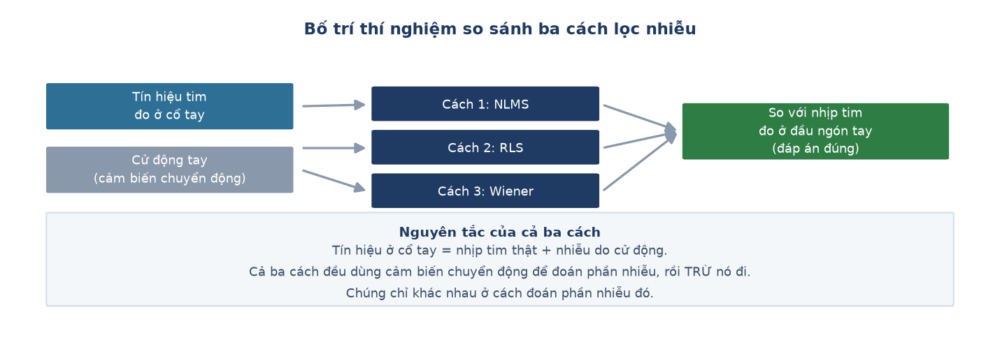

# Week 10 Report — So sánh ba cách lọc nhiễu cho tín hiệu nhịp tim

> ⚠️ **KẾT LUẬN CỦA TUẦN NÀY VỀ SAU BỊ BÁC BỎ — xem [Week 13](week_13.md)**
>
> Bốn con số công bố ở tuần này được đo so với nhịp tim suy từ cảm biến đầu ngón tay. Ngày
> 15-08, kênh tham chiếu đó bị phát hiện **sai gấp đôi ở 3 trên 5 người** do một lỗi thuật
> toán, nên cả bốn con số đều được đo bằng **một cái thước cong** và không dùng để kết
> luận được.
>
> Nội dung tuần này **được giữ nguyên, không sửa lại**. Việc một kết luận tự tin về sau bị
> chính nhóm lật lại là một phần của quá trình nghiên cứu, và là bằng chứng trực tiếp cho
> luận điểm ở Chương 5 mục 5.3 của thesis.

## Tuần này làm gì — nhìn tổng quan

**Giai đoạn:** Phase 3 — *Polish and Documentation* (Tuần 10–13). Khớp với mốc **M4** và
**M5** của kế hoạch.

**Một câu tóm tắt:** dựng và chạy trọn vẹn **hướng nghiên cứu riêng** của dự án — so sánh
ba thuật toán lọc nhiễu xem cách nào giúp đo nhịp tim ở cổ tay chính xác nhất.

**Ý nghĩa trong tổng thể:** đây là phần *nghiên cứu*, khác với phần *sản phẩm*. Nhận diện
hoạt động (Tuần 5–9) là tính năng người dùng thấy được. Phần này trả lời một câu hỏi mở
mà chưa ai trả lời trên phần cứng rẻ tiền cỡ này.

---

## Bố trí thí nghiệm

Cả ba thuật toán đều dựa trên cùng một ý tưởng: **tín hiệu ở cổ tay = nhịp tim thật + nhiễu
do cử động**. Dùng cảm biến chuyển động để đoán phần nhiễu, rồi trừ nó đi. Chúng chỉ khác
nhau ở cách đoán.

## Nhóm việc 1 — Sửa công cụ đo trước khi so sánh bất cứ thứ gì

- **Lần thử đầu tiên cho ra kết quả vô lý về mặt sinh học** (07-28): nhịp tim nhảy từ 53
  lên 125, lên 133, rồi xuống 18.5 trong vài giây liên tiếp — trong khi người tham gia đang
  **nằm yên**.
  → **Ý nghĩa:** thay vì cố chỉnh cho ra số đẹp, quyết định dừng lại. Nguyên nhân không nằm
  ở thuật toán lọc mà ở **bước đo nhịp tim** đứng trước nó. Không thể so sánh ba thuật toán
  bằng một phép đo chưa đáng tin.

- **Làm lại cách nhận diện nhịp tim qua ba vòng** (07-28), mỗi vòng khắc phục điểm yếu của
  vòng trước. Sau khi sửa, thuật toán LMS thắng rõ trên người đầu tiên.
  → **Ý nghĩa:** giống như tinh chỉnh một cái thước cho đến khi nó đủ chính xác, rồi mới
  dùng nó đo. *(Ghi chú muộn: chính vòng sửa thứ ba — thêm ràng buộc không cho nhịp tim
  nhảy quá xa giữa hai lần đo — về sau hoá ra là thứ che giấu lỗi lớn nhất của dự án. Xem
  Tuần 13.)*

## Nhóm việc 2 — Mở rộng ra 5 người, và kết quả không còn như cũ

- **Kết quả tốt trên một người không giữ được khi mở rộng** (07-28). Trên 5 người: 3 người
  được cải thiện, 2 người tệ đi.
  → **Ý nghĩa:** đây chính là lý do phải thử trên nhiều người trước khi kết luận. Nếu chỉ
  báo cáo kết quả của người đầu tiên, đã công bố một kết luận chỉ đúng ngẫu nhiên cho một
  trường hợp.

- **Thêm thuật toán thứ hai, và bắt được một lỗi tính toán nghiêm trọng** (07-28). Thuật
  toán RLS ban đầu cho kết quả sai lệch hàng trăm nghìn lần, đúng vào những lúc người tham
  gia **đứng, ngồi hoặc nằm yên**.
  → **Ý nghĩa:** dạng lỗi này không tìm ra được bằng cách chạy thử rồi nhìn kết quả — phải
  hiểu thuật toán hoạt động bên trong thế nào mới thấy: khi gần như không có chuyển động,
  một đại lượng bên trong thuật toán phình to không giới hạn. Sửa bằng cách đặt ngưỡng đặt
  lại đại lượng đó.

- **Thêm thuật toán thứ ba, hoàn tất so sánh bốn nhánh** (07-28).

| Cách xử lý | Sai số trung bình *(số này về sau bị bác bỏ)* |
| :--- | ---: |
| Không lọc gì | 26.95 |
| NLMS | 26.96 |
| RLS | 29.83 |
| Wiener | 29.96 |

→ **Ý nghĩa:** không thuật toán nào chứng minh được là luôn tốt hơn việc **không lọc gì
cả**. Đây là một kết quả nghiên cứu có giá trị thật: khoa học không phải lúc nào cũng tìm
ra cách tốt nhất — chứng minh được "cách này chưa đủ tốt, cần hướng khác" cũng là đóng
góp, miễn là đo đạc nghiêm túc.

## Nhóm việc 3 — Hai thử nghiệm cuối, và quyết định dừng

- **Thử dùng ba trục cảm biến riêng thay vì gộp thành một** (07-28): **tệ hơn ở mọi thuật
  toán**. Lý do: quá nhiều tham số cần ước lượng so với lượng dữ liệu có. Giữ cách gộp.

- **Điều tra vì sao một người tham gia làm hai thuật toán tệ hẳn** (07-28): người đó có mức
  tương quan giữa tín hiệu tim và cử động cao nhất, gợi ý rằng thuật toán đã "ăn" luôn cả
  tín hiệu thật khi hai thứ quá giống nhau. Nhưng một người khác có mức tương quan gần
  tương đương lại **không** bị như vậy — nên **chưa đủ bằng chứng để kết luận**, dừng điều
  tra ở đây.
  → **Ý nghĩa:** chủ động dừng đúng lúc thay vì đào sâu vô thời hạn khi chưa có manh mối
  mới. Ghi rõ đây là giả thuyết chưa xác nhận, không phải kết luận.

---

## Kết quả cuối tuần

Hoàn tất so sánh ba thuật toán lọc với phương án đối chứng "không lọc gì". Kết luận tại
thời điểm đó: chưa thuật toán nào chứng minh được lợi ích nhất quán.

**Kết luận này đã bị lật ở Tuần 13** — không phải vì các thuật toán tốt hơn ta tưởng, mà
vì cái thước dùng để chấm điểm chúng bị hỏng.

## Khác biệt so với kế hoạch gốc

Kế hoạch gốc ghi *"Web BLE dashboard and final enclosure"*. Thực tế tuần này dồn toàn bộ
vào hướng nghiên cứu, xây từ đầu đến kết quả trong cùng một phiên làm việc.

**Dẫn tới chương nào của thesis:** Chương 4 mục 4.1–4.2 (thiết kế thí nghiệm và kết quả
vòng đầu). Kết luận của tuần này bị lật ở mục 4.3–4.6.

---
[← Week 9](week_09.md) · [Weekly reports index](README.md) · [Week 11 →](week_11.md)
