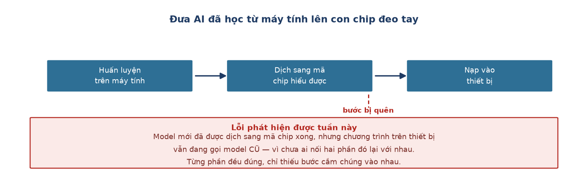

# Week 11 Report — Đưa AI lên thiết bị thật và kiểm chứng trên tay người

## Tuần này làm gì — nhìn tổng quan

**Giai đoạn:** Phase 3 — *Polish and Documentation* (Tuần 10–13). Khớp với mốc **M6** của
kế hoạch: tích hợp toàn hệ thống.

**Một câu tóm tắt:** lần đầu tiên **đeo thiết bị thật lên tay** và xem AI nhận diện hoạt
động trực tiếp, sau nhiều tuần chỉ chạy trên máy tính.

**Ý nghĩa trong tổng thể:** một mô hình chạy tốt trên máy tính chưa chắc chạy đúng trên
con chip nhỏ trong thiết bị. Tuần này trả lời câu hỏi: **kết quả trên máy tính có giữ
nguyên khi chuyển sang phần cứng thật không?**

---

## Nhóm việc 1 — Đưa mô hình từ máy tính lên con chip

- **Viết công cụ tự động dịch mô hình sang mã chip hiểu được** (07-28).
  → **Ý nghĩa:** mô hình được huấn luyện bằng Python trên máy tính, nhưng con chip trong
  thiết bị đeo tay không đủ mạnh để chạy Python. Cần "dịch" mô hình đã học thành mã chạy
  trực tiếp trên chip. Đây là bước bắt buộc để AI thật sự hoạt động trên thiết bị, không
  chỉ dừng lại trên máy tính.

- **Phát hiện: đã dịch xong nhưng chưa ai nối vào chương trình đang chạy** (07-28). Nạp
  thử lên thiết bị mới thấy chương trình vẫn đang gọi mô hình **cũ**.
  → **Ý nghĩa:** đây là loại lỗi rất hay gặp ở hệ thống nhiều phần — từng phần riêng lẻ
  đều đúng, nhưng quên mất bước cắm chúng vào nhau. Không có bước nạp thử lên thiết bị
  thật thì lỗi này sẽ không bao giờ lộ ra.

- **Gỡ bỏ một đoạn logic cũ suýt phá hỏng mô hình mới** (07-28). Chương trình cũ có một
  quy tắc: *khi thiết bị gần như đứng yên thì mặc định coi là "nằm"*. Quy tắc đó đúng với
  mô hình cũ (chỉ phân biệt vận động mạnh / nhẹ), nhưng **sai hoàn toàn** với mô hình mới.
  → **Ý nghĩa:** đứng yên chính là lúc mô hình mới cần làm việc nhất — đó là lúc nó phải
  phân biệt nằm với ngồi với đứng. Đoạn logic cũ sẽ vô hiệu hoá đúng chức năng chính của
  mô hình mới. Gỡ đúng lúc, trước khi nó âm thầm làm sai mọi kết quả.

## Nhóm việc 2 — Thử trên tay người thật

- **Nạp lên thiết bị, đeo lên tay, thu một buổi đo kiểm tra** (07-29). Kết quả: **chạy nhận
  đúng 99%, đứng nhận đúng 76%** ngay tại chỗ — thậm chí tốt hơn kết quả trên máy tính. Nằm
  và ngồi vẫn bị nhầm sang đứng.
  → **Ý nghĩa:** hướng nhầm lẫn **khớp chính xác** với những gì đã dự đoán từ lúc huấn
  luyện. Điều này xác nhận hai việc: quá trình dịch mô hình sang thiết bị đã làm đúng, và
  không có lỗi mới phát sinh khi chuyển từ máy tính sang phần cứng.

- **Thấy kết quả lạ, điều tra ra nguyên nhân là lỗi thao tác chứ không phải lỗi AI**
  (07-29). Đoạn "đi bộ" trong buổi đo bị nhận thành "đứng" tới 95%. Kiểm tra lại: mức rung
  đo được chỉ bằng khoảng **một phần mười** so với lúc đi bộ thật.
  → **Ý nghĩa:** người thử nghiệm thực ra đang **đứng yên chỉnh lại thiết bị** đúng lúc máy
  ghi nhãn "đang đi bộ". Tức là lỗi ở khâu thực hiện thí nghiệm, không phải lỗi của AI.
  Loại buổi đo này ra khỏi bộ dữ liệu chính. Đây đúng là phản xạ cần có: thấy số lạ thì
  điều tra, đừng vội kết luận "AI hỏng".

## Nhóm việc 3 — Ghi nhận một lỗ hổng quy trình, quyết định chưa sửa

- **Chương trình tự phân loại chưa phân biệt được dữ liệu thật với dữ liệu thử nghiệm**
  (07-29). Lần này dọn tay, để dành sửa nếu lặp lại.
  → **Ý nghĩa:** một quyết định ưu tiên thời gian có ý thức — không sửa mọi thứ ngay khi
  vừa phát hiện, nếu chưa chắc nó sẽ lặp lại thường xuyên. Nhưng ghi lại rõ ràng để không
  quên.

---

## Kết quả cuối tuần

Mô hình 5 lớp **chạy thật trên phần cứng**, kết quả tại chỗ khớp với kết quả trên máy tính.
Điều này xác nhận toàn bộ chuỗi *huấn luyện → dịch → nạp lên thiết bị* hoạt động đúng,
không có sai lệch phát sinh khi tích hợp.

## Khác biệt so với kế hoạch gốc

Kế hoạch gốc ghi *"Stability testing and full validation"*. Chưa có bài kiểm tra chạy liên
tục 60 phút — việc kiểm chứng tuần này chỉ ở mức một buổi đo ngắn, chưa phải kiểm tra chịu
tải dài.

**Dẫn tới chương nào của thesis:** Chương 2 mục 2.1 (kiến trúc firmware) và Chương 5 mục
5.1 (kiến trúc tích hợp hai phân hệ).

---
[← Week 10](week_10.md) · [Weekly reports index](README.md) · [Week 12 →](week_12.md)
