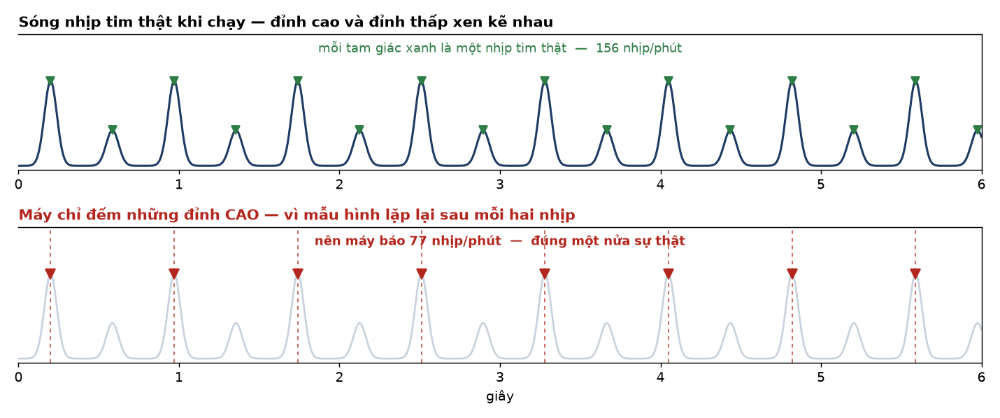
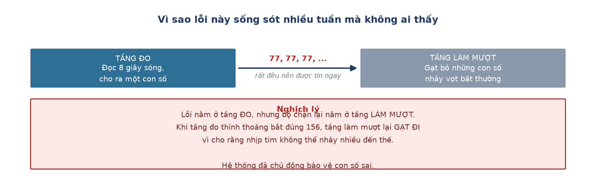

# Week 13 Report — Viết report, và phát hiện lật ngược kết quả Subsystem B

## Tuần này làm gì — nhìn tổng quan

**Giai đoạn:** Phase 3 — *Polish and Documentation*, tuần cuối cùng của dự án.

**Một câu tóm tắt:** đang ngồi viết báo cáo tổng kết thì phát hiện ra **cái thước dùng để
đo nhịp tim suốt cả dự án bị sai gấp đôi** — buộc phải bác bỏ và làm lại toàn bộ kết quả
đã công bố ở [Tuần 10](week_10.md).

**Ý nghĩa trong tổng thể:** đây là tuần quan trọng nhất của cả dự án. Không phải vì làm
thêm được tính năng gì, mà vì phát hiện ra một kết quả tưởng đã xong thực ra không dùng
được — và kịp sửa trước khi nộp.

> **Vì sao lỗi lại lộ ra đúng lúc viết báo cáo?** Vì viết báo cáo buộc phải giải thích
> từng con số cho người khác hiểu. Mà muốn giải thích được thì phải tự hỏi *con số này
> đến từ đâu, và nó có hợp lý không* — câu hỏi mà suốt các tuần trước không ai đặt ra,
> vì mọi thứ đang chạy trơn tru.

## Đã làm

### Phần 1 — Viết outline hai báo cáo (12-08)

- **Subsystem B (`paper/adaptive_filter_comparison_2026-07-28.md`) chuyển thành outline.**
  File đầy đủ trước đó do Claude viết hoàn toàn — vì đây cũng là báo cáo nộp chấm điểm
  (giống subsystem A), chuyển thành `adaptive_filter_comparison_OUTLINE.md` (số liệu giữ
  nguyên, phần phân tích để tự viết), giữ file gốc lại làm tài liệu tham chiếu, đánh dấu
  rõ "NOT FOR SUBMISSION".
- **Subsystem A (`paper/activity_classifier_report_OUTLINE.md`) hoàn thiện từng phần:**
  - Section 1 (LOGO-CV + per-class recall) — **Giang tự viết** qua Socratic Q&A, tự tính
    ra: lying (0.283) cao hơn đoán mò (0.20) nhưng thấp hơn hẳn average (0.548).
  - Section 2 (root cause 4 feature + 3 alternative per-axis) — Giang viết phần định nghĩa
    lại 4 feature và 3 hướng thử; sửa scope error (window 2.4s không phải cả hiệp 90s) và
    bổ sung công thức bất biến rotation.
  - Section 3–5 — Claude viết theo yêu cầu trực tiếp, dùng số thật từ script mới
    `check_majority_baseline.py`.
- **Ý tưởng 2-layer model** (Giang tự đề xuất): tách model tĩnh (dùng gyro) và model động
  (giữ decision tree cũ) thay vì 1 model 5-class duy nhất.

### Phần 2 — Sửa lỗi baseline tính trên sai tập dòng (14-08)

- **`check_majority_baseline.py` tính baseline trên toàn bộ 20.258 dòng**, trong khi
  `train_activity_classifier.py` train/eval trên 16.880 dòng đã lọc `is_transition == 1`.
  Hai con số đem so với nhau nhưng mô tả hai tập dữ liệu khác nhau. Đã thêm bộ lọc cho khớp.
  → **Ý nghĩa:** kết luận không đổi (0.2007→0.2006 và 0.5991→0.5995), nhưng đây là dạng lỗi
  mà người phản biện sẽ bắt ngay: so sánh hai con số đo trên hai tập dữ liệu khác nhau.

### Phần 3 — Bác bỏ ground truth và làm lại Subsystem B (15-08)

- **Phép thử sinh lý học trên kênh tham chiếu** (`check_ground_truth_sanity.py`). Câu hỏi
  rẻ nhất có thể đặt: *nhịp tim lúc chạy có cao hơn lúc nằm không?* Kết quả: kênh đầu ngón
  tay **trượt ở 3/5 đối tượng**. Nặng nhất là P02 — ghi nhận đứng yên 127.7 bpm nhưng chạy
  chỉ 89.7 bpm.
- **Vẽ dạng sóng thô ra và đếm đỉnh bằng mắt** để phân định: cảm biến hỏng hay thuật toán
  hỏng? Với P17 lúc chạy, dạng sóng **rất sạch** — 30 đỉnh trong 12 giây, tức 155.6 bpm.
  Thuật toán báo 77.0 bpm, **đúng một nửa**. → Cảm biến không hỏng, thuật toán hỏng.
- **Loại trừ cách giải thích cạnh tranh.** Nếu mỗi nhịp bị đếm thành 2 đỉnh do dicrotic
  notch thì khoảng cách giữa các đỉnh phải so le dài-ngắn. Đo được: tỉ lệ khoảng lẻ/chẵn
  = **1.03** (đều tăm tắp), còn tỉ lệ biên độ lẻ/chẵn = **2.22**. Vậy thứ so le là **biên
  độ**, không phải khoảng cách.

- **`hr_estimator_v2.py` — bộ ước lượng mới.** Đo trung vị khoảng cách đỉnh trong miền thời
  gian, trả về "không đọc được" (NaN) khi nhịp quá không đều thay vì đoán bừa, bỏ hoàn toàn
  ràng buộc liên tục giữa các cửa sổ.
- **Kiểm chứng ngược bằng đếm tay:** P17 lúc chạy v1=77.0 → v2=**156.9** (đếm tay 155.6);
  P16 lúc chạy v1=155.8 → v2=**118.9** (đếm tay 111.3). Số đối tượng qua kiểm tra sinh lý
  tăng từ **2/5 lên 4/5**.
- **Chạy lại toàn bộ so sánh bộ lọc** (`lms_denoise_v2.py`), giữ nguyên vẹn cả 3 bộ lọc,
  số tap và tín hiệu tham chiếu — chỉ đổi cách đọc nhịp tim ra khỏi dạng sóng.

### Phần 4 — Đối chiếu proposal và gộp thesis (15-08 → 20-08)

- **`paper/proposal_vs_reality.md`** — đối chiếu 14 hạng mục cam kết trong proposal với kết
  quả thật, kèm lý do cho từng chỗ đổi hướng.
- **Hình dạng sóng cho cả hai subsystem** (17-08): 4 hình cho Subsystem A (dạng sóng thô 5
  hoạt động, một cửa sổ chú giải 4 đặc trưng, phóng to 3 tư thế tĩnh, phân bố đặc trưng) và
  2 hình đầu vào cho Subsystem B.
- **Gộp hai báo cáo thành thesis 7 chương** (20-08), kèm bản tiếng Anh.

## Kết quả

**Kết quả mới của Subsystem B, thay thế con số công bố ở Week 10:**

| Tín hiệu | Tỉ lệ cửa sổ đọc được nhịp tim |
| :--- | ---: |
| Đầu ngón tay (tham chiếu) | 35.0% |
| Cổ tay, không lọc | **9.6%** |
| Cổ tay + NLMS | 8.0% |
| Cổ tay + RLS | 5.5% |
| Cổ tay + Wiener | 12.7% |

Và kết luận không phụ thuộc vào ngưỡng đã chọn: siết chặt tiêu chí thì khoảng cách giữa hai
kênh giãn tới **12.2 lần** (19.6% so với 1.6%).

→ **Ý nghĩa:** câu hỏi nghiên cứu của proposal — *"filter nào tốt nhất"* — **đặt sai tiền
đề**. Trong ~90% thời gian, PPG cổ tay ở cấu hình phần cứng này không chứa nhịp đập nào để
mà khử nhiễu. Bộ lọc *tách* tín hiệu khỏi nhiễu, nó không *tạo ra* tín hiệu.

Sản phẩm giao: 1 thesis 7 chương (31 trang, bản Việt + Anh), 1 tài liệu đối chiếu proposal,
5 script mới, 11 hình.

## Technical story 1: vì sao lỗi này sống sót nhiều tuần?

Pipeline nhịp tim có hai tầng riêng biệt. **Measurement Layer** đọc 8 giây sóng và trả ra
một con số. **Tracking Layer** nhận dãy số theo thời gian và loại bỏ các bước nhảy phi lý —
ràng buộc `MAX_JUMP_BPM = 25` nằm ở tầng này.

Lỗi octave error phát sinh ở **Measurement Layer**. Khi tầng này liên tục trả ra dãy
[77, 77, 77, …] cực kỳ nhất quán, Tracking Layer tin tưởng hoàn toàn. Tệ hơn: khi
Measurement Layer thỉnh thoảng bắt đúng 156 bpm thì Tracking Layer **gạt đi** vì cho rằng
nhịp tim nhảy quá 25 bpm. Hệ thống đã chủ động bảo vệ con số sai.

**Bài học kiến trúc:** bộ làm mượt chỉ khử được *nhiễu ngẫu nhiên*, không khử được *sai số
hệ thống*. Gặp sai số hệ thống, nó sẽ bám theo giá trị sai một cách êm ái và khiến con số
sai trông đáng tin hơn cả trước khi lọc. Đây cũng là lý do một Kalman filter — thứ trực
giác đầu tiên nghĩ tới để chặn bước nhảy phi sinh lý — **sẽ không sửa được bug này**: nó
nằm sai tầng.

## Technical story 2: so sánh 0.548 vs 0.853 trực tiếp có công bằng không?

Viết `check_majority_baseline.py` để trả lời câu hỏi "cải thiện 0.548→0.853 có ý nghĩa
không" bằng số thật thay vì cảm tính. Kết quả: majority-class baseline của 5-class chỉ
0.201 (dataset gần cân bằng, gần bằng đoán mò 1/5), nhưng của 3-class lên tới 0.599 — vì
lớp `stationary` gộp 3/5 lớp gốc nên chiếm đa số áp đảo, chỉ cần đoán "stationary" cho mọi
trường hợp đã đúng gần 60%.

Điều này có nghĩa: **so sánh thẳng 0.548 vs 0.853 (+0.305) hơi đánh lừa** — một phần con số
0.853 cao là vì bài toán 3-class *dễ hơn do cấu trúc* của chính nó, không hoàn toàn vì model
học tốt hơn. Thước đo công bằng hơn là margin trên baseline riêng của từng bài toán: 5-class
hơn baseline của nó +0.347, 3-class hơn +0.254 — 3-class vẫn thắng rõ, nhưng biên độ cải
thiện thực chất nhỏ hơn con số +0.305 thô cho thấy.

## Nhìn lại: một dạng lỗi lặp lại ba lần

Dự án đã mắc cùng một dạng lỗi ba lần, và cả ba đều chỉ bị phát hiện bằng kiểm chứng vật lý
chứ không phải bằng chỉ số:

| Lần | Cái được tin | Thực tế | Phát hiện bằng |
| :--- | :--- | :--- | :--- |
| 22-07 | 6 phiên thu "đủ nhãn, đủ dòng, log sạch" | Thiết bị nằm im trên bàn, không ai đeo | Vẽ dạng sóng thô ra nhìn |
| Suốt các tuần | 4 đặc trưng magnitude đủ để phân biệt 5 lớp | Magnitude bất biến với phép xoay, xoá mất hướng | Lập luận toán học ba dòng |
| 15-08 | Đầu ngón tay là "clean ground truth" | Sai gấp đôi ở 3/5 người | Hỏi "chạy có cao hơn nằm không?" |

Cả ba phép thử phát hiện ra lỗi đều tốn **dưới 15 phút**, và cả ba đều nằm **ngoài** mọi
pipeline đánh giá tự động. Lý do: các chỉ số kiểm tra dữ liệu *có ăn khớp với nhau không*,
chứ không kiểm tra dữ liệu *có đúng với thực tế vật lý không*.

## Khác biệt so với kế hoạch gốc

Chưa có: GitHub README được test bởi người ngoài, demo video, Web BLE dashboard. Phần
documentation thì vượt kế hoạch — thay vì một writeup 1000–1500 từ, đã ra một thesis hoàn
chỉnh 7 chương kèm bản tiếng Anh.

**Dẫn tới chương nào của thesis:** Chương 4 mục 4.3–4.6 (toàn bộ phần bác bỏ và tái thiết
kế thước đo), Chương 5 mục 5.3 (vì sao chỉ số không phát hiện được), Chương 5 mục 5.4 (đối
chiếu proposal).

---
[← Week 12](week_12.md) · [Weekly reports index](README.md)
