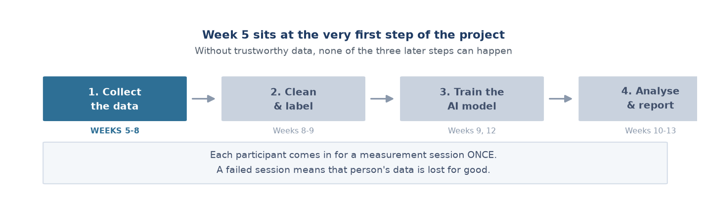
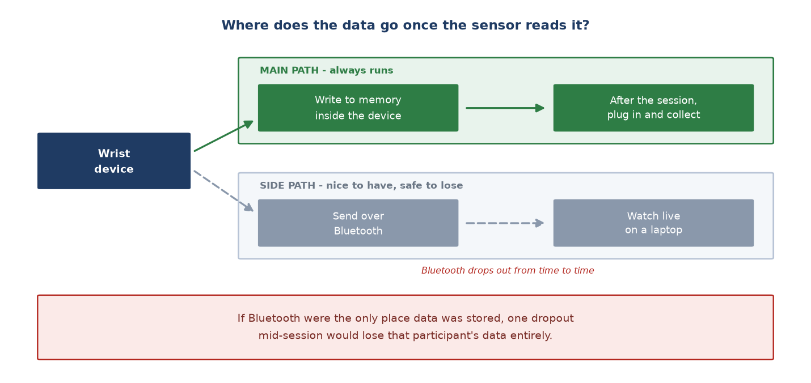
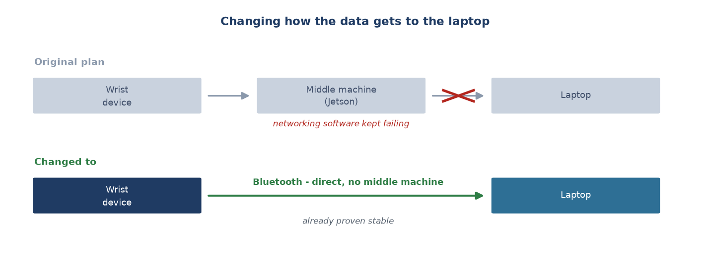

# Week 5 Report — Building the data collection foundation

## What this week was about — the overview

**Phase:** Phase 2 of the project — *Edge AI Integration* (Weeks 5–9). This week did not
touch the AI at all: all the effort went into **building a data collection system that can
be trusted**.

**In one sentence:** this week produced no feature a user would see. It produced the thing
that gives every later week something to work with — a collection process that runs from
start to finish without breaking in the middle.

**Why this step matters so much:** the AI model in step 3 learns from the data step 1
collects. If the data is wrong or incomplete, the model learns exactly that wrongness —
and worst of all, it still produces results that look good, so nobody notices until very
late.

There is one more constraint that makes this harder than usual: **each participant comes in
only once**. There is no "we will redo it tomorrow". A session that breaks partway through
permanently loses that person's data. Every technical decision this week therefore revolved
around one question: *how do we make it impossible for a session to fail?*

---

## Group 1 — The biggest decision: where does the data get stored?

This is the most important architectural decision of the week, and it protects all the data
collected in every later week.

- **Memory inside the device is the main store; Bluetooth is only for watching** (07-07).
  Every row of data is written into the device's own memory unconditionally; the wireless
  link is used only for live monitoring.
  → **What this means:** the data is saved into the device's own memory (like writing to a
  hard drive) first, and Bluetooth just lets us look at it. The reason: Bluetooth drops out
  occasionally — if it were the only place data was stored, one dropout mid-session would
  lose that participant's data.

- **Dropping the middle machine and moving to Bluetooth** (07-10). The original plan sent
  data over WiFi via an intermediate computer, but ran into networking software problems
  that were hard to fix. The old branch was kept, not deleted.
  → **What this means:** a deliberate trade-off — giving up a riskier new approach for one
  already proven stable, so that data collection would not fall behind. Keeping both paths
  alive in parallel would only have diluted the available time.

- **The Bluetooth packet is built completely by the device itself** (07-10), rather than
  having the receiving laptop reconstruct it.
  → **What this means:** this avoids the case where the device clock and the laptop clock
  drift a few seconds apart and corrupt the activity labels. There is exactly **one**
  authority on "which activity does this row belong to, and when" — the device.

---

## Group 2 — Making sure a session never breaks partway

Both faults below share a dangerous property: they ruin a session **without reporting any
error**.

- **Changing the power source from a normal power bank to a dedicated battery** (07-07).
  A power bank cuts out after about 30 seconds because this device draws too little current.
  → **What this means:** a phone-style power bank "assumes" nothing is plugged in and turns
  itself off, killing the device mid-measurement. Switching to a directly connected battery
  keeps each session running to the end.

- **Fixing the device so it reconnects itself after a Bluetooth dropout** (07-10). Added
  automatic re-advertising on the device and re-scanning on the laptop.
  → **What this means:** before this, every dropout meant power-cycling the device by hand
  while a participant was mid-session. After the fix, the device recovers on its own.

---

## Group 3 — Catching problems on the spot, not after it is too late

This group follows one principle: **a broken session caught immediately can still be
rescued; one discovered after the participant has gone home is lost.**

- **Showing two pieces of information live during the session** (07-10): whether the sensor
  is properly against the skin, and how many seconds remain in the current activity.
  → **What this means:** the operator knows immediately if the sensor has shifted and can
  correct it in time, rather than finding out after the session has ended and the data is
  already unusable.

- **A plotting tool for checking sessions by eye** (07-10), based on a simple physical
  expectation: movement intensity should rise in order — lying → sitting → standing →
  walking → running.
  → **What this means:** it checks whether a session is "plausible" before the data goes
  into AI training. For instance, the device must shake more while walking than while lying
  still — if it does not, something is wrong with that session. This tool later **actually
  found six broken sessions** in Week 8.

- **Writing a guide so teammates can submit data without knowing how to program** (07-11),
  through an ordinary web interface.
  → **What this means:** the whole team can help collect data, instead of the process
  bottlenecking on the one person who knows the specialist tools.

---

## Where things stood at the end of the week

A complete collection process that runs end to end, with three properties:

| Property | What it means |
| :--- | :--- |
| No data lost when radio drops | Data lives inside the device; radio is only for viewing |
| No breaks mid-session | Stable power, automatic reconnection |
| Problems caught early | Live warnings during the session, plot check afterwards |

## How this differed from the original plan

The original plan said *"TFLite Micro setup and Gerber files"* — that is, starting the AI
work and the PCB. In practice this week **did not touch the AI at all**.

The reason was a judgement about ordering: without trustworthy data there is nothing to
feed a model. Putting effort into AI before the collection infrastructure was stable would
have meant training on broken data — and as Week 8 later proved, broken data can pass every
automatic check without anyone noticing.

**Which thesis chapter this feeds:** Chapter 2, sections 2.1 (device and firmware
architecture) and 2.2 (collection protocol).

---
[Weekly reports index](README.md) · [Week 6 →](week_06.md)
