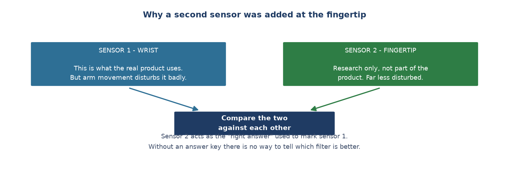

# Week 7 Report — Adding a second sensor as the answer key

## What this week was about — the overview

**Phase:** Phase 2 — *Edge AI Integration* (Weeks 5–9), still on step 1: collecting data.

**In one sentence:** building the infrastructure for the **noise-removal research track** —
adding a second sensor at the fingertip to act as the "right answer", and enlarging the
device's memory so there is room for the raw signal.

**Why it matters:** the project's research question is which of three noise-removal methods
measures heart rate most accurately. But to say "accurate" you need something to compare
against. This week builds exactly that. *(Later, in Week 13, this very "right answer" turns
out to be wrong — but that is the final week's story.)*

---

## Group 1 — The answer key

- **Adding a second heart rate sensor at the fingertip** (07-16). The two sensors are the
  same model and therefore share an address, so they cannot sit on the same connection —
  the second one needed its own line and its own processing task.
  → **What this means:** measuring at the fingertip gives a much cleaner signal than at the
  wrist, because the fingertip has denser blood vessels and is less disturbed by movement.
  This sensor is **not a product feature** — it is research equipment, used only to mark
  the work of the main wrist sensor.

## Group 2 — Room for the raw signal

- **Reconfiguring the device's internal memory** (07-17). The default configuration
  allocated only a fraction of the chip's real capacity, not enough to hold the raw signal
  for one participant across all five activities.
  → **What this means:** without this fix, a session's data would be cut off partway
  through because it ran out of room — and the worst part is that it **reports no error**,
  it simply comes up short at the end.

## Group 3 — Recording two known limitations honestly

The two items below are not achievements. They are **two problems that were measured and
written down** rather than ignored.

- **The raw signal loses about 28% of its samples** (07-17). Measured over an 8-minute test
  run: the high-rate raw stream retained only about 72% of the expected samples, most likely
  because the device pauses periodically to write to memory.
  → **What this means:** the important part here is the **scope**. This limitation touches
  only the auxiliary raw stream used for research; it does **not** touch the main data used
  for activity recognition, which remains 100% complete. Writing this down clearly means
  nobody later confuses the two streams.

- **The live heart rate number should be treated as a rough indicator only** (07-17).
  Re-running the beat-detection algorithm on the raw signal showed that only **58 out of 228**
  waves were accepted as real beats.
  → **What this means:** the heart rate shown on screen during a session is not reliable
  enough to use as research data. The accurate number has to be recomputed afterwards from
  the raw signal. This note later turned out to matter a great deal — it was the first sign
  that measuring heart rate at the wrist was much harder than originally assumed.

- **Bluetooth dropping out even right next to the laptop** (07-17). Cause unknown, decision
  taken to leave it.
  → **What this means:** thanks to the foundational decision from Week 5 — always write to
  internal memory first — this fault **loses no data at all**, it only affects live viewing.
  So the decision was not to halt data collection in order to fix something that does not
  affect the results.

---

## Where things stood at the end of the week

Two heart rate channels running in parallel (wrist and fingertip), with enough storage for
one participant's complete raw signal. Two known limitations documented along with their
scope.

## How this differed from the original plan

The original plan said *"adaptive PPG peak detection, LMS filter, measuring heart rate
error between wrist and fingertip"*. This week only built the **measurement infrastructure**
— the actual results need data from multiple participants and arrive in Week 10.

**Which thesis chapter this feeds:** Chapter 2 section 2.2, and Chapter 4 section 4.1
(the reference channel).

---
[← Week 6](week_06.md) · [Weekly reports index](README.md) · [Week 8 →](week_08.md)
