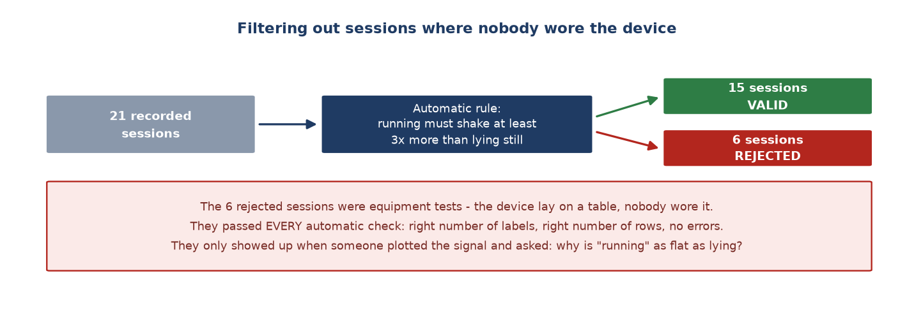

# Week 8 Report — Data quality control, and six fake sessions found

## What this week was about — the overview

**Phase:** Phase 2 — *Edge AI Integration* (Weeks 5–9). This week moved from step 1
(collecting) to **step 2 of the project: cleaning and labelling**.

**In one sentence:** setting the rules for how data is stored, and then discovering that
**6 of 21 sessions had nobody wearing the device** — the machine was simply lying on a table.

**Why it matters:** if those six sessions had reached the training stage, the AI would have
been taught that "running" looks exactly like "lying still". Every number afterwards would
have been wrong, with no way to tell where the error came from.

---

## Group 1 — Setting a rule: the original data is untouchable

- **Separating original data from processed data** (07-22). From now on, data recorded
  straight from the device is kept exactly as it is and nobody edits it by hand; every
  filtering and processing step must be done by a program that can be re-run.
  → **What this means:** like keeping the original of an important document and only
  working on copies. If a processing step is later found to be wrong, everything can be
  re-run from the original — instead of discovering that the original was edited too and
  cannot be recovered. *(This rule later saved the project in Week 13, when every heart rate
  had to be recomputed from scratch.)*

- **Deciding to keep naturally unusual data rather than filter it out** (07-22). A check
  showed 6.34% of rows contained sudden spikes, spread evenly rather than clustered.
  → **What this means:** a calculated trade-off, not a guess. Removing them would give a
  "cleaner" dataset, but the goal is an AI that works **in real life** — where people move
  unexpectedly all the time — not one that only works on perfect laboratory data. Similarly,
  extending the gap between activities from 15 to 20 seconds was considered and rejected,
  because it would have consumed the entire data of sessions cut short by power loss.

## Group 2 — Finding six sessions with nobody wearing the device

- **Spotted on a plot, then encoded as an automatic rule** (07-22). One session labelled
  "running" had a completely flat signal — the device was sitting still on a table. From
  that observation came a rule: *shaking while running must be at least 3× that of lying
  still*. Scanning all 21 sessions flagged **six**; the other 15 went on to training.
  → **What this means:** the notable part is not finding six bad sessions, but that **they
  had passed every automatic check up to that point**: right number of labels, right number
  of rows, no errors in the log. They only appeared when somebody plotted the signal and
  asked a very simple question: *why is "running" as flat as lying down?*

## Group 3 — Starting to investigate the three-still-postures problem

- **Two fixes tried, results measured per person rather than averaged** (07-23). The known
  problem: the AI confuses lying, sitting and standing, but not walking and running. Using
  the individual sensor axes instead of the combined magnitude reached **68.2%**, but one
  person dropped to **46.8%**. A second variant reached **66.1%**, fixing that person but
  breaking someone else.
  → **What this means:** systematic investigation — hypothesis, measure, compare — not just
  trying things. And the conclusion drawn was important: **each fix helps one person and
  hurts another**, meaning neither had reached the real cause. Looking only at the average
  would have made this look like success. The root cause was found in Week 9.

---

## Where things stood at the end of the week

| Item | Result |
| :--- | :--- |
| Valid sessions | 15 of 21 |
| Rejected sessions | 6 — device lying still, nobody wearing it |
| Storage rule | Original data untouchable; processing by re-runnable programs |
| Three-still-postures problem | Two fixes tried, neither reached the real cause |

## How this differed from the original plan

The original plan said *"Full system integration"*. That actually happened much later, in
Week 11.

**Which thesis chapter this feeds:** Chapter 2 section 2.2 (the dataset) and Chapter 5
section 5.3 — the six fake sessions were the **first** of three times the project made the
same kind of mistake: trusting a representation of reality instead of checking reality
itself.

---
[← Week 7](week_07.md) · [Weekly reports index](README.md) · [Week 9 →](week_09.md)
