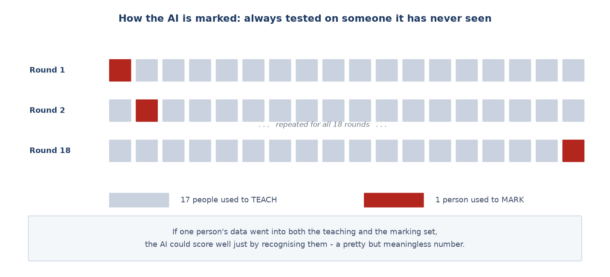
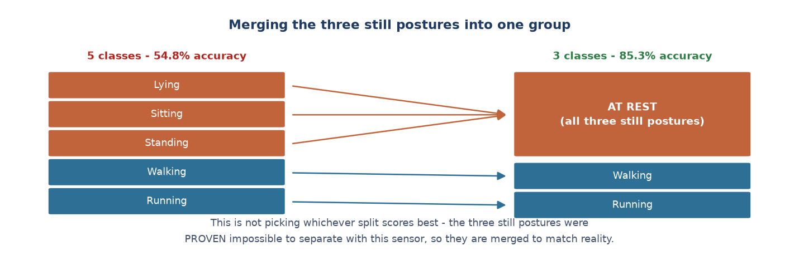
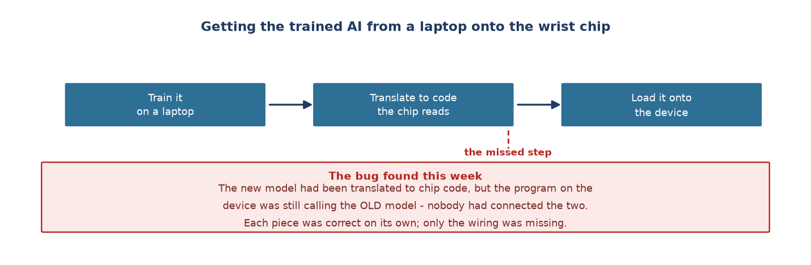

# Week 9 Report — From the first model to AI running on the real device

## What this week was about — the overview

**Phase:** Phase 2 — *Edge AI Integration*, the last week of that phase. The project moved
to **step 3: training the AI model**, and then straight on to putting it on the hardware.
Matches milestones **M3** and **M6** in the plan.

**In one sentence:** trained the first model, found the **mathematical reason** why it
cannot do better, redefined the problem to match what the sensor can do — then loaded it
onto the device and **wore it on a wrist for a real test**.

**Why it matters:** this was the turning point for the activity recognition side. Before
this week, the AI confusing the three still postures was a *bug to be fixed*. After this
week it became an *explained result* — and that changed how the problem was framed.

---

## Group 1 — Automating the whole path the data travels

- **A program that sorts and files data automatically after each session** (07-28). It
  applies the fake-session rule from Week 8, moves files to the right folders, and adds a
  row to the participant log.
- **A program that builds the training dataset from the original data** (07-28), including
  a ready-made grouping column so both the five-class and three-class versions can be
  trained later without re-running anything.
  → **What this means:** from this week on, the path *collect → process → train* runs end to
  end **with no manual step anywhere**. This is what makes every number in later reports
  reproducible.

- **More participants added**, bringing the final dataset to **18 people**.

## Group 2 — Marking the AI fairly

The model is marked by **holding out one person at a time as the test**: the AI learns from
17 people, then is tested on the 18th, whom it has never seen. This repeats until everyone
has been the test once, and the results are averaged.

→ **What this means:** if one person's data went into both the learning and the testing set,
the AI could score highly just by recognising that person — a very pretty number that means
nothing, because in real life the AI always meets new people.

## Group 3 — The result, and why one average is not enough

**Result: 54.8% average accuracy.** But that number hides what is actually happening:

| Activity | Correctly identified | |
| :--- | ---: | :--- |
| Lying | 28.4% | barely above random guessing (20%) |
| Sitting | 46.9% | |
| Standing | 55.1% | |
| Walking | 64.6% | good |
| Running | 78.2% | very good |

→ **What this means:** the model is **not uniformly mediocre**. It is very good at the two
moving activities and almost blind at one still posture. Reporting only 54.8% would leave a
reader thinking "an average model that needs more tuning" — when in fact there is one very
specific thing broken.

### Why the three still postures cannot be separated

All four features fed to the model are computed from the **magnitude** of acceleration, that
is `√(ax² + ay² + az²)` — the **length** of the acceleration arrow in space.

When the wearer rotates their wrist, that arrow changes **direction** but **not length**.
And lying, sitting and standing differ precisely in wrist **direction**, while barely
differing in how much movement there is.

→ **Conclusion:** the information needed to tell those three apart is **erased at the feature
extraction step**, before the model ever sees the data. This is a **structural** limit, not a
bad parameter choice. No amount of model tuning can recover it.

- **Closing the per-axis line of attack** (07-28). After three variants tried on four and
  then six people, the results got **more tangled rather than clearer**: the new fix dropped
  one person from 62.2% to 35.0%. The decision was to stop and report the problem honestly
  as an explained result. The real fix — adding a gyroscope and a calibration step — was
  written down for a future collection round, since it cannot be applied retroactively.

## Group 4 — Redefining the problem to match the sensor

- **Everything else held absolutely constant, only the grouping changed**: same model, same
  four features, same dataset, same marking scheme. Only lying, sitting and standing were
  merged into one group.

| Problem | Accuracy | "At rest" correctly identified |
| :--- | ---: | ---: |
| 5 classes | 54.8% | — |
| **3 classes** | **85.3%** | **95.1%** |

**Is merging classes just picking a split that scores better?** No, for two reasons. First,
**the merge boundary was derived before looking at the result**, from the root cause in
group 3 — this is a structural limit, not luck. Second, **the merge removes exactly the part
the features cannot observe**, while keeping the part they observe very well.

**What this does not claim:** merging classes does **not** make the model able to tell lying
from sitting from standing. That information is still lost. The problem has simply been
redefined to match what the hardware can actually measure.

- **Deciding to report both numbers**, keeping the five-class figure as the headline because
  it still carries information about the three still postures, which has more practical
  value for the end application.

## Group 5 — Getting the AI onto the device and testing on a wrist

- **Writing a tool that translates the model into code the chip can read** (07-28).
  → **What this means:** the model is trained in Python on a laptop, but the chip in the
  wrist device is not powerful enough to run Python. The model has to be translated into code
  that runs directly on the chip.

- **Discovering the translation was done but never wired in** (07-28). Only after loading it
  onto the device did it become clear the program was still calling the **old** model.
  → **What this means:** a very common fault in systems with several parts — each part is
  correct on its own, but the step of connecting them was forgotten. Without loading it onto
  the real device, this fault would never have surfaced.

- **Removing an old rule that would have broken the new model** (07-28). The old program had
  a rule: *when the device is nearly still, assume "lying"*. Right for the old model,
  **completely wrong** for the new one — because being still is exactly when the new model is
  needed most.

- **Loaded onto the device, worn on a wrist, one test session recorded** (07-29). Result:
  **running correct 99%, standing correct 76%** live. Lying and sitting were still confused
  with standing.
  → **What this means:** the pattern of confusion **matched exactly** what was predicted at
  training time. That confirms the whole chain *train → translate → load* works correctly,
  with no drift introduced by integration.

- **An odd result investigated, and traced to operator error rather than AI error** (07-29).
  A "walking" segment was classified as "standing" 95% of the time; checking the data, the
  measured shaking was about one tenth of real walking — the tester was **standing still
  adjusting the device**. That session was removed from the main dataset.

---

## Where things stood at the end of the week

| Item | Result |
| :--- | :--- |
| Final dataset | 18 participants |
| Five-class model | 54.8% |
| Three-class model | 85.3% ("at rest" reaches 95.1%) |
| Running on real hardware | Yes — live results match the laptop results |

The three-still-postures problem officially changed from an "outstanding bug" into **"a
result whose cause is understood"**.

## How this differed from the original plan

No 60-minute continuous endurance test, and no testing with people entirely outside the team
— all current participants are people known to or near the team.

**Which thesis chapter this feeds:** Chapter 3 sections 3.2–3.5 (results, root cause,
redesign), Chapter 2 section 2.4 (marking scheme), Chapter 5 section 5.1 (integrated
architecture).

---
[← Week 8](week_08.md) · [Weekly reports index](README.md) · [Week 10 →](week_10.md)
