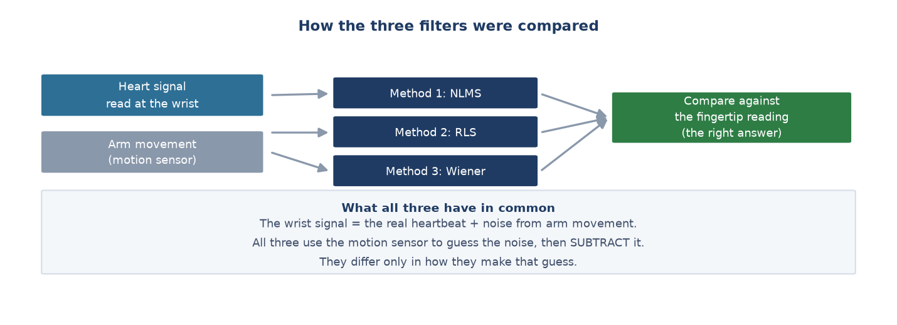

# Week 10 Report — The noise-removal research track, and the discovery that overturned it

## What this week was about — the overview

**Phase:** Phase 3 — *Polish and Documentation*, the final week of the project. Matches
milestones **M4** and **M5**.

**In one sentence:** building and running the project's own research track — a comparison of
three noise-removal algorithms — and then, while writing the final report, **discovering that
the ruler used to mark them was wrong by a factor of two**, forcing a complete redo.

**Why it matters:** this is the most important week of the project. Not because a feature was
added, but because a result that seemed finished turned out to be unusable — and was
corrected in time.

> **Why did the fault surface exactly while writing the report?** Because writing forces you
> to explain every number to someone else. And to explain a number you have to ask yourself
> *where it came from and whether it makes sense* — a question nobody asked during the
> earlier weeks, because everything appeared to be running smoothly.

---

## Part 1 — Setting up the three-algorithm comparison

All three algorithms rest on the same idea: **the wrist signal = the real heartbeat + noise
from movement**. Use the motion sensor to guess the noise, then subtract it. They differ only
in how they make the guess.

- **The first attempt produced biologically impossible numbers** (07-28): heart rate jumping
  53 → 125 → 133 → 18.5 within seconds, while the participant was **lying still**.
  → **What this means:** rather than adjusting until the numbers looked nicer, the decision
  was to stop. The cause was not in the filtering algorithm but in the **heart-rate measuring
  step** before it.

- **Rebuilding the beat detection over three rounds** (07-28), each fixing a weakness of the
  previous one.
  → *(Note added later: the third round of that rebuild — adding a constraint that heart rate
  may not jump too far between readings — turned out to be the thing that hid the project's
  largest error. See Part 3.)*

- **Scaling to five people: the good result did not survive** (07-28). Three improved, two
  got worse.

- **Adding a second algorithm, and catching a serious numerical fault** (07-28). RLS
  initially produced results off by hundreds of thousands of times, precisely when the
  participant was **standing, sitting or lying still**. This kind of fault takes understanding
  the algorithm's internals to see: with almost no movement, one internal quantity grows
  without bound.

- **Adding a third algorithm, completing the four-way comparison** (07-28).

| Processing | Average error *(this number was later overturned)* |
| :--- | ---: |
| No filtering | 26.95 |
| NLMS | 26.96 |
| RLS | 29.83 |
| Wiener | 29.96 |

- **Two final experiments** (07-28): using three separate sensor axes instead of one combined
  value was **worse for every algorithm**; investigating why one participant made two
  algorithms fail badly produced a plausible clue but **not enough evidence**, so the
  investigation stopped rather than continuing indefinitely.

## Part 2 — Fixing a comparison made on the wrong data (14-08)

- **The baseline was computed over all 20,258 rows**, while the model was trained and marked
  on the 16,880 rows left after excluding changeover periods. Two numbers were being compared
  that described different datasets.
  → **What this means:** the conclusion did not change, but this is exactly the kind of error
  a reviewer catches immediately.

## Part 3 — Rejecting the ruler and redoing everything (15-08)

- **A physiological test on the reference channel.** The cheapest possible question: *is the
  heart rate higher while running than while lying down?* Result: the fingertip channel
  **fails for 3 of 5 people**. The worst case recorded 127.7 bpm while standing still but only
  89.7 while running.

- **Plotting the raw signal and counting peaks by eye** to decide: is the sensor broken, or
  the algorithm? The signal was **very clean** — 30 peaks in 12 seconds, that is 155.6 bpm.
  The algorithm reported 77.0, **exactly half**. → The sensor is fine; the algorithm is not.

- **Ruling out the competing explanation.** If each beat were counted twice, the gaps between
  peaks would alternate long-short. Measured: the ratio of odd to even gaps was **1.03**
  (perfectly even), while the ratio of odd to even peak heights was **2.22**. So it is the
  **height** that alternates, not the spacing.

- **A new estimator.** It takes the median gap between beats in the time domain, returns "not
  readable" when the beats are too irregular instead of guessing, and drops the cross-window
  continuity constraint entirely.

- **Checked against hand counting:** one case went from 77.0 to **156.9** (hand count 155.6);
  another from 155.8 to **118.9** (hand count 111.3). Participants passing the physiological
  test rose from **2 of 5 to 4 of 5**.

- **The whole comparison was re-run**, keeping all three algorithms, the parameter count and
  the reference signal completely unchanged — only how a heart rate is read out of the
  waveform changed.

### Why did this fault survive for weeks?

The heart rate pipeline has two separate layers. The **measurement layer** reads 8 seconds of
signal and produces a number. The **smoothing layer** takes the sequence over time and removes
implausible jumps — the constraint added in Part 1 lives here.

The fault happens in the **measurement layer**. When that layer keeps producing [77, 77, 77,
…], which is perfectly consistent, the smoothing layer trusts it completely. Worse: when the
measurement layer occasionally caught the true 156, the smoothing layer **rejected it** as too
large a jump. **The system actively protected the wrong number.**

**The architectural lesson:** a smoother removes *random noise*, not *systematic bias*. Faced
with systematic bias it follows the wrong value smoothly, making the wrong number look more
trustworthy than before filtering. This is also why a Kalman filter — the first thing intuition
reaches for — **would not fix this bug**: it sits in the wrong layer.

## Part 4 — The real result after the fix, and wrapping up

| Signal | Share of windows with a readable heart rate |
| :--- | ---: |
| Fingertip (reference) | 35.0% |
| Wrist, unfiltered | **9.6%** |
| Wrist + NLMS | 8.0% |
| Wrist + RLS | 5.5% |
| Wrist + Wiener | 12.7% |

The conclusion does not depend on the chosen threshold: tightening the criterion widens the
gap between the two channels to **12.2 times**.

→ **What this means:** the proposal's research question — *which algorithm is best* — **rests
on a false premise**. For about 90% of the time, the wrist signal in this hardware
configuration contains no heartbeat to clean up. A filter *separates* signal from noise; it
does not *create* signal. The cause lies in the **optical wavelength** — the sensing layer,
not the algorithm layer.

- **Proposal comparison** (15-08): 14 committed items reviewed against the actual results,
  with a reason for each change of direction.
- **Merging the two reports into a seven-chapter thesis** (20-08), with an English version.

## Looking back: the same kind of mistake, three times

| Occasion | What was believed | The reality | Found by |
| :--- | :--- | :--- | :--- |
| Week 8 | 6 sessions "with the right labels, rows and clean logs" | Device lying on a table, nobody wearing it | Plotting the raw signal |
| Week 9 | Four features are enough to separate five classes | Magnitude is invariant to rotation and erases orientation | A three-line mathematical argument |
| Week 10 | The fingertip is a clean reference | Wrong by a factor of two for 3 of 5 people | Asking "is running higher than lying?" |

All three tests took **under 15 minutes**, and all three sat **outside** every automated
evaluation pipeline. The reason: metrics check whether the data *agrees with itself*, not
whether it *agrees with physical reality*.

---

## Where the project ended

A seven-chapter thesis (31 pages, Vietnamese and English), a proposal comparison document,
five new scripts, eleven figures. The heart rate subsystem's outcome is a **carefully
validated negative result**: software filters cannot compensate for choosing the wrong optical
wavelength at the hardware layer.

## How this differed from the original plan

Not done: the web dashboard, a demo video, a 60-minute endurance test. The documentation side
went beyond the plan — instead of a 1,000–1,500 word write-up, the result is a complete thesis
with an English version.

**Which thesis chapter this feeds:** all of Chapter 4, and Chapter 5 sections 5.3 and 5.4.

---
[← Week 9](week_09.md) · [Weekly reports index](README.md)
