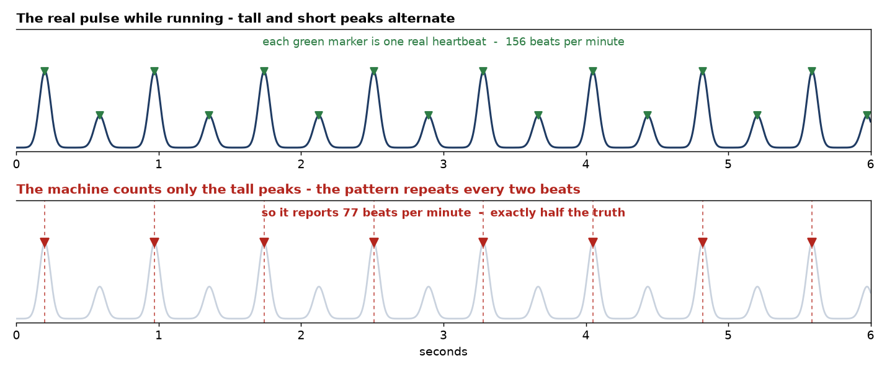
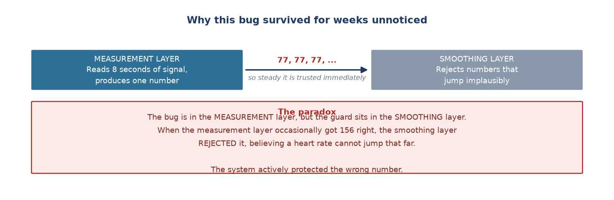

# Week 13 Report — Writing up, and overturning the Subsystem B result

## What this week was about — the overview

**Phase:** Phase 3 — *Polish and Documentation*, the final week of the project.

**In one sentence:** while writing the final report, we discovered that **the ruler used to
measure heart rate throughout the whole project was wrong by a factor of two** — forcing us
to reject and redo the results published in [Week 10](week_10.md).

**Why it matters:** this is the most important week of the project. Not because a feature
was added, but because a result that seemed finished turned out to be unusable — and was
corrected in time.

> **Why did the fault surface exactly while writing the report?** Because writing forces
> you to explain every number to someone else. And to explain a number you have to ask
> yourself *where it came from and whether it makes sense* — a question nobody asked during
> the earlier weeks, because everything appeared to be running smoothly.

## What was done

### Part 1 — Drafting the two report outlines (12-08)

- **The Subsystem B write-up was converted into an outline.** The earlier full document had
  been written entirely by the assistant. Since this report is also marked, it was converted
  into an outline (figures kept, analysis left to be written), with the original retained
  purely as a reference and clearly marked "NOT FOR SUBMISSION".
- **The Subsystem A outline was filled in section by section:**
  - Section 1 (marking scheme and per-class recall) — **written by Giang** through a
    question-and-answer process, working out that lying (0.283) sits above random guessing
    (0.20) but well below the average (0.548).
  - Section 2 (root cause and the three per-axis attempts) — Giang wrote the feature
    definitions and the three attempts; a scope error was corrected (the window is 2.4
    seconds, not the whole 90-second activity) and the rotation-invariance argument added.
  - Sections 3–5 — written by the assistant at Giang's direct request, using real figures
    from the new baseline script.
- **The two-layer model idea** (Giang's own): separate the still-posture model (using a
  gyroscope) from the movement model (keeping the existing tree), instead of one five-class
  model.

### Part 2 — Fixing a baseline computed on the wrong rows (14-08)

- **The baseline script used all 20,258 rows**, while training and evaluation used the
  16,880 rows left after excluding changeover periods. Two numbers were being compared that
  described different datasets. A matching filter was added.
  → **What this means:** the conclusion did not change, but this is exactly the kind of
  error a reviewer catches immediately: comparing two numbers measured on different data.

### Part 3 — Rejecting the reference and redoing Subsystem B (15-08)

- **A physiological test on the reference channel.** The cheapest possible question: *is the
  heart rate higher while running than while lying down?* Result: the fingertip channel
  **fails for 3 of 5 participants**. The worst case recorded 127.7 bpm while standing still
  but only 89.7 bpm while running.
- **Plotting the raw signal and counting peaks by eye** to decide between two possibilities:
  is the sensor broken, or is the algorithm? For P17 while running the signal was **very
  clean** — 30 peaks in 12 seconds, that is 155.6 bpm. The algorithm reported 77.0 bpm,
  **exactly half**. → The sensor is fine; the algorithm is not.
- **Ruling out the competing explanation.** If each beat were being counted twice because of
  a secondary bump, the gaps between peaks would alternate long-short. Measured: the ratio of
  odd to even gaps was **1.03** (perfectly even), while the ratio of odd to even peak
  *heights* was **2.22**. So it is the **height** that alternates, not the spacing.

- **A new estimator.** It takes the median gap between beats in the time domain, returns
  "not readable" when the beats are too irregular instead of guessing, and drops the
  cross-window continuity constraint entirely.
- **Checked against hand counting:** P17 running went from 77.0 to **156.9** (hand count
  155.6); P16 running went from 155.8 to **118.9** (hand count 111.3). Participants passing
  the physiological test rose from **2 of 5 to 4 of 5**.
- **The whole filter comparison was re-run**, keeping all three algorithms, the tap count
  and the reference signal completely unchanged — only how a heart rate is read out of the
  waveform changed.

### Part 4 — Proposal review and merging the thesis (15-08 → 20-08)

- **A proposal-versus-reality document** comparing 14 committed items against the actual
  results, with a reason for each change of direction.
- **Waveform figures for both subsystems** (17-08).
- **Merging the two reports into a seven-chapter thesis** (20-08), with an English version.

## Results

**The new Subsystem B result, replacing the figures published in Week 10:**

| Signal | Share of windows with a readable heart rate |
| :--- | ---: |
| Fingertip (reference) | 35.0% |
| Wrist, unfiltered | **9.6%** |
| Wrist + NLMS | 8.0% |
| Wrist + RLS | 5.5% |
| Wrist + Wiener | 12.7% |

And the conclusion does not depend on the chosen threshold: tightening the criterion widens
the gap between the two channels to **12.2 times** (19.6% against 1.6%).

→ **What this means:** the proposal's research question — *which filter is best* — **rests
on a false premise**. For about 90% of the time, the wrist signal in this hardware
configuration contains no heartbeat to clean up. A filter *separates* signal from noise; it
does not *create* signal.

Delivered: a seven-chapter thesis (31 pages, Vietnamese and English), a proposal comparison
document, five new scripts, eleven figures.

## Technical story 1: why did this fault survive for weeks?

The heart rate pipeline has two separate layers. The **measurement layer** reads 8 seconds
of signal and produces a number. The **smoothing layer** takes the sequence of numbers over
time and removes implausible jumps — the "no jump larger than 25 bpm" constraint lives here.

The octave error happens in the **measurement layer**. When that layer keeps producing the
sequence [77, 77, 77, …], which is perfectly consistent, the smoothing layer trusts it
completely. Worse: when the measurement layer occasionally caught the true 156 bpm, the
smoothing layer **rejected it** as too large a jump. The system actively protected the wrong
number.

**The architectural lesson:** a smoother removes *random noise*, not *systematic bias*.
Faced with systematic bias it follows the wrong value smoothly, making the wrong number look
more trustworthy than before filtering. This is also why a Kalman filter — the first thing
intuition reaches for to block implausible jumps — **would not fix this bug**: it sits in
the wrong layer.

## Technical story 2: is comparing 0.548 with 0.853 directly fair?

A baseline script was written to answer "does the improvement from 0.548 to 0.853 mean
anything" with real numbers rather than intuition. Result: the majority-class baseline for
the five-class problem is only 0.201 (the dataset is nearly balanced, close to a 1-in-5
guess), but for the three-class problem it rises to 0.599 — because the merged "at rest"
class covers three of the five original classes, so simply always guessing "at rest" is
right nearly 60% of the time.

This means **comparing 0.548 with 0.853 directly (+0.305) is somewhat misleading** — part of
why 0.853 is high is that the three-class problem is *structurally easier*, not purely that
the model learned better. The fairer measure is the margin over each problem's own baseline:
the five-class model clears its baseline by +0.347, the three-class by +0.254 — the
three-class still wins clearly, but the real improvement is smaller than the raw +0.305
suggests.

## Looking back: the same kind of mistake, three times

The project made the same kind of error three times, and all three were caught by a physical
check rather than by a metric:

| Occasion | What was believed | The reality | Found by |
| :--- | :--- | :--- | :--- |
| 22-07 | 6 sessions "with the right labels, rows and clean logs" | Device lying on a table, nobody wearing it | Plotting the raw signal |
| Across many weeks | Four magnitude features are enough to separate five classes | Magnitude is invariant to rotation and erases orientation | A three-line mathematical argument |
| 15-08 | The fingertip is a clean ground truth | Wrong by a factor of two for 3 of 5 people | Asking "is running higher than lying?" |

All three tests that found these took **under 15 minutes**, and all three sat **outside**
every automated evaluation pipeline. The reason: metrics check whether the data *agrees with
itself*, not whether the data *agrees with physical reality*.

## How this differed from the original plan

Not done: a GitHub README tested by an outsider, a demo video, the web dashboard. The
documentation side went beyond the plan — instead of a 1,000–1,500 word write-up, the result
is a complete seven-chapter thesis with an English version.

**Which thesis chapter this feeds:** Chapter 4 sections 4.3–4.6 (rejecting and rebuilding
the reference), Chapter 5 section 5.3 (why metrics did not catch it), and Chapter 5 section
5.4 (proposal comparison).

---
[← Week 12](week_12.md) · [Weekly reports index](README.md)
